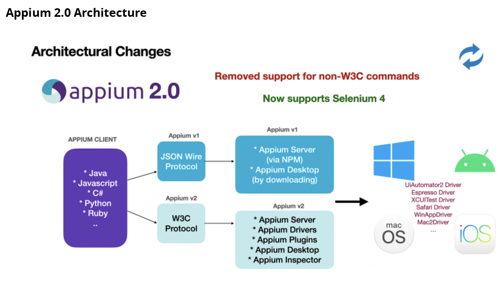
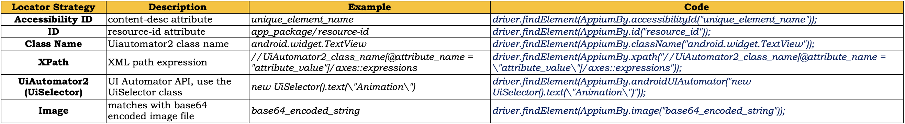
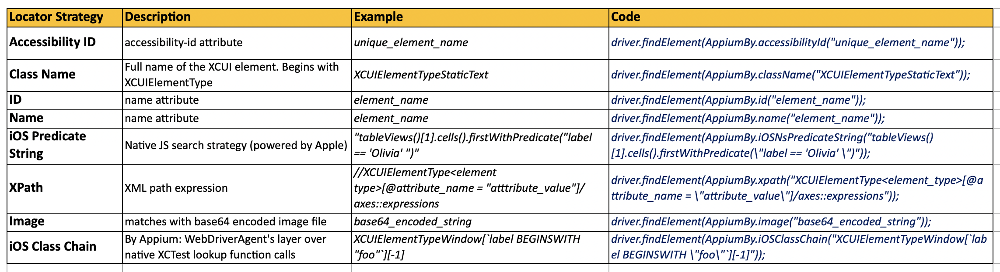

# Appium (2.0)

**What is Appium?**

- Appium is an open-source test automation framework for mobile apps. It allows you to write tests for native, hybrid, and mobile web apps on various platforms like iOS, Android, and Windows.developed and supported by Sauce Labs.

**Advantages**

1. Cross platform: Android &iOS: we can test native, hybrid, web app
2. Allows you to communicate with other apps, Ex: WhatsApp (Majority of tools doesn't support this)
3. Don't have to recompile or modify the app for automation
4. support for built-in app: alarm, phone, calendar etc
5. Any WebDriver compatible language is supported: Java, objective C, Ruby, php, C# : we just need language specific libraries to work on
6. Good community support

**Limitations**

1. For Android, No Support for Android API level < 17(for android v>4.1) if you mobile having less than 17 then we need to go for selendroid.
2. Script execution is very slow on iOS platform & android virtual devices
3. No support for Toast messages: we can handle this
4. No paralel execution directly : we can handle using sauce labs
5. iOS automation with local Appium server requires a Mac
6. Maintaining local Appium server lab requires additional resources
7. Documentation is limited or some times too technical
8. Changes to XCTest framework often breaks Appium

### Comparison with Other tools

|                        | **Appium**  | **XCTest**           | **Robotium** | **UI Automator** | **Expresso**   |
| ---------------------- | ----------- | -------------------- | ------------ | ---------------- | -------------- |
| **Platform**           | iOS/Android | iOS                  | Android      | Android          | Android        |
| **Unit Testing**       | No          | Yes                  | No           | No               | Yes            |
| **Functional Testing** | Yes         | Yes                  | Yes          | Yes              | No             |
| **Language**           | Multiple    | Objective C or Swift | Java         | Java or Kotlin   | Java or Kotlin |

## Appium Architecture



Appium 2.0 introduces a new architecture that brings significant changes and improvements to the framework. The key aspects of the Appium 2.0 architecture are:

1. **Driver Providers**: Appium 2.0 replaces the concept of "drivers" with "driver providers." Driver providers are responsible for managing the lifecycle of the automation session, including launching and terminating the app under test. This separation of concerns allows for better modularity and extensibility.

2. **Plugin-based Architecture**: Appium 2.0 adopts a plugin-based architecture, where different components of the framework can be implemented as separate plugins. This modular approach makes it easier to extend Appium's functionality and maintain individual components.

3. **Execution Contexts**: Appium 2.0 introduces the concept of "execution contexts," which represent different automation contexts within an app, such as native UI, web views, or Chrome Dev Tools (for web apps). This allows for seamless switching between different contexts during test execution.

4. **Pluggable Driver Providers**: Driver providers are now pluggable, allowing for easy integration of new or custom driver providers. This enables support for automating different types of applications or platforms without modifying the core Appium codebase.

5. **Improved Session Management**: Appium 2.0 enhances session management by separating the notion of a session from the automation context. This allows for multiple execution contexts within a single session, enabling more efficient test execution.

6. **Better Compatibility**: Appium 2.0 aims to improve compatibility with the latest versions of iOS, Android, and other platforms, ensuring that the framework stays up-to-date with the latest platform changes and features.

7. **Performance Optimizations**: The new architecture focuses on performance optimizations, including improved parallelization and more efficient resource utilization, leading to faster test execution times.

8. **Improved Testability and Maintainability**: The modular design and separation of concerns in Appium 2.0 make the codebase more testable and maintainable, facilitating easier contributions and bug fixes from the community.

Overall, the Appium 2.0 architecture introduces a more modular, extensible, and scalable approach to mobile app automation. It aims to address some of the limitations and challenges faced in previous versions, while also providing a foundation for future enhancements and improvements to the framework.

**`Note`**:

- Appium 2.x no longer uses the JSON Wire protocol. This is completely replaced by the W3C WebDriver protocol.

- The W3C WebDriver protocol is also based on the same client server architecture as explained in this lecture.

- W3C stands for World Wide Web Consortium, which is an international community that develops the standard for the Web. All major browsers, like Chrome, Firefox, etc. follow this standard, and now Selenium WebDriver 4.x has also switched to it completely.

- In the past, Selenium (3.x) supported both the JSON Wire protocol and the W3C, but with Selenium 4.x, the JSON Wire protocol has been completely removed. Since Appium is based on the WebDriver, it also supported both protocols in Appium 1.x, but from Appium 2.x on, it has also switched to W3C completely.

## Types of Mobile Apps

1. **Mobile Web App:**
   Web apps are not real applications; they are actually websites that open in your smartphone with the help of a web browser. Mobile websites have the broadest audience of all the primary types of applications.

2. **Native App:**
   A native app is developed specifically for one platform. It can be installed through an application store (such as Google Play Store or Apple's App Store).
   Example - Whatsapp, Facebook. This app can use all the system application's(the apps which comes by default with your mobile)

3. **Hybrid App:**
   Hybrid Apps are a way to expose content from existing websites in App format. They can be well described as a mixture of Web App and Native App.

## Installation

**`Windows`**

```
1. Install Node

2. Install Appium Command Line Interface (CLI) server
=====================================================
-> Command to install Appium using npm: npm install -g appium@next
Note: @next will not be required once Appium 2.0 stable release is out to market.
-> Command to install specific version: npm install -g appium@<verion_number>
-> Command to start Appium: appium
-> Command to get installation location: where appium
-> Command to uninstall Appium: npm uninstall -g appium

3. Install UiAutomator2 driver (using Appium CLI)
=================================================
Get help: appium driver --help (or -h)
Get list of officially supported drivers: appium driver list
Install driver: appium driver install uiautomator2
Install driver with specific version: appium driver install uiautomator2@<version_number>

4. Install Appium Inspector
===========================
-> Download and install from https://github.com/appium/appium-inspector/releases

5. Install JAVA JDK and configure environment variables
====================================================
-> Command to check if JAVA is already installed: java -version
-> JAVA JDK download link: https://www.oracle.com/technetwork/java/javase/downloads/index.html
Important note: Please use Java 8/11/15 for now. Don't use Java 16 or higher. The current Appium Java Client 8.x.x is not compatible with Java 16+. You may use Java 16+ once Appium Java client becomes compatible.
-> Create JAVA_HOME system environment variable and set it to JDK path (without bin folder).
Edit PATH system environment variable and add %JAVA_HOME%\bin
Note: Usually JDK path is "C:\Program Files\Java\<your_jdk_version>"

6. Install Android Studio and configure environment variables
==========================================================
-> Android Studio download link: https://developer.android.com/studio
-> Create ANDROID_HOME system environment variable and set it to SDK path.
Edit PATH system environment variable and add below,
%ANDROID_HOME%\platform-tools
%ANDROID_HOME%\cmdline-tools


7. Verify installation using appium-doctor
==========================================
Command to install appium-doctor: npm install -g appium-doctor
Command to get help: appium-doctor --help
Command to check Android setup: appium-doctor --android


8. Emulator Setup: Accelerate Performance
======================================
Launch Android Studio -> SDK Manager -> SDK Tools
Intel processor: Check "Intel x86 Emulator Accelerator (HAXM Installer)" and Apply
AMD processor: Check "Android Emulator Hypervisor Driver for AMD Processors (installer)" and Apply


9. Emulator Setup: Create AVD and start it
===========================================
Important note: AVDs are resource hungry! Please use a laptop with powerful processor (that supports Intel HAXM/AMD hypervisor) and sufficient RAM.
Open Android Studio -> Configure -> Virtual Device Manager -> Create Virtual Device ->
Select Model -> Download Image for desired OS version if not already downloaded
-> Start AVD


10. Emulator Setup: Create Driver Session using Appium CLI
======================================================
Download link for dummy app:
https://github.com/appium/appium/tree/master/packages/appium/sample-code/apps


11. Real Device Setup: Enable USB debugging on Android mobile
=============================================================
Note: Steps can differ based on the phone manufacturer!
-> Settings -> System -> About Phone -> Click Build Number 7-8 times
-> Settings -> Developer Options -> Enable USB Debugging
-> Permission pop-up: Check the box and press Allow to recognise the computer
-> run "adb devices" in CMD prompt to check if device is recognised
-> USB drivers:
Google: https://developer.android.com/studio/run/win-usb
OEMs: https://developer.android.com/studio/run/oem-usb


12. Real Device Setup: Create Driver Session using Appium CLI
=========================================================
Download link for dummy app:
https://github.com/appium/appium/tree/master/packages/appium/sample-code/apps


```

**`Mac`**

```

1. Install homebrew [package manager for macOS and is used to install software packages]
======================================================================================
Link: https://brew.sh/
Command: /usr/bin/ruby -e "$(curl -fsSL https://raw.githubusercontent.com/Homebrew/install/master/install)"


2. Install node and npm [Appium dependencies]
===============================================
Commands to check if node and npm are installed:
node -v
npm -v
Command to install node: brew install node [This will install npm as well]
Command to check node installation path: where node or which node


3. Install Appium CLI server
=========================
-> Command to install Appium using npm: npm install -g appium@next
Note: @next will not be required once Appium 2.0 stable release is out to market.
-> Command to install specific version: npm install -g appium@<verion_number>
-> Command to start Appium: appium
-> Command to get installation location: where appium
Note: This command only gives location of the shortcut, not the actual installation location.
Actual installation location is this: /usr/local/lib/node_modules/appium
-> Command to uninstall Appium: npm uninstall -g appium


4. Install Appium Inspector
========================
-> Download and install from https://github.com/appium/appium-inspector/releases


5. Install JAVA JDK (not the JRE!)
================================
-> Command to check if JAVA is already installed: java -version
-> JAVA JDK download link: https://www.oracle.com/technetwork/java/javase/downloads/index.html
Important note: Please use Java 8/11/15 for now. Don't use Java 16 or higher. The current Appium Java Client 8.x.x is not compatible with Java 16+. You may use Java 16+ once Appium Java client becomes compatible.


6. Set JAVA_HOME environment variable
==================================
On macOS 10.15 Catalina and later, default shell is zsh:
--------------------------------------------------------
-> Navigate to home directory: cd ~/
-> Open zshrc file: open -e .zshrc
-> Create zshrc file: touch .zshrc
-> Add below entries:
export JAVA_HOME=$(/usr/libexec/java_home)
export PATH="${JAVA_HOME}/bin:${PATH}"
-> source .zshrc
-> echo $JAVA_HOME
-> echo $PATH
Follow this article: https://mkyong.com/java/how-to-set-java_home-environment-variable-on-mac-os-x/

For Android in Mac
__________________________________

1. Install UiAutomator2 driver (using Appium CLI)
===========================================
Command to get help: appium driver --help (or -h)
Command to list drivers: appium driver list
Command to install driver: appium driver install UiAutomator2


2. Install Android Studio
====================================================================
- Android Studio download link: https://developer.android.com/studio


3. Set ANDROID_HOME environment variables
======================================
On macOS 10.15 Catalina and later, default shell is zsh:
--------------------------------------------------------
-> Navigate to home directory: cd ~/
-> Open zshrc file: open -e .zshrc
-> Add below entries:
export ANDROID_HOME=${HOME}/Library/Android/sdk
export PATH="${ANDROID_HOME}/platform-tools:${ANDROID_HOME}/cmdline-tools:${PATH}"
-> source .zshrc
-> echo $ANDROID_HOME
-> echo $PATH


4. Verify installation using appium-doctor
==========================================
Command to install appium-doctor: npm install -g appium-doctor
Command to get appium-doctor help: appium-doctor --help
Command to check Android setup: appium-doctor --android


5. Emulator Setup: Create AVD and start it
==========================================
Open Android Studio
Click Configure option
Click "Virtual Device Manager" option
Click "Create Virtual Device" button
Select the phone model
Download the Image for desired OS version if not already downloaded
Start AVD

6. Emulator Setup: Create driver session using Appium CLI
=======================================================
Download link for dummy app:
https://github.com/appium/appium/tree/master/packages/appium/sample-code/apps/ApiDemos-debug.apk


7. Real Device Setup: Enable USB debugging on Android mobile
============================================================
On your phone,
Go to Settings
Click System option
Click "About Phone" option
Click on "Build Number" 7 to 8 times
Go back to Settings
Open Developer Options
Enable "USB Debugging"

8. Real Device Setup: Create driver session using Appium CLI
==========================================================
https://github.com/appium/appium/tree/master/packages/appium/sample-code/apps/ApiDemos-debug.apk


Setup for iOS
____________________


Install Xcode
====================
Configure Apple ID in Account preferences
Install from App Store


Install Xcode command line tools
======================================
Command: xcode-select --install


Install xcpretty [to make Xcode output reasonable]
========================================================
Command to install xcpretty: gem install xcpretty


Install Carthage [dependency manager, required for WebDriverAgent]
==================================================================
Note: This may be optional. In case of any installation issue, just ignore and proceed further.
Command to install Carthage: brew install Carthage


Install Appium-doctor and check Appium setup
===================================================
Command to install Appium doctor: npm install -g appium-doctor
Command to get help: appium-doctor --h
Command to check setup for iOS: appium-doctor --ios


Install XCUITest driver (using Appium CLI)
===========================================
Command to get help: appium driver --help (or -h)
Command to list drivers: appium driver list
Command to install driver: appium driver install XCUITest


Simulator setup: Build UIKitCatalog app for simulator
=====================================================
Download link: https://github.com/appium/ios-uicatalog
Command to get simulator name: xcodebuild -showsdks
Command to build app for the simulator: xcodebuild -sdk <simulator_name>
Command to build UIKitCatalog app for simulator: npm install


Simulator setup: Start session with UIKitCatalog app using Appium CLI
=======================================================================
Command to get UDID: xcrun simctl list
Command to get UDID: xcrun xctrace list devices
Xcode option to get UDID: Xcode -> Window -> Devices and Simulators -> Simulators -> Select the simulator in the left pane. In the right pane, "Identifier" will be the UDID.


=================================================================
                       Real device setup
=================================================================

Getting UDID
=============
Command to install ios-deploy: npm install -g ios-deploy
Command to get UDID: ios-deploy -c
OR
Command to get UDID: xcrun simctl list [May show real devices as well]
Command to get UDID: xcrun xctrace list devices [May show real devices as well]
Xcode option to get UDID: Xcode -> Window -> Devices and Simulators -> Devices -> Select the device in the left pane. In the right pane, "Identifier" will be the UDID.


Option 1. Code signing WebDriverAgent: Basic (automatic/manual) configuration.
=============================================================================

Step 1. Enrol for Developer program
-> Create Apple account: https://developer.apple.com
-> Enable two factor authentication: https://appleid.apple.com/account/manage
-> Click Join the Apple Developer program
-> Click Enrol
-> Click Start Your Enrolment

Step 2. Register device UDID on the developer portal (this can be done from Xcode as well)

Step 3. Add your Apple ID (paid developer account) to Xcode and download the certificate (if required, create new certificate on the developer portal)

Step 4. Generate UIKitCatalog IPA:
-> Download UIKitCatalog app from https://github.com/appium/ios-uicatalog
-> Launch project and code sign using Xcode managed provisioning profile
-> Confirm wild card provisioning profile is created in the developer account
-> (select generic iOS device) Archive app to generate IPA

Step 5. Create session with app using Appium CLI server
-> Open inspector session and set below desired capabilities
"xcodeOrgId": "your team id"
"xcodeSigningId": "iPhone Developer"


Option 2. Code signing WebDriverAgent: Full manual configuration path
====================================================================
Step 1. Add your Apple ID to Xcode and download the certificate

Step 2. Find WebDriverAgent project
In terminal, execute command:
echo "$(dirname "$(find "$HOME/.appium" -name WebDriverAgent.xcodeproj)")"

Step 3. Navigate to WebDriverAgent project path in terminal and run below command to setup the project:
mkdir -p Resources/WebDriverAgent.bundle

Step 4. Open WebDriverAgent.xcodeproj in Xcode. For both the WebDriverAgentLib and WebDriverAgentRunner targets, select "Automatically manage signing" in the "General" tab, and then select your Development Team. This should also auto select Signing Certificate.

Step 5. Manually change the bundle id for the target by going into the "Build Settings" tab, and changing the "Product Bundle Identifier" from com.facebook.WebDriverAgentRunner to
something that Xcode will accept (something really unique!)

Step 6. Command to build the project:
xcodebuild -project WebDriverAgent.xcodeproj -scheme WebDriverAgentRunner -destination 'id=<udid>' test -allowProvisioningUpdates

Note: If mirroring device using Quick Time Player at the same, there could be port conflict. In that case, start Appium server with a different port of WebDriverAgent.
appium server --driver-xcuitest-webdriveragent-port 8101

Step 7. Create session with app using Appium Inspector pointing to CLI server

```

**`Appium Driver Management`**

```
Appium driver management (using Appium CLI)
==========================================
List driver:
-> appium driver list
-> appium driver list --installed
-> appium driver list --updates

Install driver:
-> appium driver install <official_driver_name>
-> appium driver install <official_driver_name>@<specific_version_number>
-> appium driver install --source <source> --package <name>
source: npm (default), github, git, local
package: customDriver@1.0.0
Examples:
-> appium driver install --source npm appium-uiautomator2-driver
-> appium driver install --source git https://github.com/appium/appium-uiautomator2-driver.git --package appium-uiautomator2-driver
-> appium driver install --source github appium/appium-uiautomator2-driver --package appium-uiautomator2-driver

Uninstall driver:
-> appium driver uninstall <official_driver_name>

Update driver:
-> appium driver update uiautomator2
-> appium driver update --unsafe
-> appium driver update installed
```

## Appium Driver

| Driver       | Platform    | Description                                                                                             |
| ------------ | ----------- | ------------------------------------------------------------------------------------------------------- |
| UiAutomator2 | Android     | The default and recommended driver for Android. It uses Google's UiAutomator2 framework for automation. |
| XCUITest     | iOS         | The default and recommended driver for iOS. It uses Apple's XCUITest framework for automation.          |
| Espresso     | Android     | An alternative Android driver that provides faster and more reliable automation for hybrid apps.        |
| UIAutomation | iOS         | An older iOS driver, deprecated since iOS 10. It's recommended to use XCUITest instead.                 |
| Selendroid   | Android     | A legacy Android driver, used for devices running Android 2.3 to 4.1. It's rarely used now.             |
| Windows      | Windows     | Used for automating Windows desktop applications.                                                       |
| Mac          | macOS       | Used for automating macOS desktop applications.                                                         |
| Flutter      | Android/iOS | A driver specifically for automating Flutter applications on both Android and iOS.                      |
| Youi         | Android/iOS | A driver for automating applications built with the You.i Engine.                                       |
| Gecko        | Firefox OS  | Used for automating Firefox OS applications. It's not commonly used now.                                |
| Safari       | iOS         | A driver specifically for automating the Safari browser on iOS devices.                                 |
| Chromium     | Android     | A driver for automating Chromium-based browsers on Android.                                             |

## Desired Capabilities

Desired Capabilities are a set of key-value pairs that define the configuration and settings for an Appium test session. They provide information about the device, application, and other parameters needed to set up and run automated tests on mobile devices or emulators.

Desired Capabilities serve several important purposes in Appium:

- Device configuration: They specify which device or emulator to use for testing.
- Application details: They provide information about the app under test, such as its location or package name.
- Automation settings: They configure various automation-related options, like timeout values or logging preferences.
- Platform-specific settings: They allow you to set capabilities specific to iOS or Android platforms.

## Commonly used desired capabilities for both Android and iOS

| Capability            | Android | iOS | Description                                                                          |
| --------------------- | ------- | --- | ------------------------------------------------------------------------------------ |
| platformName          | ✓       | ✓   | Name of the mobile platform ("Android" or "iOS")                                     |
| deviceName            | ✓       | ✓   | Name of the device to automate                                                       |
| platformVersion       | ✓       | ✓   | Version of the mobile OS                                                             |
| app                   | ✓       | ✓   | Path to the mobile app (.apk or .ipa file)                                           |
| automationName        | ✓       | ✓   | Name of the automation engine (e.g., "UiAutomator2" for Android, "XCUITest" for iOS) |
| udid                  | ✓       | ✓   | Unique device identifier (more commonly used for iOS)                                |
| appPackage            | ✓       |     | Java package of the Android app                                                      |
| appActivity           | ✓       |     | Name of the Android activity to launch                                               |
| bundleId              |         | ✓   | Bundle identifier of the iOS app                                                     |
| noReset               | ✓       | ✓   | Don't reset app state before session (true/false)                                    |
| fullReset             | ✓       | ✓   | Perform a complete reset (true/false)                                                |
| newCommandTimeout     | ✓       | ✓   | Time to wait for a new command (in seconds)                                          |
| language              | ✓       | ✓   | Language to set for the device                                                       |
| locale                | ✓       | ✓   | Locale to set for the device                                                         |
| orientation           | ✓       | ✓   | Initial orientation of the device                                                    |
| autoGrantPermissions  | ✓       |     | Automatically grant app permissions (true/false)                                     |
| xcodeOrgId            |         | ✓   | Apple developer team identifier                                                      |
| xcodeSigningId        |         | ✓   | Signing certificate to use for iOS                                                   |
| useNewWDA             |         | ✓   | Use a new WebDriverAgent instance for each session (true/false)                      |
| androidInstallTimeout | ✓       |     | Timeout for installing Android app (in milliseconds)                                 |
| avd                   | ✓       |     | Name of the Android Virtual Device to use                                            |

## Android Desired Capabilities Example

```
{
  "platformName": "Android",
  "deviceName": "Android Emulator",
  "platformVersion": "11.0",
  "automationName": "UiAutomator2",
  "app": "/path/to/your/app.apk",
  "appPackage": "com.example.myapp",
  "appActivity": "com.example.myapp.MainActivity",
  "noReset": true,
  "newCommandTimeout": 6000,
  "autoGrantPermissions": true,
  "language": "en",
  "locale": "US",
  "orientation": "PORTRAIT",
  "androidInstallTimeout": 90000,
  "avd": "Pixel_3a_API_30_x86"
}
```

## iOS Desired Capabilities Example

```
{
  "platformName": "iOS",
  "deviceName": "iPhone 12",
  "platformVersion": "14.5",
  "automationName": "XCUITest",
  "app": "/path/to/your/app.ipa",
  "bundleId": "com.example.myapp",
  "udid": "1234567890abcdef1234567890abcdef12345678",
  "noReset": true,
  "newCommandTimeout": 6000,
  "language": "en",
  "locale": "US",
  "orientation": "PORTRAIT",
  "xcodeOrgId": "ABCDE12345",
  "xcodeSigningId": "iPhone Developer",
  "useNewWDA": true
}
```

**Note:**

For More Information visit following pages

- UiAutomator2 (Android) capabilities:
  https://github.com/appium/appium-uiautomator2-driver?#capabilities

- XCUITest (iOS) capabilities:
  https://github.com/appium/appium-xcuitest-driver#capabilities

## Vendor Prefix

A **vendor prefix** is a way for browser vendors (like Google for Chrome or Apple for Safari) or platform-specific tools to introduce experimental or non-standardized features that may eventually become standard but aren't fully supported across all platforms yet. These prefixes allow developers to use these features and ensure that their applications function correctly on platforms that support them, without breaking functionality on others.

In **Appium**, vendor prefixes help standardize cross-platform support for mobile automation, especially when working with different driver implementations (like iOS and Android). Each platform has unique capabilities and behaviors, and by using vendor-specific prefixes, Appium can maintain compatibility and differentiate between platform-specific options without causing conflicts. Here’s how it works:

- **Example**: For Android and iOS capabilities, Appium uses vendor prefixes (`appium:`) to specify capabilities. For instance, if you have a capability like `appium:appWaitActivity`, the `appium:` prefix indicates it’s a custom or extended capability that’s understood by Appium rather than being a standard W3C capability.

- **Purpose**: The prefix helps keep Appium’s capabilities consistent with the W3C WebDriver standard by distinguishing Appium-specific capabilities from standardized ones, improving both compatibility and future-proofing the code as standards evolve.

This approach allows Appium to evolve with the WebDriver protocol while also catering to platform-specific needs and maintaining backwards compatibility with mobile devices.

# Create Project

1. Create a maven Project.
2. Add following dependencies
   - Java Client
   - testNG

### **Very Important note**:

Please create all packages and class files in src/test/java and not in src/main/java.
Recently, Appium has changed the scope of one of its transitive Selenium dependency (Support Ul package) from "compile" to "runtime". Due to this, the dependency may not resolve under src/main/java. We can certainly try to change the scope to compile, but let's be safe and create everything under src/test/java.
This is where typically test automation resides. If you still want to use src/main/ java, then please add the entire "selenium-java" package as a seperate dependency in pom.xmi. Make sure to match the version with the Selenium version that's shipped with Appium Java

### **Avoid using DesiredCapabilities class**

If you're still using the DesiredCapabilities class to set up your capabilities, it's crucial to stop and update your approach.

As of version 9.2.3, the Appium Java Client has ceased to automatically add the 'appium:' prefix to capabilities (confirmed through this defect: https://github.com/appium/java-client/issues/2184). This means if you continue using the DesiredCapabilities class, you must explicitly prefix non-W3C capabilities with 'appium:'. Failing to do so will result in the following exception:

**java.lang.IllegalArgumentException: Illegal key values seen in w3c capabilities: [app, automationName, deviceName, udid]**

This change hints at a broader trend: the potential future deprecation of the DesiredCapabilities class by the Appium developers. To stay ahead, it's advisable to switch to the recommended Options class. I have covered this in detail in the lecture titled "Create Driver Session using Options Class." You will find this lecture under section titled "First Appium Project". Please ensure you don't skip this critical lecture.

Should you choose to continue using DesiredCapabilities for the time being, make sure to add the 'appium:' prefix to any non-W3C compliant capabilities. The Appium documentation has already updated these capabilities with the 'appium:' prefix, helping you easily distinguish which capabilities are compliant with W3C standards and which are not. You can reference the list of capabilities at the following links:

Common Capabilities: https://appium.io/docs/en/latest/guides/caps/

UiAutomator2 (Android): https://github.com/appium/appium-uiautomator2-driver?tab=readme-ov-file#capabilities

XCUITest (iOS): https://appium.github.io/appium-xcuitest-driver/latest/reference/capabilities/

### Avoid using MobileCapabilityType

MobileCapabilityType class is removed from Java Client version 9.0.0. Please use the key names directly. For example, use "platformName",
"deviceName", "automationName", "udid", "app" and so on. You can get the actual key names from respective driver's GitHub page. For UiAutomator2 driver, the capabilities are listed here: https://github.com/appium/appium-
uiautomator2-driver#capabilities

### Important note:

From Appium 2.0, we don't need to add
`/wd/hub/` to the URL

### Deprecated Code (FYR)

Android (Deprecated Code)

```Java
import io.appium.java_client.AppiumDriver;
import io.appium.java_client.android.AndroidDriver;
import io.appium.java_client.remote.MobileCapabilityType;
import org.openqa.selenium.remote.DesiredCapabilities;
import java.net.MalformedURLException;
import java.net.URL;
import java.io.File;

public class CreateDriverSession {
    public static void main(String[] args) throws MalformedURLException {
        DesiredCapabilities caps = new DesiredCapabilities();

        // Set capabilities for Appium
        caps.setCapability(MobileCapabilityType.PLATFORM_NAME, "Android");
        caps.setCapability(MobileCapabilityType.DEVICE_NAME, "Pixel 3");
        caps.setCapability(MobileCapabilityType.AUTOMATION_NAME, "UiAutomator2");
        caps.setCapability(MobileCapabilityType.UDID, "emulator-5554");

        // Build app URL path
        String appUrl = System.getProperty("user.dir")
            + File.separator + "src"
            + File.separator + "main"
            + File.separator + "resource"
            + File.separator + "ApiDemos-debug.apk";

        caps.setCapability(MobileCapabilityType.APP, appUrl);

        // Create Appium server URL
        URL url = new URL("http://0.0.0.0:4723/wd/hub");

        // Initialize Android driver
        AppiumDriver driver = new AndroidDriver(url, caps);
    }
}
```

iOS(Deprecated Code)

```Java
import io.appium.java_client.AppiumDriver;
import io.appium.java_client.ios.IOSDriver;
import io.appium.java_client.remote.MobileCapabilityType;
import org.openqa.selenium.remote.DesiredCapabilities;
import java.net.MalformedURLException;
import java.net.URL;
import java.io.File;

public class CreateDriverSession {
public static void main(String[] args) throws MalformedURLException {
    DesiredCapabilities caps = new DesiredCapabilities();

    // Set iOS-specific capabilities
    caps.setCapability(MobileCapabilityType.PLATFORM_NAME, "iOS");
    caps.setCapability(MobileCapabilityType.DEVICE_NAME, "iPhone 11");
    caps.setCapability(MobileCapabilityType.AUTOMATION_NAME, "XCUITest");
    caps.setCapability(MobileCapabilityType.UDID, "77F6B8F0-8877-4EDF-8C8C-99DBE64A93FF");

    // Build app URL path
    String appUrl = System.getProperty("user.dir")
        + File.separator + "src"
        + File.separator + "main"
        + File.separator + "resources"
        + File.separator + "UIKitCatalog-iphonesimulator.app";

    caps.setCapability(MobileCapabilityType.APP, appUrl);

    // Create Appium server URL
    URL url = new URL("http://0.0.0.0:4723/wd/hub");

    // Initialize iOS driver
    AppiumDriver driver = new IOSDriver(url, caps);
}
}
```

**Important note:**
These capabilities are sufficient if you are using a free developer account with Apple and have followed the
"Full Manual Configuration" path lecture to setup Appium for real device.
If you are using a paid developer account with Apple and have followed the "Basic Automatic Configuration" path lecture to setup Appium for real device, then you will need to add below two capabilities:

```
caps.setCapability("xcodeOrgld", "enter your team id");
caps.setCapability("codeSigningld", "¡Phone Developer");`
```

## Sample create session code- Android

```Java
package android;

import io.appium.java_client.android.AndroidDriver;
import io.appium.java_client.android.options.UiAutomator2Options;
import java.io.File;
import java.net.MalformedURLException;
import java.net.URL;
import java.time.Duration;

public class CreateDriverSession {
    public static void main(String[] args) throws MalformedURLException {
        // Initialize UiAutomator2Options
        UiAutomator2Options options = new UiAutomator2Options();

        // Build app URL path
        String appUrl = System.getProperty("user.dir")
                + File.separator + "src"
                + File.separator + "test"
                + File.separator + "resources"
                + File.separator + "application"
                + File.separator + "ApiDemos-debug.apk";

        System.out.println("App Path: " + appUrl);

        // Set capabilities
        options.setPlatformName("Android")
                .setDeviceName("pixel")
                .setUdid("emulator-5554")
                .setAutomationName("UiAutomator2")
               //  .setApp(appUrl)
               .setA
                .setNewCommandTimeout(Duration.ofSeconds(60));
        URL url = new URL("http://127.0.0.1:4723");

        // Initialize Android driver
        AndroidDriver driver = new AndroidDriver(url, options);
    }
}
```

## Prerequisites for Starting a Driver Session with Simulator

1. **Appium Server**

   - Ensure you have the Appium server installed.

2. **XCUITest Driver**

   - Make sure the XCUITest driver is set up.

3. **Xcode**

   - Install Xcode from the App Store or Apple’s developer website.

4. **Xcode Command Line Tools**

   - Install the command line tools using the following command:
     ```bash
     sudo xcode-select --install
     ```

5. **Install xcpretty**

   - Beautify the logs by installing `xcpretty`:
     ```bash
     sudo gem install xcpretty
     ```

6. **Install Carthage**

   - Install Carthage, a dependency manager required by WebDriverAgent:
     ```bash
     brew install carthage
     ```

7. **Fetch UDID**

   - Get the UDID of your simulator using the command:
     ```bash
     xcrun simctl list
     ```

8. **Build the .app File**

   - Clone or download the iOS UI Catalog project from [GitHub](https://github.com/appium/ios-uicatalog).

   - Navigate to the `UIKitCatalog` folder:

     ```bash
     cd ./ios-uicatalog-master/UIKitCatalog
     ```

   - Install dependencies and build the .app file:

     ```bash
     npm install
     ```

   - The .app file will be created under:
     `    ./UIKitCatalog/build/Release-iphonesimulator/UIKitCatalog-iphonesimulator.app`

## Sample create session code - iOS

```Java
package ios;

import io.appium.java_client.ios.IOSDriver;
import io.appium.java_client.ios.options.XCUITestOptions;
import java.io.File;
import java.net.MalformedURLException;
import java.net.URL;

public class CreateDriverSession {
    public static void main(String[] args) throws MalformedURLException {

        XCUITestOptions options = new XCUITestOptions();

        // Build app URL path
        String appUrl = System.getProperty("user.dir")
                + File.separator + "src"
                + File.separator + "test"
                + File.separator + "resources"
                + File.separator + "application"
                + File.separator + "UIKitCatalog-iphonesimulator.app";

        System.out.println("App Path: " + appUrl);

        // Set capabilities
        options.setDeviceName("iPhone 15 Pro").
                setAutomationName("XCUITest").
                setUdid("4E7F8CBE-88A7-41D3-947B-406DD309CA39").
       //       setApp(appUrl); //installation of application
                setBundleId("com.example.apple-samplecode.UICatalog");//launch existing application
        URL url = new URL("http://127.0.0.1:4723");

        // Initialize iOS driver
        IOSDriver driver = new IOSDriver(url, options);
    }
}

```

## How to find appPackage and appActivity?

Launch the app on your device and make sure the activity you want is in focus and enter following commands in respective terminals

Windows:

```
adb shell

dumpsys window displays | grep -E ‘mCurrentFocus’
```

Mac:

```
adb shell

dumpsys window | grep -E mCurrentFocus
```

## To launch existing application - Android

Add following options

```
.setAppActivity(".ApiDemos") // launching existing application
.setAppPackage("io.appium.android.apis")
```

# How to Get iOS Bundle ID Without Xcode/Source Code

## 1. From .app File

1. Right-click the .app file
2. Select "Show Package Contents"
3. Find and open `Info.plist` in Xcode
4. Search for "Bundle identifier"

## 2. From .ipa File

1. Rename the `.ipa` file to `.zip`
2. Right-click the `.zip` file → Open With → Archive Utility
3. Navigate to the created Payload folder
4. Right-click the `.app` file
5. Select "Show Package Contents"
6. Find and open `Info.plist` in Xcode
7. Search for "Bundle identifier"

## 3. From App Store

1. Find the app in Safari's App Store
   ```
   Example URL:
   https://apps.apple.com/us/app/whatsapp-messenger/id310633997
   ```
2. Use the iTunes Lookup API:

   ```
   https://itunes.apple.com/lookup?id=310633997
   ```

   Replace `310633997` with your app's ID number

3. A Text file will be downloaded after navigating the url. Open the file and search for `bundleId`

## To launch existing application - iOS

Add following options

```
  .setBundleId("com.example.apple-samplecode.UICatalog");//launch existing application
```

## Launch Emulator Automatically

Add the following option

```Java
package android;

import io.appium.java_client.android.AndroidDriver;
import io.appium.java_client.android.options.UiAutomator2Options;
import java.io.File;
import java.net.MalformedURLException;
import java.net.URL;
import java.time.Duration;

public class CreateDriverSession {
    public static void main(String[] args) throws MalformedURLException {
        // Initialize UiAutomator2Options
        UiAutomator2Options options = new UiAutomator2Options();

        // Build app URL path
        String appUrl = System.getProperty("user.dir")
                + File.separator + "src"
                + File.separator + "test"
                + File.separator + "resources"
                + File.separator + "application"
                + File.separator + "ApiDemos-debug.apk";

        System.out.println("App Path: " + appUrl);

        // Set capabilities
        options.setPlatformName("Android")
                .setDeviceName("pixel")
                .setUdid("emulator-5554")
                .setAutomationName("UiAutomator2")
                .setApp(appUrl)
                .setNewCommandTimeout(Duration.ofSeconds(60))
                .setAvd("Pixel_3a_API_34") //
                .setAvdLaunchTimeout(Duration.ofSeconds(180))
                .setAvdReadyTimeout(Duration.ofSeconds(120));
        URL url = new URL("http://127.0.0.1:4723");

        // Initialize Android driver
        AndroidDriver driver = new AndroidDriver(url, options);
    }
}
```

## Launch Simulator Automatically

```Java
package ios;

import io.appium.java_client.ios.IOSDriver;
import io.appium.java_client.ios.options.XCUITestOptions;

import java.io.File;
import java.net.MalformedURLException;
import java.net.URL;
import java.time.Duration;

public class LaunchSimulator {
    public static void main(String[] args) throws MalformedURLException {
        XCUITestOptions options = new XCUITestOptions();
        // Set capabilities
        options.setDeviceName("iPhone 15 Pro").
                setAutomationName("XCUITest").
                setUdid("4E7F8CBE-88A7-41D3-947B-406DD309CA39").
        setBundleId("com.example.apple-samplecode.UICatalog").//launch existing application
                setSimulatorStartupTimeout(Duration.ofSeconds(180));// launch timeout for simulator
        URL url = new URL("http://127.0.0.1:4723");

        // Initialize iOS driver
        IOSDriver driver = new IOSDriver(url, options);
    }
}

```

## Appium Inspector

Appium Inspector is a tool used to inspect mobile applications and interact with their elements, making it easier to write automated test scripts for both Android and iOS platforms. With Appium Inspector, you can view and analyze the app’s UI elements, check their properties (like resource ID, class name, text, etc.), and identify suitable locators to use in your automation code.

Here are some essential capabilities for setting up Appium Inspector to work with Android and iOS devices:

### Android Desired Capabilities

```json
{
  "platformName": "Android",
  "platformVersion": "your_android_version", // e.g., "13.0"
  "deviceName": "your_android_device_name", // e.g., "Pixel 5"
  "app": "path/to/your_app.apk", // Path to your app APK file
  "appPackage": "your_app_package", // e.g., "com.example.app"
  "appActivity": "your_main_activity", // e.g., "com.example.app.MainActivity"
  "automationName": "UiAutomator2", // Common choice for Android
  "autoGrantPermissions": true // Optional: grants all permissions automatically
}
```

- **platformName**: Specifies the mobile OS platform, like Android.
- **platformVersion**: Version of the Android OS on the device.
- **deviceName**: The name of your Android device or emulator.
- **app**: Path to the .apk file on your computer or the app’s package name if it’s pre-installed.
- **appPackage** and **appActivity**: Define the app package and main activity to launch.
- **automationName**: `UiAutomator2` is the recommended automation engine for Android.

### iOS Desired Capabilities

```json
{
  "platformName": "iOS",
  "platformVersion": "your_ios_version", // e.g., "16.0"
  "deviceName": "your_ios_device_name", // e.g., "iPhone 14"
  "app": "path/to/your_app.app", // Path to .app file or .ipa for real device
  "automationName": "XCUITest", // Common choice for iOS
  "udid": "your_device_udid", // Only required for real devices
  "xcodeOrgId": "your_xcode_org_id", // For real devices, required for signing
  "xcodeSigningId": "iPhone Developer", // For real devices, set as "iPhone Developer"
  "autoAcceptAlerts": true // Optional: automatically accepts alerts
}
```

- **platformName**: Specifies the platform as iOS.
- **platformVersion**: Version of the iOS on the device.
- **deviceName**: The name of your iOS device or simulator.
- **app**: Path to the .app file (for simulators) or .ipa file (for real devices).
- **automationName**: `XCUITest` is the recommended automation engine for iOS.
- **udid**: The device’s unique identifier (only needed for real devices).
- **xcodeOrgId** and **xcodeSigningId**: Required for running tests on real devices to sign the app.

## Install Appium Inspector

Appium Inspector is a standalone tool, so you need to install it separately. You can get the installer for your OS (macOS, Windows, or Linux) from the official Appium GitHub page.

- Go to the [Appium Inspector GitHub Releases page](https://github.com/appium/appium-inspector/releases).
- Download the latest `.dmg` (for macOS), `.exe` (for Windows), or `.AppImage` (for Linux) file.
- Run the installer and follow the prompts.

## Deprecation Notice:

```
driver.findElementBy* -> driver.findElement(AppiumBy.*)
MobileElement -> WebElement
MobileBy -> AppiumBy
```

## Mobile Locators

In mobile automation, locators are used to find and interact with UI elements in an application. They help identify elements on the screen, like buttons, text fields, images, etc., enabling test scripts to interact with them programmatically.

### Common Mobile Locators

1. **ID**: The resource ID of the element, often unique to the element in the layout.
2. **Accessibility ID**: A unique identifier associated with the element, useful for accessibility features.
3. **Class Name**: The class type of the element, like `android.widget.Button` or `android.widget.TextView`.
4. **XPath**: The XML path to locate elements hierarchically, which is flexible but can be slow in mobile testing.
5. **UIAutomator (Android only)**: A locator strategy specific to Android that uses the `UiSelector` class.
6. **iOS Predicate String (iOS only)**: A query format in iOS that allows filtering of UI elements.
7. **iOS Class Chain (iOS only)**: Similar to XPath but specific to iOS, designed to improve performance.

### What is UIAutomator?

UIAutomator is a powerful Android testing framework provided by Google, enabling developers to access and control UI elements of other Android apps. It works well for locating elements in Android apps, even if they are in other apps on the device, which is unique to UIAutomator. UIAutomator uses the `UiSelector` class to locate elements.

#### UIAutomator Locator Syntax:

- **UiSelector().text("text")**: Finds elements with specific text.
- **UiSelector().className("class name")**: Locates elements by class.
- **UiSelector().resourceId("resource ID")**: Locates by resource ID.
- **UiSelector().description("content-desc")**: Uses the content description.

### Specialties of UIAutomator

1. **Cross-App Testing**: It can interact with elements across different Android applications, which is useful for testing inter-app interactions.
2. **Native Integration**: Built into Android, so it’s optimized and faster for native Android apps.
3. **Extended Element Location**: UIAutomator can find elements by text, content description, and more complex queries, providing robust ways to interact with elements.

### Difference from Other Locator Strategies

- **Platform-Specific**: Unlike accessibility ID or XPath, which are universal, UIAutomator is Android-specific.
- **Optimized for Android**: UIAutomator is often faster and more stable on Android devices, especially when interacting with deep nested elements.
- **Limited to Android SDK**: UIAutomator requires Android SDK tools, while other locator strategies like XPath can work on both Android and iOS.

In essence, UIAutomator is designed specifically for Android testing, making it ideal for scenarios where Android-specific interactions or performance optimizations are needed.

## Android: Location Strategies and Best Practices



## Android: Finding Elements using different Locator Strategies

```Java
package android.native_application;

import io.appium.java_client.AppiumBy;
import io.appium.java_client.android.AndroidDriver;
import io.appium.java_client.android.options.UiAutomator2Options;
import org.openqa.selenium.WebElement;

import java.io.File;
import java.net.MalformedURLException;
import java.net.URL;

public class FindElements {
    public static void main(String[] args) throws MalformedURLException {
        UiAutomator2Options options = new UiAutomator2Options();
        String appUrl = System.getProperty("user.dir")
                + File.separator + "src"
                + File.separator + "test"
                + File.separator + "resources"
                + File.separator + "application"
                + File.separator + "ApiDemos-debug.apk";
        // Set capabilities
        options.setPlatformName("Android")
                .setDeviceName("pixel")
                .setUdid("emulator-5554")
                .setAutomationName("UiAutomator2")
                .setApp(appUrl);// installation of application
        URL url = new URL("http://127.0.0.1:4723");

        // Initialize Android driver
        AndroidDriver driver = new AndroidDriver(url, options);

        WebElement myElement = driver.findElement(AppiumBy.accessibilityId("Accessibility"));
        System.out.println(myElement.getText());

        myElement = driver.findElements(AppiumBy.id("android:id/text1")).get(1);
        System.out.println(myElement.getText());

        myElement = driver.findElements(AppiumBy.className("android.widget.TextView")).get(2);
        System.out.println(myElement.getText());

        myElement = driver.findElement(AppiumBy.xpath("//android.widget.TextView[@content-desc=\"Accessibility\"]"));
        System.out.println(myElement.getText());

        myElement = driver.findElement(AppiumBy.xpath("//*[@text=\"Accessibility\"]"));
        System.out.println(myElement.getText());

//        myElement = driver.findElement(AppiumBy.tagName("Accessibility"));
//        System.out.println(myElement.getText());

    }
}

```

### Android: Finding Elements using UiAutomator (Native Technique)

```Java
package android.native_application;

import io.appium.java_client.AppiumBy;
import io.appium.java_client.android.AndroidDriver;
import io.appium.java_client.android.options.UiAutomator2Options;
import org.openqa.selenium.WebElement;

import java.io.File;
import java.net.MalformedURLException;
import java.net.URL;

public class AndroidUiAutomatorFindElements {
    public static void main(String[] args) throws MalformedURLException {
        UiAutomator2Options options = new UiAutomator2Options();
        String appUrl = System.getProperty("user.dir")
                + File.separator + "src"
                + File.separator + "test"
                + File.separator + "resources"
                + File.separator + "application"
                + File.separator + "ApiDemos-debug.apk";
        // Set capabilities
        options.setPlatformName("Android")
                .setDeviceName("pixel")
                .setUdid("emulator-5554")
                .setAutomationName("UiAutomator2")
                .setApp(appUrl);// installation of application
        URL url = new URL("http://127.0.0.1:4723");

        // Initialize Android driver
        AndroidDriver driver = new AndroidDriver(url, options);

        WebElement myElement = driver
                .findElement(AppiumBy.androidUIAutomator("new UiSelector().text(\"Accessibility\")"));
        System.out.println(myElement.getText());

        myElement = driver
                .findElements(AppiumBy.androidUIAutomator("new UiSelector().className(\"android.widget.TextView\")")).get(2);
        System.out.println(myElement.getText());

        myElement = driver
                .findElement(AppiumBy.androidUIAutomator("new UiSelector().description(\"Accessibility\")"));
        System.out.println(myElement.getText());

        myElement = driver
                .findElements(AppiumBy.androidUIAutomator("new UiSelector().resourceId(\"android:id/text1\")")).get(1);
        System.out.println(myElement.getText());
    }
}

```

## iOS: Locator Strategies and Best Practices



In iOS automation, **iOS Predicate String** and **iOS Class Chain** are two powerful locator strategies specific to iOS, allowing precise and efficient element selection on iOS devices.

### iOS Predicate String

iOS Predicate String is a query language based on NSPredicate, which is used extensively in iOS development. This locator strategy allows you to filter UI elements based on specific attributes and conditions, making it especially powerful for locating complex UI elements in iOS applications.

#### Common Predicate Examples:

- **By text**: `name == "Submit"`
- **Contains text**: `label CONTAINS "Welcome"`
- **Logical operators**: `(name == "Submit" OR name == "Next")`
- **Begins or Ends with**: `label BEGINSWITH "Start"` or `label ENDSWITH "End"`
- **Attribute-based filters**: `visible == true`, `enabled == true`

#### Benefits of iOS Predicate String:

- **Flexible and Powerful**: Supports a wide range of comparisons and filters, like text equality, substring matching, and logical operators.
- **Efficient in Complex Queries**: Allows chaining and combination of conditions in one query.
- **Native to iOS**: Uses native iOS querying capabilities, making it fast and optimized.

#### Example Usage:

```javascript
// Finding a button with exact name "Submit"
driver.findElement("-ios predicate string", "name == 'Submit'");

// Finding any label containing "Welcome"
driver.findElement("-ios predicate string", "label CONTAINS 'Welcome'");
```

---

### iOS Class Chain

iOS Class Chain is a query language designed specifically for Appium and iOS that enables the selection of UI elements based on a hierarchical structure. It is similar to XPath but optimized for iOS, making it more efficient for navigating complex hierarchies and selecting deeply nested elements.

#### Common Class Chain Examples:

- **Direct class selection**: `/XCUIElementTypeButton`
- **Hierarchical structure**: `/XCUIElementTypeWindow/XCUIElementTypeButton[1]`
- **Child and Descendant selectors**: `**/XCUIElementTypeButton` (finds all buttons in the hierarchy)
- **Index-based selection**: `**/XCUIElementTypeTable[1]/XCUIElementTypeCell[2]`

#### Benefits of iOS Class Chain:

- **Faster Than XPath**: Optimized for iOS, it’s generally faster and more efficient than using XPath for element navigation.
- **Ideal for Nested Elements**: Helps locate deeply nested elements without the performance hit often associated with XPath.
- **Supports Broad and Specific Queries**: Allows flexible queries to either match specific paths or broadly locate all instances of a class type.

#### Example Usage:

```javascript
// Finding the first button in the hierarchy
driver.findElement("-ios class chain", "/XCUIElementTypeButton[1]");

// Finding all buttons within a table view
driver.findElement(
  "-ios class chain",
  "**/XCUIElementTypeTable/XCUIElementTypeButton"
);
```

---

### Choosing Between Predicate String and Class Chain

- Use **iOS Predicate String** when you need flexible filtering, such as locating elements by name, label, or combining conditions.
- Use **iOS Class Chain** for locating elements within a deep hierarchy, especially when performance is a concern.

Both locator strategies are highly effective for iOS automation and provide optimized alternatives to XPath, making your tests faster and more reliable on iOS devices.

# Important note on XPath

For native apps, it's advisable to avoid using XPath. XPath is fragile, slow, and prone to changes with minor UI updates in the application. A single UI update can impact many XPaths if they are not optimized.

If you must use XPath, ensure to write optimized XPaths. Detailing XPath is beyond the scope of this course as our focus is on learning Appium and its best practices.

If elements cannot be identified using unique IDs, request your application development team to add these wherever possible.

For iOS, consider using Predicate Strings and Class Chains as better alternatives to XPath. The Appium Inspector often automatically suggests these, so they should be preferred over XPath.

For Android, using XPath is somewhat acceptable for elements where resource-id is not available, but for iOS, try to avoid it as much as possible.

In the case of Hybrid apps, if elements cannot be identified using unique IDs, prefer CSS selectors over XPath.

## iOS: Finding Elements using different Locator Strategies

```Java
package ios.native_application;

import io.appium.java_client.AppiumBy;
import io.appium.java_client.ios.IOSDriver;
import io.appium.java_client.ios.options.XCUITestOptions;
import org.openqa.selenium.WebElement;

import java.net.MalformedURLException;
import java.net.URL;
import java.time.Duration;

public class IOSFindElements {
    public static void main(String[] args) throws MalformedURLException {
        XCUITestOptions options = new XCUITestOptions();
        // Set capabilities
        options.setDeviceName("iPhone 15 Pro").
                setAutomationName("XCUITest").
                setUdid("4E7F8CBE-88A7-41D3-947B-406DD309CA39").
                setBundleId("com.example.apple-samplecode.UICatalog").//launch existing application
                setSimulatorStartupTimeout(Duration.ofSeconds(180));// launch timeout for simulator
        URL url = new URL("http://127.0.0.1:4723");

        // Initialize iOS driver
        IOSDriver driver = new IOSDriver(url, options);

        WebElement myElement = driver.findElement(AppiumBy.accessibilityId("Activity Indicators"));
        System.out.println(myElement.getText());

        myElement = driver.findElements(AppiumBy.className("XCUIElementTypeStaticText")).get(1);
        System.out.println(myElement.getText());

        myElement = driver.findElement(AppiumBy.name("Activity Indicators"));
        System.out.println(myElement.getText());

        myElement = driver.findElement(AppiumBy.id("Activity Indicators"));
        System.out.println(myElement.getText());

        myElement = driver.findElement(AppiumBy.xpath("//XCUIElementTypeStaticText[@name=\"Activity Indicators\"]"));
        System.out.println(myElement.getText());

//        myElement = driver.findElement(AppiumBy.tagName("Activity Indicators"));
//        System.out.println(myElement.getText());

    }
}

```

## iOS: Finding Elements using Predicate Strings (Native Technique)

```Java
package ios.native_application;

import io.appium.java_client.AppiumBy;
import io.appium.java_client.ios.IOSDriver;
import io.appium.java_client.ios.options.XCUITestOptions;
import org.openqa.selenium.WebElement;

import java.net.MalformedURLException;
import java.net.URL;
import java.time.Duration;

public class IOSPredicateString {
    public static void main(String[] args) throws MalformedURLException {
        XCUITestOptions options = new XCUITestOptions();
        // Set capabilities
        options.setDeviceName("iPhone 15 Pro").
                setAutomationName("XCUITest").
                setUdid("4E7F8CBE-88A7-41D3-947B-406DD309CA39").
                setBundleId("com.example.apple-samplecode.UICatalog").//launch existing application
                setSimulatorStartupTimeout(Duration.ofSeconds(180));// launch timeout for simulator
        URL url = new URL("http://127.0.0.1:4723");

        // Initialize iOS driver
        IOSDriver driver = new IOSDriver(url, options);

        WebElement myElement = driver.findElement(
                AppiumBy.iOSNsPredicateString("label CONTAINS \"Activity Indicators\""));
        System.out.println(myElement.getText());

        myElement = driver.findElement(
                AppiumBy.xpath("//XCUIElementTypeStaticText[@name=\"Activity Indicators\"]"));
        System.out.println(myElement.getText());

    }
    }

```

## Different Ways of Defining Native Elements and Best Practices

The `@FindBy`, `@AndroidFindBy`, and `@iOSXCUITFindBy` annotations are used in Appium and Selenium for element location in Page Object Models (POM). They help define locators for UI elements in a more structured and readable way, especially when you have different locators for Android and iOS.

### 1. `@FindBy`

`@FindBy` is a Selenium annotation that allows you to define locators for web elements based on common locating strategies. It can be used in Appium for web-based mobile testing and is typically applied when the same locator works across both Android and iOS platforms.

#### Example Usage:

```java
@FindBy(id = "submit_button")
private WebElement submitButton;
```

#### Locator Strategies with `@FindBy`:

- `id`: Locates elements by their ID.
- `name`: Locates elements by their name.
- `className`: Locates elements by their class name.
- `xpath`: Locates elements using XPath expressions.
- `css`: Locates elements using CSS selectors.

### 2. `@AndroidFindBy`

`@AndroidFindBy` is an Appium-specific annotation for locating elements only on Android devices. It allows you to specify locators using Android-specific attributes like `resource-id`, `content-desc`, or class names. This annotation is helpful when you’re testing an application across both Android and iOS platforms and need to define Android-specific locators.

#### Example Usage:

```java
@AndroidFindBy(id = "com.example.app:id/submit_button")
private WebElement androidSubmitButton;
```

#### Locator Strategies with `@AndroidFindBy`:

- `id`: Uses the resource ID of the element (e.g., `com.example.app:id/button`).
- `xpath`: Locates elements using XPath.
- `accessibility`: Uses the content description (`content-desc`) attribute.
- `className`: Uses the element’s Android class name (e.g., `android.widget.Button`).

### 3. `@iOSXCUITFindBy`

`@iOSXCUITFindBy` is an Appium annotation specific to iOS devices. It helps locate elements using iOS-only attributes or locator strategies, making it ideal when testing on both Android and iOS with different locator needs for each platform.

#### Example Usage:

```java
@iOSXCUITFindBy(accessibility = "submit_button")
private WebElement iosSubmitButton;
```

#### Locator Strategies with `@iOSXCUITFindBy`:

- `accessibility`: Uses the accessibility ID of the element.
- `id`: Similar to accessibility ID, it’s often used interchangeably.
- `xpath`: Locates elements using XPath.
- `className`: Uses the iOS class name (e.g., `XCUIElementTypeButton`).
- `predicate`: Uses iOS Predicate String for more complex queries.
- `classChain`: Uses iOS Class Chain for efficient navigation through element hierarchies.

### Example of Combined Usage

When testing on both Android and iOS, you can define separate locators using `@AndroidFindBy` and `@iOSXCUITFindBy` for platform-specific elements:

```java
@AndroidFindBy(id = "com.example.app:id/submit_button")
@iOSXCUITFindBy(accessibility = "submit_button")
private WebElement submitButton;
```

### Summary

- **`@FindBy`**: Used for general locators that work across platforms.
- **`@AndroidFindBy`**: Used specifically for Android locators.
- **`@iOSXCUITFindBy`**: Used specifically for iOS locators.

These annotations help in writing platform-specific locators in a structured, reusable way, making code easier to manage in cross-platform mobile test automation.

## Different Ways of Defining Native Elements and Best Practices

```Java
package android.native_application;

import io.appium.java_client.AppiumBy;
import io.appium.java_client.AppiumDriver;
import io.appium.java_client.android.AndroidDriver;
import io.appium.java_client.android.options.UiAutomator2Options;
import io.appium.java_client.pagefactory.AndroidFindBy;
import io.appium.java_client.pagefactory.AppiumFieldDecorator;
import io.appium.java_client.pagefactory.iOSXCUITFindBy;
import org.openqa.selenium.By;
import org.openqa.selenium.WebElement;
import org.openqa.selenium.support.PageFactory;

import java.net.URL;

public class DifferentWaysOfDefiningElements {
    @AndroidFindBy(xpath = "//*[@text=\"Accessibility\"]")
    @iOSXCUITFindBy(accessibility = "Accessibility")
    private static WebElement myElement3;

    public DifferentWaysOfDefiningElements(AppiumDriver driver){
        PageFactory.initElements(new AppiumFieldDecorator(driver), this);
    }

    public static void main(String[] args) throws Exception {

        // Initialize UiAutomator2Options
        UiAutomator2Options options = new UiAutomator2Options();

        // Set capabilities
        options.setPlatformName("Android")
                .setDeviceName("pixel")
                .setUdid("emulator-5554")
                .setAutomationName("UiAutomator2")
                .setAppActivity(".ApiDemos") // launching existing application
                .setAppPackage("io.appium.android.apis");
        URL url = new URL("http://127.0.0.1:4723");

        // Initialize Android driver
        AndroidDriver driver = new AndroidDriver(url, options);

        DifferentWaysOfDefiningElements differentWaysOfDefiningElements = new DifferentWaysOfDefiningElements(driver);
        System.out.println(myElement3.getText());

        By myElement2 = AppiumBy.accessibilityId("Accessibility");
        System.out.println(driver.findElement(myElement2).getText());

        WebElement myElement = driver.findElement(AppiumBy.accessibilityId("Accessibility"));
        System.out.println(myElement.getText());

        WebElement myElement1 = driver.findElement(AppiumBy.accessibilityId("Accessibility"));
        System.out.println(myElement1.getText());
    }
}

```

## Basic Actions Example

```Java
package android.native_application;

import com.google.common.collect.ImmutableMap;
import io.appium.java_client.AppiumBy;
import io.appium.java_client.AppiumDriver;
import io.appium.java_client.android.AndroidDriver;
import io.appium.java_client.android.options.UiAutomator2Options;
import org.openqa.selenium.By;
import org.openqa.selenium.WebElement;
import org.openqa.selenium.remote.RemoteWebElement;

import java.net.URL;

public class ElementBasicActions {
    public static void main(String[] args) throws Exception {
        // Initialize UiAutomator2Options
        UiAutomator2Options options = new UiAutomator2Options();

        // Set capabilities
        options.setPlatformName("Android")
                .setDeviceName("pixel")
                .setUdid("emulator-5554")
                .setAutomationName("UiAutomator2")
                .setAppActivity(".ApiDemos") // launching existing application
                .setAppPackage("io.appium.android.apis");
        URL url = new URL("http://127.0.0.1:4723");

        // Initialize Android driver
        AndroidDriver driver = new AndroidDriver(url, options);


        By views = AppiumBy.accessibilityId("Views");
        By textFields = AppiumBy.accessibilityId("TextFields");
        By editText = AppiumBy.id("io.appium.android.apis:id/edit");

        driver.findElement(views).click();

        //Swipe
        WebElement element = driver.findElement(AppiumBy.id("android:id/list"));

        driver.executeScript("mobile: swipeGesture", ImmutableMap.of(
                "elementId", ((RemoteWebElement) element).getId(),
                "direction", "up",
                "percent", 0.75
        ));

        driver.findElement(textFields).click();
        driver.findElement(editText).sendKeys("my text");
        Thread.sleep(3000);
        driver.findElement(editText).clear();
    }

// click, sendKeys, clear

}

```

## Fetch Attributes

```Java
package ios.native_application;

import io.appium.java_client.AppiumBy;
import io.appium.java_client.android.AndroidDriver;
import io.appium.java_client.android.options.UiAutomator2Options;
import io.appium.java_client.ios.IOSDriver;
import io.appium.java_client.ios.options.XCUITestOptions;
import org.openqa.selenium.By;

import java.net.URL;
import java.time.Duration;

public class FetchElementAttributes {

    public static void main(String[] args) throws Exception {
        XCUITestOptions options = new XCUITestOptions();
        // Set capabilities
        options.setDeviceName("iPhone 15 Pro").
                setAutomationName("XCUITest").
                setUdid("4E7F8CBE-88A7-41D3-947B-406DD309CA39").
                setBundleId("com.example.apple-samplecode.UICatalog").//launch existing application
                setSimulatorStartupTimeout(Duration.ofSeconds(180));// launch timeout for simulator
        URL url = new URL("http://127.0.0.1:4723");

        // Initialize iOS driver
        IOSDriver driver = new IOSDriver(url, options);


        By accessibility = AppiumBy.accessibilityId("Activity Indicators");
        System.out.println("label:" + driver.findElement(accessibility).getText());
        System.out.println("label:" + driver.findElement(accessibility).getAttribute("label"));
        System.out.println("value:" + driver.findElement(accessibility).getAttribute("value"));
        System.out.println("enabled:" + driver.findElement(accessibility).getAttribute("enabled"));
        System.out.println("selected:" + driver.findElement(accessibility).getAttribute("selected"));
        System.out.println("visible:" + driver.findElement(accessibility).getAttribute("visible"));

        System.out.println("selected:" + driver.findElement(accessibility).isSelected());
        System.out.println("enabled:" + driver.findElement(accessibility).isEnabled());
        System.out.println("displayed:" + driver.findElement(accessibility).isDisplayed());
    }
}
// How to fetch element attributes?

```

## Waits

```Java
package ios.native_application;

import io.appium.java_client.AppiumBy;
import io.appium.java_client.ios.IOSDriver;
import io.appium.java_client.ios.options.XCUITestOptions;
import org.openqa.selenium.By;
import org.openqa.selenium.support.ui.ExpectedConditions;
import org.openqa.selenium.support.ui.WebDriverWait;

import java.net.URL;
import java.time.Duration;

public class Waits {

    public static void main(String[] args) throws Exception {
        XCUITestOptions options = new XCUITestOptions();
        // Set capabilities
        options.setDeviceName("iPhone 15 Pro").
                setAutomationName("XCUITest").
                setUdid("4E7F8CBE-88A7-41D3-947B-406DD309CA39").
                setBundleId("com.example.apple-samplecode.UICatalog").//launch existing application
                setSimulatorStartupTimeout(Duration.ofSeconds(180));// launch timeout for simulator
        URL url = new URL("http://127.0.0.1:4723");

        // Initialize iOS driver
        IOSDriver driver = new IOSDriver(url, options);

        driver.manage().timeouts().implicitlyWait(Duration.ofSeconds(10));

        By alertViews = AppiumBy.accessibilityId("Alert Views");
        By okayCancel = AppiumBy.accessibilityId("Okay / Cancel");

        WebDriverWait wait = new WebDriverWait(driver, Duration.ofSeconds(10));
        wait.until(ExpectedConditions.visibilityOfElementLocated(alertViews)).click();
        //   driver.findElement(alertViews).click();
        wait.until(ExpectedConditions.visibilityOfElementLocated(okayCancel)).click();
        //   driver.findElement(okayCancel).click();

// why not to use both implicit and explicit wait !!!???

    }
}

```

### Waits Note:

```
Waits
———
Why? For synchronizing because different elements load at different time or it might take some time for the entire page to load due to underlying API call.
Default wait time is zero. Driver might throw ElementNotVisibleException/ElementNotFoundException

Implicit Wait
————————
- Driver waits for a certain fixed amount of time before throwing an exception
- Default wait time is zero if not set
- Global and always available for all UI elements throughout the driver instance

Explicit Wait
————————
- Driver waits until a certain condition is met or until timeout occurs before throwing an exception
- Can be applied for specific elements
- Client polls every 500ms to check if the condition is met

Fluent Wait
———————-
- Same as explicit wait except for the ability to set polling interval

Best practice:
———————
Use either Implicit wait or explicit wait, but don’t mix both!
Fluent wait doesn’t add much value except for the fact that we have the ability to set the polling interval, which isn’t really required.

```

## Important note on React Native apps

React Native apps can indeed be automated using Appium.

Remember, React Native apps are native apps, not hybrids. For example, the Sauce Lab demo app we use in this course is a React Native app.

If you're working on automating a React Native app and struggle to find unique UI elements, request your developers to add a "testID" attribute for each UI element. This attribute corresponds to resource-id (or content-desc) for Android and accessibility-identifier (or label) for iOS.

Developers may be reluctant to add an "accessibilityLabel" attribute as it can interfere with accessibility reading tools.

However, with "testID," you can circumvent this issue.

It’s possible to have both "accessibilityLabel" and "testID" if your developer consents.

If you manage to achieve this, you’ll likely not need XPath in most cases, making your life much easier. Take my word for it.

**Important Note on Flutter App Automation Options**

As Flutter app automation queries increase, it's important to understand the current options available and their respective strengths and limitations. Here’s an overview to help you evaluate and choose the best fit for your project requirements.

---

### Option 1: Appium's UiAutomator2/XCUITest Driver

Appium’s UiAutomator2 for Android and XCUITest for iOS can automate Flutter applications. However, these drivers may not recognize many UI elements by their attributes, which can lead to challenges in element identification. Often, you may need to rely on lengthy, fragile XPaths.

- **Pros:** Can work across platforms (Android/iOS).
- **Cons:** Limited element visibility, potentially requiring fragile XPaths, which can make tests flaky.

**Recommendation:** If you choose this option, try using optimized XPaths with axes and other features to reduce flakiness.

---

### Option 2: Appium's Flutter Driver (Experimental)

Appium offers an experimental Flutter driver specifically designed to address the limitations of UiAutomator2/XCUITest. This driver provides access to Flutter’s native element attributes, which can improve element identification.

- **Pros:** Access to Flutter-specific element attributes, potentially better element identification.
- **Cons:** Still experimental, with potential limitations and issues.

**Next Steps:** Conduct a proof of concept (POC) to assess its fit for your project.  
**Links:**

- [Appium Flutter Driver GitHub](https://github.com/truongsinh/appium-flutter-driver)
- [Flutter Element Attributes List](https://api.flutter.dev/flutter/flutter_driver/CommonFinders-class.html)

---

### Option 3: Flutter's Native Flutter Driver (Dart Language)

Flutter’s own driver, the **Flutter Driver**, supports integration testing but only in the Dart language. This driver could be effective for end-to-end testing, though it has some limitations in handling complex scenarios.

- **Pros:** Native driver with strong support for Flutter apps.
- **Cons:** Dart language requirement, which may require extra learning.

**Next Steps:** Discuss with your team before deciding. Learning Dart may be necessary.  
**Link:** [Flutter Driver Documentation](https://flutter.dev/docs/cookbook/testing/integration/introduction)

---

### Option 4: Maestro (No-Code Tool)

Maestro is a no-code tool that supports Flutter applications, although it currently only operates with emulators and simulators. As a no-code option, it can be user-friendly and does not rely on frameworks like Appium.

- **Pros:** Easy to use, no-code; doesn’t require Appium framework.
- **Cons:** Limited to emulators and simulators only.

**Next Steps:** Evaluate if a no-code tool meets your needs.  
**Link:** [Maestro Official Site](https://maestro.mobile.dev)

---

### Final Thoughts

Each tool has pros and cons, and the best choice depends on your project’s specific needs and the team’s familiarity with the required technologies. Consider discussing these options with your development team and conducting initial POCs to see what fits best.

**Important Note on OTPs (MFA)**

I keep receiving queries on how to automate SMS-based OTPs. Here are five methods to handle OTPs (MFA):

---

1. **Remove the OTP requirement for test accounts and test environments.**

2. **Allow static OTP for test accounts and test environments.**

3. **Retrieve the OTP from the database or via an API.**  
   Although there may be security concerns, it is still worth attempting in test environments.

4. **If your app sends OTPs via email, programmatically fetch them by accessing the user's email.**

5. **Fetch the OTP from the real mobile device.**  
   Many opt for option 5, primarily because they lack the necessary support from their team for options 1, 2, and 3, and when option 4 is not feasible.

---

Some believe that automating OTPs through the mobile UI is straightforward, but this is not the case! **Option 5 should be the least desirable.**

**Why? Let’s delve into the details.**

The backend notification service typically generates and validates the OTP. The app's UI's sole function is to receive the OTP from the user and send it to the backend API. Therefore, we should only validate this functionality through the UI. For this purpose, any OTP that the app accepts is sufficient. How the OTP is generated does not significantly impact the app.

The process of generating and validating the OTP can be automated through API channels or lower-level automation, such as component tests or unit tests.

The notification service creates the OTP and sends it to the network carrier (or mobile service provider), which then triggers the actual SMS. The SMS traverses the network to reach your device, where the messaging app receives and stores it. Automating this functionality is unnecessary, as it falls outside the app's scope. The app is not accountable if the mobile service provider fails to deliver the SMS or if the device fails to receive it. These functionalities should be tested separately through other integration-level tests.

**Fetching the OTP from the device is ill-advised for several reasons:**

- This process is unrelated to your app's core functionality.
- It binds your test account to your specific device.
- It is unreliable and prone to frequent failures.
- Different implementations are necessary for iOS and Android, and even within Android, variations may exist depending on the mobile OEM.

Therefore, think carefully before choosing option 5. In my opinion, options 1, 2, and 3 are more suitable for handling SMS OTPs. Additionally, if your OTPs are sent via email (option 4), consider this method for fetching the OTP, as it is relatively reliable and straightforward.

## Introduction: Mobile App Gestures

Mobile app gestures are touch-based interactions that allow users to navigate and perform actions within apps

### Common Mobile Commands (Android & iOS)

- **Long Press**

  - **Android**: `mobile: longClickGesture`
  - **iOS**: `mobile: touchAndHold`

- **Tap/Click**

  - **Android**: `mobile: clickGesture`
  - **iOS**: `mobile: tap`

- **Drag**

  - **Android**: `mobile: dragGesture`
  - **iOS**: `mobile: dragFromToForDuration`

- **Swipe**

  - **Android**: `mobile: swipeGesture`
  - **iOS**: `mobile: swipe`

- **Scroll**

  - **Android**: `mobile: scrollGesture`
  - **iOS**: `mobile: scroll`

- **Pinch (Zoom In/Out)**
  - **Both Platforms**:
    - Pinch open (Zoom In): `mobile: pinchOpenGesture`
    - Pinch close (Zoom Out): `mobile: pinchCloseGesture`

### iOS-Only Commands

- **Select Picker Wheel Value**: `mobile: selectPickerWheelValue`
- **Scroll to Element**: `mobile: scrollToElement`

### Key Points

- **Pros**: Easy to use.
- **Cons**: Commands are platform-specific, so they vary between Android and iOS.

## Android Gestures

#### Example: 1

```Java
package android.gestures;

import com.google.common.collect.ImmutableMap;
import io.appium.java_client.AppiumBy;
import io.appium.java_client.AppiumDriver;
import io.appium.java_client.android.AndroidDriver;
import io.appium.java_client.android.options.UiAutomator2Options;
import org.openqa.selenium.WebElement;
import org.openqa.selenium.remote.RemoteWebElement;

import java.net.URL;

public class AndroidGestures1 {
    public static void main(String[] args) throws Exception {
        // Initialize UiAutomator2Options
        UiAutomator2Options options = new UiAutomator2Options();

        // Set capabilities
        options.setPlatformName("Android")
                .setDeviceName("pixel")
                .setUdid("emulator-5554")
                .setAutomationName("UiAutomator2")
                .setAppActivity(".ApiDemos") // launching existing application
                .setAppPackage("io.appium.android.apis");
        URL url = new URL("http://127.0.0.1:4723");

        // Initialize Android driver
        AndroidDriver driver = new AndroidDriver(url, options);

        //Gestures
//        longClickGesture(driver);
//        clickGesture(driver);
//        dragGesture(driver);
//        swipeGesture(driver);
        scrollGesture(driver);
    }

    public static void scrollGesture(AppiumDriver driver){
        driver.findElement(AppiumBy.accessibilityId("Views")).click();
        //       WebElement element = driver.findElement(AppiumBy.id("android:id/list"));
        WebElement element = driver.findElement(AppiumBy.accessibilityId("Animation"));

        boolean canScrollMore = true;
        while(canScrollMore){
            canScrollMore = (Boolean) driver.executeScript("mobile: scrollGesture", ImmutableMap.of(
                    "left", 100, "top", 100, "width", 600, "height", 600,
//                "elementId", ((RemoteWebElement) element).getId(),
                    "direction", "down",
                    "percent", 1.0
            ));
            System.out.println(canScrollMore);
        }
    }

    public static void swipeGesture(AppiumDriver driver){
        driver.findElement(AppiumBy.accessibilityId("Views")).click();
        driver.findElement(AppiumBy.accessibilityId("Gallery")).click();
        driver.findElement(AppiumBy.accessibilityId("1. Photos")).click();

        WebElement element = driver.findElement(AppiumBy.
                xpath("//*[@resource-id=\"io.appium.android.apis:id/gallery\"]/android.widget.ImageView[1]"));

        driver.executeScript("mobile: swipeGesture", ImmutableMap.of(
//                "left", 100, "top", 100, "width", 600, "height", 600,
                "elementId", ((RemoteWebElement) element).getId(),
                "direction", "left",
                "percent", 0.75
        ));

/*        WebElement element = driver.findElement(AppiumBy.id("android:id/list"));

        driver.executeScript("mobile: swipeGesture", ImmutableMap.of(
//                "left", 100, "top", 100, "width", 600, "height", 600,
                "elementId", ((RemoteWebElement) element).getId(),
                "direction", "up",
                "percent", 0.75
        ));*/
    }

    public static void dragGesture(AppiumDriver driver){
        driver.findElement(AppiumBy.accessibilityId("Views")).click();
        driver.findElement(AppiumBy.accessibilityId("Drag and Drop")).click();
        WebElement element = driver.findElement(AppiumBy.id("io.appium.android.apis:id/drag_dot_1"));

        driver.executeScript("mobile: dragGesture", ImmutableMap.of(
                "elementId", ((RemoteWebElement) element).getId(),
                "endX", 649,
                "endY", 662
        ));

    }

    public static void clickGesture(AppiumDriver driver){
        WebElement element = driver.findElement(AppiumBy.accessibilityId("Views"));

        driver.executeScript("mobile: clickGesture", ImmutableMap.of(
                "elementId", ((RemoteWebElement) element).getId()
        ));
    }

    public static void longClickGesture(AppiumDriver driver){
        driver.findElement(AppiumBy.accessibilityId("Views")).click();
        driver.findElement(AppiumBy.accessibilityId("Drag and Drop")).click();
        WebElement element = driver.findElement(AppiumBy.id("io.appium.android.apis:id/drag_dot_1"));

        driver.executeScript("mobile: longClickGesture", ImmutableMap.of(
                //possibility-1 click on center of element

//                "elementId", ((RemoteWebElement) element).getId()
                //possibility-2 clicks on element based on co-ordinates from top left corner

                "x", 217 ,
                "y", 659,
                "duration", 1000
        ));

    }

}
```

#### Example: 2

```Java

package android.gestures;

import com.google.common.collect.ImmutableMap;
import io.appium.java_client.AppiumBy;
import io.appium.java_client.AppiumDriver;
import io.appium.java_client.android.AndroidDriver;
import io.appium.java_client.android.options.UiAutomator2Options;
import org.openqa.selenium.WebElement;
import org.openqa.selenium.remote.RemoteWebElement;

import java.net.URL;

public class AndroidGestures2 {
    public static void main(String[] args) throws Exception {
        // Initialize UiAutomator2Options
        UiAutomator2Options options = new UiAutomator2Options();

        // Set capabilities
        options.setPlatformName("Android")
                .setDeviceName("pixel")
                .setUdid("emulator-5554")
                .setAutomationName("UiAutomator2")
                .setAppActivity("com.google.android.maps.MapsActivity") // launching existing application
                .setAppPackage("com.google.android.apps.maps");
        URL url = new URL("http://127.0.0.1:4723");

        // Initialize Android driver
        AndroidDriver driver = new AndroidDriver(url, options);

        //Gestures
        pinchOpenGesture(driver);
    }

    public static void pinchOpenGesture(AppiumDriver driver) throws InterruptedException {
        Thread.sleep(3000);
        driver.findElement(AppiumBy.xpath("//android.widget.Button[@text=\"SKIP\"]")).click();
        Thread.sleep(5000);

// Java
        driver.executeScript("mobile: pinchOpenGesture", ImmutableMap.of(
                "left", 200,
                "top", 470,
                "width", 600,
                "height", 600,
                "percent", 0.75
        ));
    }
}

```

## Reference Document: [Docs](supporting%20files/android-mobile-gestures.md)

## iOS Gestures

### Example: 1

```Java
package ios.gestures;
import io.appium.java_client.AppiumBy;
import io.appium.java_client.AppiumDriver;
import io.appium.java_client.ios.IOSDriver;
import io.appium.java_client.ios.options.XCUITestOptions;
import org.openqa.selenium.WebElement;
import org.openqa.selenium.remote.RemoteWebElement;

import java.net.URL;
import java.util.HashMap;
import java.util.Map;

public class IOSGesture1 {
    public static void main(String[] args) throws Exception {
        XCUITestOptions options = new XCUITestOptions();

        // Set capabilities
        options.setDeviceName("iPhone 15 Pro").
                setAutomationName("XCUITest").
                setUdid("4E7F8CBE-88A7-41D3-947B-406DD309CA39").
                setBundleId("com.example.apple-samplecode.UICatalog");//launch existing application
        URL url = new URL("http://127.0.0.1:4723");

        // Initialize iOS driver
        IOSDriver driver = new IOSDriver(url, options);
        swipeGesture(driver);
    }

    public static void slider(AppiumDriver driver){
        driver.findElement(AppiumBy.accessibilityId("Sliders")).click();

        WebElement element = driver.findElement(AppiumBy.iOSNsPredicateString("value == \"42%\""));
        element.sendKeys("0");

        element = driver.findElement(AppiumBy.iOSNsPredicateString("value == \"0%\""));
        element.sendKeys("1");
    }

    public static void pickerWheel(AppiumDriver driver){
        driver.findElement(AppiumBy.accessibilityId("Picker View")).click();

        boolean flag = false;
        while(!flag){
            WebElement redPickerWheel = driver.findElement(AppiumBy.
                    iOSNsPredicateString("label == \"Red color component value\""));
            Map<String, Object> params = new HashMap<>();
            params.put("order", "next");
            params.put("offset", 0.15);
            params.put("element", ((RemoteWebElement) redPickerWheel).getId());
            driver.executeScript("mobile: selectPickerWheelValue", params);
            if(redPickerWheel.getText().equals("90")){
                flag = true;
            }
        }

        flag = false;
        while(!flag){
            WebElement redPickerWheel = driver.findElement(AppiumBy.
                    iOSNsPredicateString("label == \"Green color component value\""));
            Map<String, Object> params = new HashMap<>();
            params.put("order", "previous");
            params.put("offset", 0.15);
            params.put("element", ((RemoteWebElement) redPickerWheel).getId());
            driver.executeScript("mobile: selectPickerWheelValue", params);
            if(redPickerWheel.getText().equals("190")){
                flag = true;
            }
        }

        flag = false;
        while(!flag){
            WebElement redPickerWheel = driver.findElement(AppiumBy.
                    iOSNsPredicateString("label == \"Blue color component value\""));
            Map<String, Object> params = new HashMap<>();
            params.put("order", "next");
            params.put("offset", 0.15);
            params.put("element", ((RemoteWebElement) redPickerWheel).getId());
            driver.executeScript("mobile: selectPickerWheelValue", params);
            if(redPickerWheel.getText().equals("135")){
                flag = true;
            }
        }

    }

    public static void dragAndDrop(AppiumDriver driver){
        Map<String, Object> params = new HashMap<>();
        params.put("fromX", 60);
        params.put("fromY", 300);
        params.put("toX", 60);
        params.put("toY", 0);
        params.put("duration", 1);
        driver.executeScript("mobile: dragFromToForDuration", params);
    }

    public static void tap(AppiumDriver driver){
        WebElement element = driver.findElement(AppiumBy.accessibilityId("Steppers"));

        Map<String, Object> params = new HashMap<>();
        params.put("elementId", ((RemoteWebElement) element).getId());
        params.put("x", 0);
        params.put("y", 0);
        driver.executeScript("mobile: tap", params);
    }

    public static void touchAndHold(AppiumDriver driver){
        driver.findElement(AppiumBy.accessibilityId("Steppers")).click();

        WebElement element = driver.findElement(AppiumBy
                .iOSClassChain("**/XCUIElementTypeButton[`label == \"Increment\"`][1]"));

        Map<String, Object> params = new HashMap<>();
        params.put("elementId", ((RemoteWebElement) element).getId());
        params.put("duration", 5);
        driver.executeScript("mobile: touchAndHold", params);
    }


    public static void scrollGesture(AppiumDriver driver) {
        Map<String, Object> params = new HashMap<>();
        params.put("direction", "down");
        driver.executeScript("mobile: scroll", params);


/*        WebElement parentElement = driver.findElement(AppiumBy.
                iOSNsPredicateString("type == \"XCUIElementTypeTable\""));*/
        WebElement childElement = driver.findElement(AppiumBy.
                accessibilityId("Activity Indicators"));
        params = new HashMap<>();
//        params.put("direction", "down");
        params.put("elementId", ((RemoteWebElement) childElement).getId());
        //        params.put("name", "Web View");
//        params.put("predicateString", "label == \"Web View\"");
        params.put("toVisible", true);
        driver.executeScript("mobile: scroll", params);
    }

    public static void swipeGesture(AppiumDriver driver) {
        WebElement element = driver.findElement(AppiumBy.
                iOSNsPredicateString("type == \"XCUIElementTypeTable\""));
        Map<String, Object> params = new HashMap<>();
        params.put("direction", "up");
               params.put("velocity", 2500);
        params.put("element", ((RemoteWebElement) element).getId());
        driver.executeScript("mobile: swipe", params);
    }
}

```

### Example 2

```Java
package ios.gestures;

import io.appium.java_client.AppiumBy;
import io.appium.java_client.AppiumDriver;
import io.appium.java_client.ios.IOSDriver;
import io.appium.java_client.ios.options.XCUITestOptions;
import org.openqa.selenium.WebElement;
import org.openqa.selenium.remote.RemoteWebElement;

import java.net.URL;
import java.util.HashMap;
import java.util.Map;

public class IOSGesture2 {
    public static void main(String[] args) throws Exception {
        XCUITestOptions options = new XCUITestOptions();

        // Set capabilities
        options.setDeviceName("iPhone 15 Pro").
                setAutomationName("XCUITest").
                setUdid("4E7F8CBE-88A7-41D3-947B-406DD309CA39").
                setBundleId("com.apple.Maps");//launch existing application
        URL url = new URL("http://127.0.0.1:4723");

        // Initialize iOS driver
        IOSDriver driver = new IOSDriver(url, options);
        pinchGesture(driver);
    }

    public static void pinchGesture(AppiumDriver driver){
//        driver.findElement(AppiumBy.
//                iOSClassChain("**/XCUIElementTypeButton[`label == \"Continue\"`]")).click();

        Map<String, Object> params1 = new HashMap<>();
        params1.put("scale", 20);
        params1.put("velocity", 2.2);
        driver.executeScript("mobile: pinch", params1);

//        WebElement element = driver.findElement(AppiumBy.
//                iOSClassChain("**/XCUIElementTypeOther[`name == \"OverlayView\"`][1]"));
//
//        Map<String, Object> params2 = new HashMap<>();
//        params2.put("elementId", ((RemoteWebElement) element).getId());
//        params2.put("scale", 0.1);
//        params2.put("velocity", -2.2);
//        driver.executeScript("mobile: pinch", params2);

    }
}


```

## Reference Document: [iOS Reference](https://github.com/appium/appium-xcuitest-driver/blob/master/docs/guides/gestures.md)

## Driver Commands

#### Android: Interacting with Apps

Terminate app - Terminates an existing app

Install Application - Test app upgrades
Note: Use terminate before installing

Remove app - Uninstalls app

Is app installed? - Checks if an app is already installed

Run app is background - Sends app to background for specified time and then brings back to foreground

Activate app - Activates an app and moves it to foreground (the app should be already running)

Query app state - Returns current app state (for e.g. RUNNING_IN_FOREGROUND)

Reset app - Reset the app data

```Java
package android.appium_driver_commands;

import io.appium.java_client.AppiumBy;
import io.appium.java_client.android.AndroidDriver;
import io.appium.java_client.android.appmanagement.AndroidInstallApplicationOptions;
import io.appium.java_client.android.options.UiAutomator2Options;
import org.openqa.selenium.By;

import java.io.File;
import java.net.URL;
import java.time.Duration;

public class InteractsWithApps {
    public static void main(String[] args) throws Exception {
        // Initialize UiAutomator2Options
        UiAutomator2Options options = new UiAutomator2Options();

        // Set capabilities
        options.setPlatformName("Android")
                .setDeviceName("pixel")
                .setUdid("emulator-5554")
                .setAutomationName("UiAutomator2")
                .setAppActivity(".ApiDemos") // launching existing application
                .setAppPackage("io.appium.android.apis");
        URL url = new URL("http://127.0.0.1:4723");

        // Initialize Android driver
        AndroidDriver driver = new AndroidDriver(url, options);
        driver.manage().timeouts().implicitlyWait(Duration.ofSeconds(10));

        By views = AppiumBy.accessibilityId("Views");
        driver.findElement(views).click();

        Thread.sleep(5000);

        driver.terminateApp("io.appium.android.apis");

        System.out.println(driver.queryAppState("io.appium.android.apis"));
        Thread.sleep(5000);
        driver.terminateApp("io.appium.android.apis");
        Thread.sleep(5000);
        System.out.println(driver.queryAppState("io.appium.android.apis"));
        //     driver.runAppInBackground(Duration.ofMillis(5000));
        driver.terminateApp("io.appium.android.apis");
        Thread.sleep(5000);
        driver.activateApp("com.android.settings");
        Thread.sleep(5000);
        driver.activateApp("io.appium.android.apis");
             System.out.println(driver.isAppInstalled("io.appium.android.apis"));
         driver.terminateApp("io.appium.android.apis");
        // Build app URL path
        String appUrl = System.getProperty("user.dir")
                + File.separator + "src"
                + File.separator + "test"
                + File.separator + "resources"
                + File.separator + "application"
                + File.separator + "ApiDemos-debug.apk";

        driver.installApp(appUrl, new AndroidInstallApplicationOptions().withReplaceEnabled());


    }
    }

```

### Android: Lock and Unlock

```Java
package android.appium_driver_commands;

import io.appium.java_client.android.AndroidDriver;
import io.appium.java_client.android.options.UiAutomator2Options;

import java.net.URL;
import java.time.Duration;

public class LockAndUnlockDevice {
    public static void main(String[] args) throws Exception {
        // Initialize UiAutomator2Options
        UiAutomator2Options options = new UiAutomator2Options();

        // Set capabilities
        options.setPlatformName("Android")
                .setDeviceName("pixel")
                .setUdid("emulator-5554")
                .setAutomationName("UiAutomator2")
                .setAppActivity(".ApiDemos") // launching existing application
                .setAppPackage("io.appium.android.apis")
                .setUnlockType("pin") // set pin and try this cap similarly you can try pattern as well
                .setUnlockKey("1111");
        URL url = new URL("http://127.0.0.1:4723");

        // Initialize Android driver
        AndroidDriver driver = new AndroidDriver(url, options);
        driver.manage().timeouts().implicitlyWait(Duration.ofSeconds(10));

        ((AndroidDriver) driver).lockDevice();
        System.out.println(((AndroidDriver) driver).isDeviceLocked());
        Thread.sleep(5000);
        ((AndroidDriver) driver).unlockDevice();
        System.out.println(((AndroidDriver) driver).isDeviceLocked());

    }
    }

```

### Android: Working with Keys

```Java
package android.appium_driver_commands;

import com.google.common.collect.ImmutableMap;
import io.appium.java_client.AppiumBy;
import io.appium.java_client.AppiumDriver;
import io.appium.java_client.android.AndroidDriver;
import io.appium.java_client.android.nativekey.AndroidKey;
import io.appium.java_client.android.nativekey.KeyEvent;
import io.appium.java_client.android.options.UiAutomator2Options;
import org.openqa.selenium.By;
import org.openqa.selenium.WebElement;
import org.openqa.selenium.remote.RemoteWebElement;

import java.net.URL;
import java.time.Duration;

public class InteractWithKeyboard {
    public static void main(String[] args) throws Exception {
        // Initialize UiAutomator2Options
        UiAutomator2Options options = new UiAutomator2Options();

        // Set capabilities
        options.setPlatformName("Android")
                .setDeviceName("pixel")
                .setUdid("emulator-5554")
                .setAutomationName("UiAutomator2")
                .setAppActivity(".ApiDemos") // launching existing application
                .setAppPackage("io.appium.android.apis");
        URL url = new URL("http://127.0.0.1:4723");

        // Initialize Android driver
        AppiumDriver driver = new AndroidDriver(url, options);
        driver.manage().timeouts().implicitlyWait(Duration.ofSeconds(10));

        By views = AppiumBy.accessibilityId("Views");
        By textFields = AppiumBy.accessibilityId("TextFields");
        By editText = AppiumBy.id("io.appium.android.apis:id/edit");

        driver.findElement(views).click();

        WebElement element = driver.findElement(AppiumBy.id("android:id/list"));
        driver.executeScript("mobile: swipeGesture", ImmutableMap.of(
                "elementId", ((RemoteWebElement) element).getId(),
                "direction", "up",
                "percent", 0.75
        ));

        driver.findElement(textFields).click();
        driver.findElement(editText).click();
        Thread.sleep(3000);

        System.out.println(((AndroidDriver) driver).isKeyboardShown());

        ((AndroidDriver) driver).pressKey(new KeyEvent().withKey(AndroidKey.C));
//        driver.getKeyboard().pressKey(Keys.ARROW_DOWN); -> Deprecated
        ((AndroidDriver) driver).pressKey(new KeyEvent().withKey(AndroidKey.HOME));
        ((AndroidDriver) driver).pressKey(new KeyEvent().withKey(AndroidKey.CALENDAR));
//        ((AndroidDriver) driver).pressKey(new KeyEvent().withKey(AndroidKey.B));
        Thread.sleep(3000);
//        driver.getKeyboard().pressKey(Keys.HOME); -> Deprecated
        ((AndroidDriver) driver).hideKeyboard();

    }
    }

```

### iOS: Interacting with Apps

Terminate app - Terminates an existing app

Install Application - Test app upgrades
Note: Use terminate before installing

Remove app - Uninstalls app

Is app installed? - Checks if an app is already installed

Run app is background - Sends app to background for specified time and then brings back to foreground

Activate app - Activates an app and moves it to foreground (the app should be already running)

Query app state - Returns current app state (for e.g. RUNNING_IN_FOREGROUND)

Reset app - Reset the app data

```Java
package ios.appium_driver_commands;

import io.appium.java_client.AppiumBy;
import io.appium.java_client.ios.IOSDriver;
import io.appium.java_client.ios.options.XCUITestOptions;
import org.openqa.selenium.By;

import java.io.File;
import java.net.MalformedURLException;
import java.net.URL;
import java.time.Duration;
import java.util.HashMap;
import java.util.Map;

public class InteractsWithApps {
    public static void main(String[] args) throws MalformedURLException, InterruptedException {

        XCUITestOptions options = new XCUITestOptions();

        // Set capabilities
        options.setDeviceName("iPhone 15 Pro").
                setAutomationName("XCUITest").
                setUdid("4E7F8CBE-88A7-41D3-947B-406DD309CA39").
                setBundleId("com.example.apple-samplecode.UICatalog");//launch existing application
        URL url = new URL("http://127.0.0.1:4723");

        // Initialize iOS driver
        IOSDriver driver = new IOSDriver(url, options);
        driver.manage().timeouts().implicitlyWait(Duration.ofSeconds(10));

        By activityIndicators = AppiumBy.accessibilityId("Activity Indicators");
        driver.findElement(activityIndicators).click();

        Thread.sleep(5000);

        Map<String, Object> params = new HashMap<>();
        params.put("bundleId", "com.example.apple-samplecode.UICatalog");
        final boolean isInstalled = (Boolean)driver.executeScript("mobile: isAppInstalled", params);
        System.out.println(isInstalled);


              System.out.println(driver.queryAppState("com.example.apple-samplecode.UICatalog"));
             Thread.sleep(5000);
              driver.terminateApp("com.example.apple-samplecode.UICatalog");
              Thread.sleep(5000);
              System.out.println(driver.queryAppState("com.example.apple-samplecode.UICatalog"));
              Thread.sleep(5000);
        String appUrl = System.getProperty("user.dir")
                + File.separator + "src"
                + File.separator + "test"
                + File.separator + "resources"
                + File.separator + "application"
                + File.separator + "UIKitCatalog-iphonesimulator.app";
        System.out.println("App Path: " + appUrl);

        driver.installApp(appUrl);
              driver.runAppInBackground(Duration.ofMillis(5000));
              driver.activateApp("com.apple.Preferences");
              Thread.sleep(5000);
              driver.activateApp("com.example.apple-samplecode.UICatalog");

    }
}

```

### iOS: Working with Keys

```Java
package ios.appium_driver_commands;

import io.appium.java_client.AppiumBy;
import io.appium.java_client.ios.IOSDriver;
import io.appium.java_client.ios.options.XCUITestOptions;
import org.openqa.selenium.By;
import org.openqa.selenium.WebElement;
import org.openqa.selenium.remote.RemoteWebElement;

import java.io.File;
import java.net.MalformedURLException;
import java.net.URL;
import java.time.Duration;
import java.util.HashMap;
import java.util.Map;

public class InteractWithKeyboard {
    public static void main(String[] args) throws MalformedURLException, InterruptedException {

        XCUITestOptions options = new XCUITestOptions();

        // Set capabilities
        options.setDeviceName("iPhone 15 Pro").
                setAutomationName("XCUITest").
                setUdid("4E7F8CBE-88A7-41D3-947B-406DD309CA39").
                setBundleId("com.example.apple-samplecode.UICatalog");//launch existing application
        URL url = new URL("http://127.0.0.1:4723");

        // Initialize iOS driver
        IOSDriver driver = new IOSDriver(url, options);
        driver.manage().timeouts().implicitlyWait(Duration.ofSeconds(10));

        WebElement element = driver.findElement(AppiumBy.
                iOSNsPredicateString("type == \"XCUIElementTypeTable\""));
        Map<String, Object> params = new HashMap<>();
        params.put("direction", "up");
        params.put("element", ((RemoteWebElement) element).getId());
        driver.executeScript("mobile: swipe", params);

        driver.findElement(AppiumBy.accessibilityId("Text Fields")).click();
        driver.findElement(AppiumBy.xpath("//XCUIElementTypeCell [1]/XCUIElementTypeTextField")).click();
        Thread.sleep(3000);

        driver.findElement(AppiumBy.accessibilityId("q")).click();
        driver.findElement(AppiumBy.accessibilityId("w")).click();
        driver.findElement(AppiumBy.accessibilityId("e")).click();
        Thread.sleep(3000);
        ((IOSDriver) driver).hideKeyboard();
        //    driver.getKeyboard().pressKey(Keys.DO); - > Deprecated
//              driver.findElement(AppiumBy.accessibilityId("Done")).click();

    }
}

```

Here’s a breakdown of how to inspect `WEBVIEW` elements in Android applications using Appium Inspector and Chrome Remote Debugger.

---

# WebView Automation

### 1. Inspecting WEBVIEW Natively Using Appium Inspector

To inspect `WEBVIEW` elements in a native Android app using Appium Inspector:

1. **Enable WebView Debugging**:

   - In your Android app code, enable debugging by adding `WebView.setWebContentsDebuggingEnabled(true);` in your `MainActivity` or other relevant activities. This allows Appium to access the `WEBVIEW` content.
   - For hybrid applications, ensure you’re running an Appium version that supports `WEBVIEW` contexts.

2. **Set Up Appium Inspector**:

   - Open Appium Inspector and connect to your Appium server.
   - Configure the capabilities for the Android device, including:
     - `platformName`: "Android"
     - `deviceName`: (Your device name)
     - `appPackage` and `appActivity`: (Specific to the app you are testing)
     - `automationName`: "UiAutomator2" (for Android)

3. **Switch to WebView Context**:

   - Start the session in Appium Inspector.
   - By default, it starts in the native context (`NATIVE_APP`).
   - Switch to the `WEBVIEW` context by going to the “Context” dropdown in Appium Inspector and selecting `WEBVIEW_<package_name>`.

4. **Inspect Web Elements**:
   - Once in the `WEBVIEW` context, Appium Inspector should now display the HTML elements of the WebView, similar to a browser’s dev tools.
   - You can select elements, view their properties, and interact with them as you would with native elements.

---

### 2. Inspecting WEBVIEW in Web/Hybrid Mode Using Appium Inspector

For hybrid applications with both native and `WEBVIEW` content, follow these steps to switch between `WEBVIEW` and native contexts:

1. **Start the Appium Session**:

   - Configure Appium Inspector with capabilities as described above, especially setting `automationName` to `UiAutomator2` for Android.
   - Start the session.

2. **Switch Contexts**:

   - Go to the “Context” dropdown in Appium Inspector.
   - Choose between `NATIVE_APP` and `WEBVIEW` contexts. In hybrid apps, you’ll see both contexts available, allowing you to inspect native elements and `WEBVIEW` elements.

3. **Inspect Elements in Web/Hybrid Mode**:

   - In `WEBVIEW` context, Appium Inspector lets you view and interact with HTML elements, as you would with a standard web application.
   - For native elements, switch back to `NATIVE_APP` context. This mode is useful for hybrid apps where some screens are native and others are WebViews.

4. **Work with Element Locators**:
   - Inspect elements and determine locators such as `id`, `class`, `xpath`, etc.
   - You can use these locators in your automation code for interaction.

---

### 3. Android: Inspecting WEBVIEW Using Chrome Remote Debugger

Chrome Remote Debugger provides an alternative for inspecting `WEBVIEW` elements in Android applications, particularly helpful when Appium Inspector is limited.

1. **Enable WebView Debugging**:

   - Ensure `WebView.setWebContentsDebuggingEnabled(true);` is enabled in the Android app.

2. **Connect Device to Chrome**:

   - Connect your Android device to your computer via USB.
   - Open Chrome on your computer and navigate to `chrome://inspect`.
   - Ensure USB debugging is enabled on your Android device.

3. **View Available WebViews**:

   - In `chrome://inspect`, you should see the list of WebViews running on your Android device.
   - Select the WebView you want to inspect by clicking on the `Inspect` link. This will open the WebView in a new Developer Tools window.

4. **Inspect Elements**:

   - Use Chrome’s DevTools to inspect elements within the WebView.
   - You can view HTML, CSS, and JavaScript, modify styles in real-time, and find element locators.

5. **Use DevTools for Element Locator Strategies**:
   - Identify elements in the WebView using locators such as `id`, `class`, and `css`.
   - Copy these locators into your Appium scripts to interact with elements in the WebView.

---

For automating a hybrid Android application using Appium 2.0, here are some notes:

### Automating a Hybrid Application

- **Identify WebView Contexts**: Hybrid applications have native and WebView contexts. Use `driver.getContexts()` to list all available contexts and switch to the WebView context for automating web content.
- **Switch to WebView**: Use `driver.context("WEBVIEW_<package_name>")` to switch to the WebView context where you can interact with web elements using standard web-based automation methods.
- **Inspect Elements**: For WebView content, use Chrome DevTools to inspect elements. Launch Chrome with remote debugging enabled and connect the device using `chrome://inspect/#devices`.
- **Handling Native to Web and Back**: Switching back to native context requires `driver.context("NATIVE_APP")`. Ensure proper switching between contexts as needed.

#### Using a Compatible ChromeDriver

- **Matching ChromeDriver Version**: The ChromeDriver version must match the Chrome version on the Android device. Use `adb shell pm list packages | grep chrome` to check the Chrome version and download the compatible ChromeDriver from the [ChromeDriver website](https://chromedriver.chromium.org/downloads).
- **Setting Up ChromeDriver**: Specify the ChromeDriver path in Appium capabilities. For example:

- **Automating WebView Content**: Once the correct ChromeDriver is set, Appium can seamlessly interact with WebView elements.
- **Automatically download Respective driver**: Add the below capabilities

```
  setCapability("chromedriverAutodownload", true); // Enable auto-download for ChromeDriver
  setCapability("appium:chromeDriverExecutable", "path_to_driver"); // for manually downloading chromeDriver
```

start appium with command for automating downloading chrome driver

`appium --allow-insecure chromedriver_autodownload --relaxed-security`

Note:

If you are behind proxy or if there is a firewall, you will have to work with your security team, else download might not work.
Documentation: http://appium.io/docs/en/writing-running-appium/web/chromedriver/

## Example of Hybrid Application - Android

```Java
package android.webview;

import com.google.common.collect.ImmutableMap;
import io.appium.java_client.AppiumBy;
import io.appium.java_client.AppiumDriver;
import io.appium.java_client.android.AndroidDriver;
import io.appium.java_client.android.options.UiAutomator2Options;
import org.openqa.selenium.By;
import org.openqa.selenium.WebElement;
import org.openqa.selenium.remote.RemoteWebElement;

import java.net.MalformedURLException;
import java.net.URL;
import java.time.Duration;
import java.util.Set;

public class WebViewAndAutomate {
    public static void main(String[] args) throws MalformedURLException, InterruptedException {
        // Initialize UiAutomator2Options
        UiAutomator2Options options = new UiAutomator2Options();

        // Set capabilities
        options.setPlatformName("Android")
                .setDeviceName("pixel")
                .setUdid("emulator-5554")
                .setAutomationName("UiAutomator2")
                .setAppActivity(".ApiDemos") // Launching existing application
                .setAppPackage("io.appium.android.apis")
                //start appium with command: "appium --allow-insecure chromedriver_autodownload --relaxed-security"
                .setCapability("chromedriverAutodownload", true); // Enable auto-download for ChromeDriver
//                .setCapability("appium:chromeDriverExecutable", "/Users/anudeepgubba/Downloads/chromedriver_mac64/chromedriver");  // Optional: Specify custom ChromeDriver path
        URL url = new URL("http://127.0.0.1:4723");

        // Initialize Android driver
        AppiumDriver driver = new AndroidDriver(url, options);
        driver.manage().timeouts().implicitlyWait(Duration.ofSeconds(10));

        // Interact with the app to navigate to WebView
        driver.findElement(AppiumBy.accessibilityId("Views")).click();

        WebElement element = driver.findElement(AppiumBy.id("android:id/list"));
        driver.executeScript("mobile: swipeGesture", ImmutableMap.of(
                "elementId", ((RemoteWebElement) element).getId(),
                "direction", "up",
                "percent", 0.75
        ));

        driver.findElement(AppiumBy.accessibilityId("WebView")).click();
        Thread.sleep(5000);

        // Get available contexts and print them
        Set<String> contextHandles = ((AndroidDriver) driver).getContextHandles();
        for (String contextHandle : contextHandles) {
            System.out.println(contextHandle);
        }

        // Switch to WebView context
//        ((AndroidDriver) driver).context("WEBVIEW");
        ((AndroidDriver) driver).context(contextHandles.toArray()[1].toString());
        // Interact with elements in WebView
        System.out.println(driver.findElement(By.cssSelector("body > h1")).getText());
        System.out.println(driver.findElement(By.xpath("//*[@id='i_am_a_textbox']")).getAttribute("value"));

        // Switch back to native context
        ((AndroidDriver) driver).context("NATIVE_APP");

        // Close driver
        driver.quit();
    }
}

```

### Android: Chrome browser: Automating Ul elements (tesla.com)

- Use browserName capability with value Chrome or Chromium

**Note:**

1. Id, classname locators won't work for Chrome because it uses W3C standards by default.
   You will get "Invalid Locator" error.
2. This issue doesn't happen with Selenium for desktop chrome browser because Selenium internally converts the locators to css.
3. Appium doesn't convert locators internally due to limitations.
   More here: https://github.com/appium/appium/issues/13306
4. Workarounds:

- Force chrome to use JSONWP instead of W3C
- Convert locators to CSS, XPath

### Android: Automating the Chrome browser

Sample code (Not Working currently need to update)

```Java
package android.webview;

import com.google.common.collect.ImmutableMap;
import io.appium.java_client.android.AndroidDriver;
import io.appium.java_client.android.options.UiAutomator2Options;
import org.openqa.selenium.By;
import org.openqa.selenium.JavascriptExecutor;
import org.openqa.selenium.WebElement;
import org.openqa.selenium.support.ui.ExpectedConditions;
import org.openqa.selenium.support.ui.WebDriverWait;

import java.net.MalformedURLException;
import java.net.URL;
import java.time.Duration;

public class AutomateBrowser {
    public static void main(String[] args) throws MalformedURLException {
        // Initialize UiAutomator2Options
        UiAutomator2Options options = new UiAutomator2Options();

        // Set capabilities
        options.setPlatformName("Android")
                .setDeviceName("pixel")
                .setUdid("emulator-5554")
                .setAutomationName("UiAutomator2")
                .setCapability("browserName", "Chrome");;
        URL url = new URL("http://127.0.0.1:4723");

        // Initialize Android driver
        AndroidDriver driver = new AndroidDriver(url, options);
        driver.get("https://www.tesla.com/");
        //        driver.findElement(By.xpath("//*[@id=\"tds-menu-header-main\"]/div[2]/div/label/span")).click();
        driver.findElement(By.xpath("//*[@id=\"tds-site-header\"]/ol/li/button/span")).click();
//        driver.findElement(By.xpath("//*[@id=\"tds-menu-header-main\"]/div[2]/div/nav/nav[2]/ol/li[3]/a")).click();
        driver.findElement(By.xpath("//*[@id=\"tds-global-menu\"]/dialog/section/ol/li[3]/a/span")).click();
//        driver.findElement(By.xpath("//*[@id=\"tesla-hero-showcase-1838\"]/div/div[1]/div/div[2]/div/div[6]/a")).click();
        driver.findElement(By.xpath("//*[@id=\"tesla-hero-2846\"]/div[2]/div/section/div/a")).click();

        WebDriverWait wait = new WebDriverWait(driver, Duration.ofSeconds(30));
        wait.until(ExpectedConditions.visibilityOfElementLocated(By.xpath("//span[contains(text(),'Select Your Car')]")));

        driver.executeScript("mobile: swipeGesture", ImmutableMap.of(
                "left", 100, "top", 100, "width", 600, "height", 600,
                "direction", "up",
                "percent", 0.75
        ));

/*        Dimension size = driver.manage().window().getSize();
        for(int i=0;i<2;i++){
            TouchAction t = new TouchAction(driver);
            t.press(PointOption.point(size.width / 2, (int) (size.height * 0.8)))
                    .waitAction(WaitOptions.waitOptions(Duration.ofMillis(2000)))
                    .moveTo(PointOption.point(size.width / 2, (int) (size.height * 0.2)))
                    .release()
                    .perform();
        }*/
//        Thread.sleep(10000);

        wait.until(ExpectedConditions.visibilityOfElementLocated(
                By.xpath("//button[@class='tds-btn tds-btn tds-btn--blue tds-btn--large']")
        )).click();
        //    driver.findElement(By.xpath("//button[@class='tds-btn tds-btn tds-btn--blue tds-btn--large']")).click();

        WebElement element = driver.findElement(By.xpath("//*[@id=\"FIRST_NAME\"]"));
        ((JavascriptExecutor) driver).executeScript("arguments[0].scrollIntoView(true);", element);
        element.sendKeys("Omprakash");


    }
}

```

---

### **Steps to Inspect WebView Elements on iOS Simulator and Real iOS Devices**

#### **1. Enable Web Inspector on Your Device (Real Device)**

Before you can inspect WebView elements on an **iOS real device**, you need to enable the **Web Inspector** feature:

- **On your iOS device:**
  - Open the **Settings** app.
  - Navigate to **Safari** -> **Advanced**.
  - Toggle the **Web Inspector** switch to **ON**.

#### **2. Launch Your Hybrid App or Safari Browser**

- **For Hybrid App (iOS):**

  - **On the Simulator**: Open your Hybrid app on the **iOS Simulator**.
  - **On the Real Device**: Launch your hybrid app on the **real iPhone/iPad**.
  - Navigate to the page containing the **WebView** you want to inspect.

- **For Safari Browser (Desktop or iOS):**
  - **On the Simulator or Real Device**: Open **Safari** and navigate to the desired webpage.

#### **3. Connect Your Real Device to Mac (if applicable)**

- If you're inspecting a **real device**, connect your **iPhone/iPad** to your **Mac** via **USB** (or use **Wi-Fi** debugging if set up).
- If you're working with the **Simulator**, no physical device connection is needed.

#### **4. Open Safari on Your Mac and Enable the “Develop” Menu**

1. **On your Mac**, open **Safari**.
2. In the **Safari menu**, go to **Safari** -> **Preferences** -> **Advanced**.
3. Make sure **“Show Develop menu in menu bar”** is checked. This will enable the **Develop** menu in Safari, which is required to connect to the Simulator or device.

#### **5. Connect to the WebView via the Develop Menu**

- **On the Simulator**:

  1.  With your **iOS Simulator** running the hybrid app or webpage, go to **Safari** on your Mac.
  2.  From the **Develop** menu in Safari, select **Simulator** and then choose the appropriate WebView or webpage from the list.
  3.  This will open the **Web Inspector** for the selected WebView or webpage in the **Elements** tab.

- **On a Real Device**:
  1.  Connect the **real device** to your Mac via USB (or Wi-Fi if set up).
  2.  Go to **Safari** on your Mac and open the **Develop** menu.
  3.  You should see your **device name** listed. Select the **device**, and then you’ll see the active **WebView** or webpage from the hybrid app or Safari.
  4.  Click on the WebView or page you want to inspect, and the **Web Inspector** will open.

#### **6. Inspect WebView Elements in the Web Inspector**

Once connected, the **Web Inspector** will open, allowing you to debug the HTML, CSS, and JavaScript of the WebView content. Use the following tabs:

- **Elements Tab**: Inspect the DOM, modify HTML and CSS in real-time.
- **Console Tab**: Execute JavaScript commands, view logs and errors.
- **Network Tab**: Monitor network requests, API calls, and resources loaded by the WebView.
- **Resources Tab**: View cookies, local storage, session storage, and other resources.

**In the Elements Tab**:

- Right-click on any element and select **Copy** -> **Copy Selector** to copy the **CSS selector** or **Copy XPath** to copy the **XPath** for automation purposes.
- These locators can be used in **Selenium** or **Appium** to interact with the WebView elements programmatically.

---

### **Additional Tips for Inspecting WebViews**

1. **Ensure Both Safari Versions Are Compatible**:

   - Ensure that both the **Safari browser on your Mac** and the **WebView content** on the device or simulator are using **WebKit** (Safari’s rendering engine).
   - If there is a mismatch in versions, the Web Inspector may not work correctly.

2. **Debugging Hybrid App WebView Content**:

   - For **Hybrid Apps**, ensure that the **WebView** is correctly displaying content. If it doesn’t load, check if the WebView is properly initialized.
   - If you're debugging a WebView that uses embedded web content (e.g., HTML, JavaScript), make sure **developer tools** are available within the WebView for better inspection.

3. **Monitor Network Requests**:

   - The **Network** tab is helpful to debug slow page load times, missing resources, or network issues. You can inspect API calls, images, and scripts that are loaded by the WebView.

4. **Accessing WebView’s JavaScript Console**:
   - In the **Console** tab, you can log errors, interact with the page via JavaScript, and see any issues that might be occurring in the WebView (e.g., JavaScript errors or other issues).

---

### **Troubleshooting Common Issues**

1. **Web Inspector Not Appearing in the Develop Menu**:

   - **Check that Web Inspector is enabled** on the device (for real devices) or in the simulator settings.
   - **Reconnect the device** or **restart the Simulator**. Ensure that the app or webpage is active in the WebView when attempting to connect.
   - If the device does not show up, make sure the device is properly connected via USB or Wi-Fi.

2. **WebView Not Showing Up in the Develop Menu**:

   - Ensure that the **WebView is actively displaying content**. If the WebView is blank or paused, it may not appear in the Develop menu.
   - **Restart the app or page** to make sure the WebView is visible and rendering content.
   - **Try restarting Safari** on your Mac or the Simulator to refresh the connection.

3. **Web Inspector Not Displaying WebView Content**:

   - Make sure the app is **not running in a background state** and that the WebView is visible and active.
   - For **hybrid apps**, check that the WebView content is fully loaded. If the page requires additional permissions (like camera or location), ensure they are granted.

4. **Connection Issues with Real Device**:
   - If you're using **Wi-Fi debugging**, ensure that both the iOS device and your Mac are on the **same network**.
   - **Trust the connection** on the iOS device if prompted (if using a USB connection).
   - Ensure that the **Web Inspector** is turned on in the iOS **Settings**.

---

### **Key Differences Between Real Devices and Simulator**

- **Simulator**: Easier to set up, and no need for a physical device connection. All steps for inspecting WebViews in the simulator are similar to inspecting a webpage in Safari, but the app runs in an emulated environment.
- **Real Devices**: Requires the device to be connected via USB or Wi-Fi. You also need to ensure **Web Inspector** is enabled on the iOS device (Settings > Safari > Advanced). Real devices can sometimes have additional complications, such as permissions or network issues that don’t occur in the Simulator.

---

### iOS: Automating the Hybrid application [Simulator]

Example

```Java
package ios.webview;

import io.appium.java_client.AppiumBy;
import io.appium.java_client.ios.IOSDriver;
import io.appium.java_client.ios.options.XCUITestOptions;
import org.openqa.selenium.By;

import java.net.MalformedURLException;
import java.net.URL;
import java.time.Duration;
import java.util.HashMap;
import java.util.Map;
import java.util.Set;

public class WebViewiOSSimAutomate {
   public static void main(String[] args) throws MalformedURLException {
       XCUITestOptions options = new XCUITestOptions();
       // Set capabilities
       options.setDeviceName("iPhone 15 Pro").
               setAutomationName("XCUITest").
               setUdid("4E7F8CBE-88A7-41D3-947B-406DD309CA39").
               setBundleId("com.example.apple-samplecode.UICatalog").
               setCapability("includeSafariInWebviews",true);// Add this capability
       URL url = new URL("http://127.0.0.1:4723");

       // Initialize iOS driver
       IOSDriver driver = new IOSDriver(url, options);
       driver.manage().timeouts().implicitlyWait(Duration.ofSeconds(10));

//        WebElement element = driver.findElement(AppiumBy.
//                iOSNsPredicateString("type == \"XCUIElementTypeTable\""));
       Map<String, Object> params = new HashMap<>();
       params.put("direction", "up");
       //       params.put("velocity", 2500);
//        params.put("element", ((RemoteWebElement) element).getId());
       driver.executeScript("mobile: swipe", params);

       driver.findElement(AppiumBy.accessibilityId("Web View")).click();
       //       Thread.sleep(10000);

       Set<String> contextHandles = ((IOSDriver) driver).getContextHandles();
       for(String contextHandle : contextHandles){
           System.out.println(contextHandle);
       }

       ((IOSDriver) driver).context(contextHandles.toArray()[1].toString());
       System.out.println(driver.findElement(By.cssSelector("body > h1")).getText());
       System.out.println(driver.findElement(By.xpath("//h1")).getText());
       System.out.println(driver.findElement(By.tagName("h1")).getText());

       ((IOSDriver) driver).context("NATIVE_APP");
       driver.findElement(AppiumBy.xpath("//XCUIElementTypeButton[@name=\"UIKitCatalog\"]")).click();
       driver.quit();

   }
}

```
