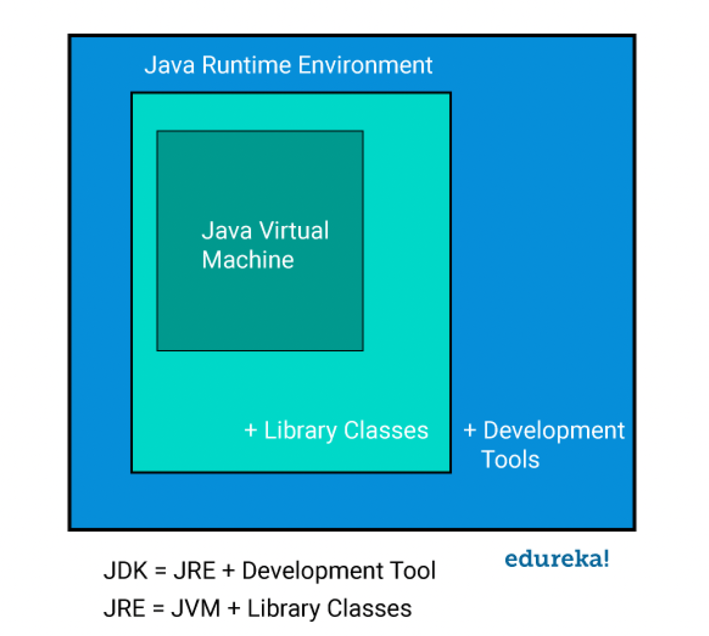

# Introduction to Java

===================================================================================================

Java is a popular, versatile, and object-oriented programming language first released by Sun Microsystems in 1995. It's designed to be platform-independent, following the principle of "Write Once, Run Anywhere" (WORA).

#### Key features of Java:
1. Object-Oriented: Java is built around the concept of "objects" that contain data and code. This paradigm helps in organizing complex programs and promotes code reusability.
2. Platform Independence: Java code is compiled into bytecode, which can run on any device with a Java Virtual Machine (JVM), regardless of the underlying hardware and operating system.
3. Robustness: Java's strong type checking, exception handling, and automatic memory management (garbage collection) make it a robust language for developing error-free, reliable applications.
4. Security: Java is designed with security in mind, making it suitable for developing systems that require a high level of security, such as banking applications.
5. Multithreading: Java provides built-in support for multithreaded programming, allowing developers to create efficient, concurrent applications.
6. Rich Standard Library: Java comes with a comprehensive set of standard libraries that provide ready-to-use functions for various programming tasks.


#### Here's a concise list of major Java versions released so far:
```
JDK 1.0 (1996)
JDK 1.1 (1997)
J2SE 1.2 (1998)
J2SE 1.3 (2000)
J2SE 1.4 (2002)
J2SE 5.0 (2004)
Java SE 6 (2006)
Java SE 7 (2011)
Java SE 8 (LTS) (2014)
Java SE 9 (2017)
Java SE 10 (2018)
Java SE 11 (LTS) (2018)
Java SE 12 (2019)
Java SE 13 (2019)
Java SE 14 (2020)
Java SE 15 (2020)
Java SE 16 (2021)
Java SE 17 (LTS) (2021)
Java SE 18 (2022)
Java SE 19 (2022)
Java SE 20 (2023)
Java SE 21 (LTS) (2023)
```

# Java Architecture

===================================================================================================

Java architecture consists of several components that work together to enable the "Write Once, Run Anywhere" principle. The main components are:

1. Java Development Kit (JDK)
2. Java Runtime Environment (JRE)
3. Java Virtual Machine (JVM)

Let's explore each of these in detail:

### 1. Java Development Kit (JDK)

The JDK is a software development environment used for developing Java applications. It includes:

#### a) Java Compiler (javac)
- Converts Java source code (.java files) into Java bytecode (.class files).
- Usage: `javac MyProgram.java`

#### b) Java Runtime Environment (JRE)
- Necessary for running Java applications.

#### c) Development Tools
- **javadoc:** Generates HTML documentation from Java source code.
- **jar:** Creates and manages JAR (Java Archive) files.
- **jdb:** Java Debugger for finding and fixing bugs in Java programs.

#### 2. Java Runtime Environment (JRE)

The JRE is the runtime environment in which Java programs run. It contains:

#### a) Java Virtual Machine (JVM)
- The core component that runs Java bytecode.

#### b) Java Class Libraries
- A set of standard libraries providing common programming functions.

#### c) Java Class Loader
- Loads Java classes and interfaces.

### 3. Java Virtual Machine (JVM)

The JVM is an abstract computing machine that enables a computer to run a Java program. It has several components:

#### a) Class Loader Subsystem
- **Bootstrap Class Loader:** Loads core Java libraries.
- **Extension Class Loader:** Loads classes from ext directory.
- **Application Class Loader:** Loads classes from the application classpath.

#### b) Runtime Data Areas
- **Method Area:** Stores class structures, methods, and constants.
- **Heap:** Runtime data area where objects are allocated.
- **Java Stacks:** Stores local variables and partial results.
- **PC Registers:** Stores the address of the current executing instruction.
- **Native Method Stacks:** Used for native methods.

#### c) Execution Engine
- **Interpreter:** Reads bytecode and executes instructions.
- **Just-In-Time (JIT) Compiler:** Compiles frequently executed bytecode to native machine code.
- **Garbage Collector:** Automatically frees up memory by deleting unused objects.

#### d) Native Method Interface (JNI)
- Enables Java code to call and be called by native applications and libraries written in other languages like C, C++.

### Java Program Execution Flow

1. Java source code (.java file) is written by the programmer.
2. The Java compiler (javac) compiles the source code into bytecode (.class file).
3. The bytecode is loaded into memory by the Class Loader.
4. The bytecode verifier checks the code for any security violations.
5. The JVM interpreter reads the bytecode and executes it.
6. For frequently used code, the JIT compiler compiles bytecode to native machine code for faster execution.

### Key Points

- Java's architecture ensures platform independence.
- The JVM acts as a layer between the compiled Java program and the operating system.
- The JIT compiler significantly improves performance by converting bytecode to native machine code.
- Automatic memory management through garbage collection reduces the risk of memory leaks.

# Installation

===================================================================================================
### Windows
#### a) Download JDK:

- Go to the official Oracle website or adopt OpenJDK website.
- Choose the latest JDK version for Windows.
- Download the installer (.exe file).

#### b) Install JDK:

- Run the downloaded installer.
- Follow the installation wizard, selecting the installation directory.
- Let the installer set the PATH variable.

#### c) Set environment variables:

```
JAVA_HOME = "C:\Program Files\Java\jdk-21"
path = %JAVA_HOME%\bin
```
#### d) Verify installation:
- Open Command Prompt.
- Type "java -version" and "javac -version" to check if Java is correctly installed.

### MAC

#### a) Download JDK:

- Visit the official Oracle website or adopt OpenJDK website.
- Download the macOS .dmg file for the latest JDK version.

#### b) Install JDK:

- Open the downloaded .dmg file.
- Double-click the .pkg file inside and follow the installation wizard.

#### c) Set environment variables:

- Open Terminal.
- Edit your shell profile file (.bash_profile, .zshrc, etc.) using a text editor.

open profile file `nano ~/.zshrc`
Add following
```
export JAVA_HOME="/Library/Java/JavaVirtualMachines/jdk-21.jdk/Contents/Home"
export PATH=$JAVA_HOME/bin:$PATH
```
Save the file and run `source ~/.zshrc` (or your corresponding profile file).

#### d) Verify installation:

In Terminal, type `java -version` and `javac -version`.

### Linux (Ubuntu/Debian):
Update package index: `sudo apt update`

Install OpenJDK:`sudo apt install default-jdk`

Set environment variables:
- Open Terminal.
- Edit your shell profile file (.bashrc, .zshrc, etc.) using a text editor and Add these lines.
```
export JAVA_HOME=$(readlink -f /usr/bin/java | sed "s:bin/java::")
export PATH=$JAVA_HOME/bin:$PATH
```
Save the file and run `source ~/.bashrc` (or your corresponding profile file).

#### d) Verify installation:

In Terminal, type `java -version` and `javac -version`.

# Basic Structure of Program
```
public class Demo
{
public static void main(String args[])
{
System.out.println("This is my first program");
}
}
```

### Every program has 3 main parts

1. **Class Declaration**
    - Example:
        ```
        public class Sample
        public class Demo
        ```
    - It consists of 3 things:
        1. **Access Modifier**: It indicates whether the program is accessible to other users or not.
            - There are 4 access modifiers in Java: `public`, `private`, `protected`, and `default`.
            - In the above section, the class is public, so it is freely accessible.
            - All access modifiers are in lowercase.
        2. **Class**: `class` is a keyword (reserved word or predefined word) in Java.
            - Every program must start with the `class` keyword.
            - All keywords must start with a lowercase letter, so `class` starts with a small "c".
        3. **Class Name**: Every class has a name, i.e., class name, program name, or file name.
            - The class name for standard should start with a capital letter.
            - The Java file name and class name must be the same for remembering purposes.
            - The class name can only be a combination of A-Z, a-z, 0-9, $, _.
            - Note: `{}` ----> scope of class.

2. **Defining Main Method**
    - Example:
        ```
        public static void main(String args[])
        {
            // LOGIC OF APP
        }
        ```
    - It consists of 5 parts:
        1. **Access Modifier**
        2. **Non-Access Modifier**
        3. **Return Type**
        4. **Method Name**
        5. **Command Line Arguments**

    1. **Access Modifier**
        - `public`:
            - `main()` is public so that it is accessible to everyone freely.

    2. **Non-Access Modifier**
        - We have 4 types of NAM: `static`, `non-static`, `final`, & `abstract`.
        - `static`: Method is accessible without object creation.
        - `non-static`: Method is accessible with object creation.

    3. **Return Type**
        - `void`: It indicates that the method is not going to return any value.

    4. **Method Name**
        - If any word contains `()`, we can identify it as a method.
        - Example: `main()`, `run()`, `display()`, etc.
        - `main` is the name of the method.

    5. **Command Line Arguments**
        - `String args[]`
            - Theoretically, we will call it as string arguments of array.
            - `String` - "S" is capital (predefined class).
            - This statement can be written in 3 ways:
                1. `String args[]`
                2. `String []args`
                3. `String[] args`
            - Note: In the syntax of the main method, only "String" starts with a capital letter, remaining all words start with small letters.

3. **Third Part - Printing Statement**
    - ```
      System.out.println("This is my sample program");
      ```
    - `System`: It is a predefined class.
    - `out`: It is an object (predefined).
    - `println()`: It is a method (predefined).
    - In simple terms, `println()` is accessed through the `out` object, but the `out` object is present in the `System` class.
    - `System` is a class that contains the `out` object, and the `out` object is referring to `println()`.
    - Whatever we give in double quotes, that message will be printed as it is.
    - variations in printing message
      println()--->print next message in new line.
      print() --->print next message in same line

# Comments

===================================================================================================

Comments in Java are used to add explanatory notes or disable code temporarily. They are ignored by the compiler and don't affect the program's execution. Java supports three types of comments:

## 1. Single-line Comments

- Start with two forward slashes (`//`)
- Everything after `//` on that line is treated as a comment

Example:
```java
// This is a single-line comment
int x = 5; // This comment is at the end of a line of code
```
## 2. Multi-line Comments

- Start with `/*`and end with `*/`
- Can span multiple lines
- Useful for longer explanations or commenting out blocks of code

Example:
```java
/* This is a multi-line comment.
   It can span several lines.
   Useful for longer explanations. */
int y = 10;
```

## 3. Javadoc Comments

- Start with `/**` and end with `*/`
- Used to generate documentation for Java code
- Can include special tags for formatting and linking

Example:
```java
/**
 * This is a Javadoc comment.
 * @param args command line arguments
 * @return void
 */
public static void main(String[] args) {
    // Method body
}
```

## More Examples
```
// Calculate age based on birth year
int age = currentYear - birthYear;

/* 
 * This algorithm uses the Sieve of Eratosthenes to find prime numbers.
 * Time complexity: O(n log log n)
 */

/**
 * Sorts the array using quicksort algorithm.
 * @param arr the array to be sorted
 * @param low starting index
 * @param high ending index
 */
public void quickSort(int[] arr, int low, int high) {
    // Method implementation
}

// TODO: Implement input validation for user data
```

## Data Types and Variables

===================================================================================================
### Data
Any information is called data.
- **Examples:** name, age, height, marks, percentage, salary, etc.

### Data Types
Defines the type of data.
- Divided into 2 types:
    1. Primitive (System-defined)
    2. Non-primitive (User-defined)

### Primitive Data Types
- These are system-defined data types.
- They have fixed memory sizes.
- There are 8 primitive data types:

| Name    | Size     | Examples                            | Default Values |
|---------|----------|-------------------------------------|----------------|
| byte    | 1 byte   | 10, 2, 5 (127 is max)               | 0              |
| boolean | 1 byte or no size | true or false              | false          |
| short   | 2 bytes  | 100, 220 (32,768 is max)            | 0              |
| char    | 2 bytes  | A, a, ...                           | empty space    |
| int     | 4 bytes  | 1, 2, 777 (2,147,483,647 is max)    | 0              |
| float   | 4 bytes  | 0.2, 0.3, 33.666...                 | 0.0            |
| long    | 8 bytes  | 33333333, 6565655...                | 0              |
| double  | 8 bytes  | 0.343434343, 99.5555555...          | 0.0            |

**Notes:**
- When 4-6 digits of accuracy are needed, use `float`; otherwise, use `double`.
- For values exceeding 32 bits in `long`, append `l` to the value.
    - **Example:** `long contact = 9878674534l;`

### Non-primitive Data Types
- These do not have fixed memory sizes.

**Examples:**

- **String:** Represents a group of characters.
    - **Example:** "java", "manual testing"
- **Arrays:**
    - **Example:** `{10, 20, ... 100}`

### Variables:

Variables are used to store the data for printing or using it in future.
#### 1.Variable Declaration

- Syntax for dec a variable is `AccessModifier Datatype variablename;`

Ex:
- public int a;
- public float b;
- public char ch;
- public String s;

variable name can be a combination of a-z,A-Z,0-9,$ and _.

Whenever we declare a variable one memory block will get created

#### 2. Variable Initialisation

Syntax: `Variablename=value;`

- a=100;
- b=0.3333f;//mandatory to write f
- ch='A';//mandatory to give ''
- s="java";//mandatory to give ""

WE CAN DECLARE AND INITIALISE A VARIABLE IN SINGLE STATEMENT ALSO.

syntax: `Access Modifier Datatype varname=value;`

public int a=22;

#### Examples

1. int a=22,b=33;//valid
2. int a=33,b;//valid
3. float percentage=60.0;//invalid- f is missing
4. char ch='AB';//invalid-character can't be more than one char
5. float h=100f;//valid--100.0
6. int i=0.334;//invalid--integer can't store decimal values
7. String s="123";//valid--->System.out.println("123");
8. String d="3334+ghijk"//valid
9. double marks=100.3434d//valid---->in double d is optional
10. long number=93939393939l//valid---> in long l is optional

# Operations in Java

===================================================================================================

Java supports various types of operations that can be performed on variables and values. These operations are fundamental to programming and allow you to manipulate data in your programs.

## 1. Arithmetic Operations

Arithmetic operations are used for mathematical calculations.

### Basic Arithmetic Operators:
- Addition (`+`)
- Subtraction (`-`)
- Multiplication (`*`)
- Division (`/`)
- Modulus (`%`) - returns the remainder of a division

```
int a = 10, b = 3;
System.out.println(a + b);  // 13
System.out.println(a - b);  // 7
System.out.println(a * b);  // 30
System.out.println(a / b);  // 3 (integer division)
System.out.println(a % b);  // 1
```

#### Addition
1. `int + int` (int/float/double/long/char/short/byte)
2. `char + char` (int/float/double/long/char/short/byte)


Java provides Unicode values for every character:
- A-65, B-66, C-67, ..., Z-90
- a-97, b-98, c-99, ..., z-122

### Examples
```
'A' + 65  // 65 + 65 --> 130
'a' + 'Z' // 97 + 90 --> 187

char ch = 65;
System.out.println(ch); // A
```
#### Concatenation
If any one operand is a String, the + operator will always act as concatenation.
```
String s = "java";
int a = 123;
System.out.println(s + a); // java123
System.out.println("I am " + s + " developer"); // I am java developer

// After concatenation, the result will always be a string.
System.out.println(123 + " "); // "123"
```

## 2. Relational Operations
Relational operations compare two values and return a boolean result.

- Equal to (==)
- Not equal to (!=)
- Greater than (>)
- Less than (<)
- Greater than or equal to (>=)
- Less than or equal to (<=)

```
int p = 5, q = 10;
System.out.println(p == q);  // false
System.out.println(p != q);  // true
System.out.println(p > q);   // false
System.out.println(p < q);   // true
System.out.println(p >= q);  // false
System.out.println(p <= q);  // true
```

## 3. Logical Operators

#### AND

- It compares two inputs, and if both inputs are true, then the output is true; otherwise, the output is false.
- It is represented as `&&` (in the examples below, 0 indicates false, and 1 indicates true).

| a | b | a && b |
|---|---|--------|
| 0 | 0 | 0      |
| 0 | 1 | 0      |
| 1 | 0 | 0      |
| 1 | 1 | 1      |

#### OR

- It compares two inputs, and if any one input is true, then the output is true; otherwise, the output is false.
- It is represented as `||` (in the examples below, 0 indicates false, and 1 indicates true).

| a | b | a \|\| b |
|---|---|--------|
| 0 | 0 | 0      |
| 0 | 1 | 1      |
| 1 | 0 | 1      |
| 1 | 1 | 1      |

### NOT

- It inverts the input value.

| input | output |
|-------|--------|
| 0     | 1      |
| 1     | 0      |

## 4. Bitwise Operators

Bitwise operators in Java are used to perform bit-level operations on integer types like `int` and `long`. They operate directly on the binary representation of the numbers. Here is a list of the bitwise operators available in Java:


1. **AND (`&`)**: Performs a bitwise AND operation. Each bit of the output is `1` if the corresponding bits of both operands are `1`; otherwise, it's `0`.  
   ```
   int a = 5;  // 0101 in binary
   int b = 3;  // 0011 in binary 
   int result = a & b;  // result is 1 (0001 in binary)
   ```

2. **OR (`|`)**: Performs a bitwise OR operation. Each bit of the output is `1` if at least one of the corresponding bits of the operands is `1`; otherwise, it's `0`.  
   ```
   int a = 5;  // 0101 in binary  
   int b = 3;  // 0011 in binary
   int result = a | b;  // result is 7 (0111 in binary)
   ```

3. **XOR (`^`)**: Performs a bitwise exclusive OR operation. Each bit of the output is `1` if the corresponding bits of the operands are different; otherwise, it's `0`.  
   ```
   int a = 5;  // 0101 in binary 
   int b = 3;  // 0011 in binary  
   int result = a ^ b;  // result is 6 (0110 in binary)
   ```

4. **Complement (`~`)**: Performs a bitwise NOT operation (unary operator). It inverts all the bits of the operand.  
   ```
   int a = 5;  // 0101 in binary  
   int result = ~a;  // result is -6 (in binary, it is represented as the two's complement)
   ```

## Shift Operators

1. **Left Shift (`<<`)**: Shifts the bits of the number to the left by a specified number of positions, filling `0` on the right. Equivalent to multiplying by `2` for each shift.  
   ```
   int a = 5;  // 0101 in binary`  
   int result = a << 1;  // result is 10 (1010 in binary)
   ```

2. **Right Shift (`>>`)**: Shifts the bits of the number to the right by a specified number of positions. The sign bit is preserved (sign-extended).  
   ```
    int a = 5;  // 0101 in binary  
    int result = a >> 1;  // result is 2 (0010 in binary)
   ```

3. **Unsigned Right Shift (`>>>`)**: Shifts the bits of the number to the right by a specified number of positions. Zeros are filled in from the left, regardless of the sign.  
   ```
   int a = -5;  // In binary, it is a negative number  
   int result = a >>> 1;  // The result is a large positive number due to zero-fill
   ```

## Summary Table

| Operator | Description                          |
|----------|--------------------------------------|
| `&`      | Bitwise AND                          |
| `\|`     | Bitwise OR                           |
| `^`      | Bitwise XOR                          |
| `~`      | Bitwise Complement (NOT)             |
| `<<`     | Left Shift                           |
| `>>`     | Right Shift (Sign-extended)          |
| `>>>`    | Unsigned Right Shift (Zero-fill)     |


## 5. Assignment Operations
Assignment operations assign values to variables.

- Simple assignment (=)
- Add and assign (+=)
- Subtract and assign (-=)
- Multiply and assign (*=)
- Divide and assign (/=)
- Modulus and assign (%=)
```
int a = 10;
a += 5;  // a is now 15
a -= 3;  // a is now 12
a *= 2;  // a is now 24
a /= 4;  // a is now 6
a %= 4;  // a is now 2
```
## 6. Unary Operators

## 1. Increment Operator

- It increases the value by one.  
  For example: `a = 10;` incrementing `a` adds `+1` to `a`.
- It is denoted as `++`.
- It has two types:
    1. **Pre-increment**
    2. **Post-increment**

## 2. Decrement Operator

- It decreases the value by one.
- It is denoted as `--`.
- It has two types:
    1. **Pre-decrement**
    2. **Post-decrement**

## Types

### Pre-Increment

- The rule is: first increment the value, then print or assign it or store it in a variable.
- It is denoted as `++variablename`.

**Examples:**

- `int a = 10;`  
  `int b = ++a; // pre-increment`

- `int a = 250;`  
  `int b = ++a; // a is increased by 1 and then 251 is stored in b`

- `int a = 50;` 
  `++a; // 50 + 1`  
  `System.out.println(a); // 51`

### Post-Increment

- The rule is: first print or assign it or store it in a variable, then increment the value.
- It is denoted as `variablename++`.

**Examples:**

- `int a = 10;` // 11  
  `int b = a++; // post increment`  
  `System.out.println(b); // 10`

### Pre-Decrement

- The rule is: first decrement the value, then print or assign it or store it in a variable.
- It is denoted as `--variablename`.

**Examples:**

- `int a = 10;`  
  `int b = --a; // pre-decrement`

- `int a = 250;`  
  `int b = --a; // a is decreased by 1 and then 249 is stored in b`

- `int a = 50;` // 49  
  `--a; // 50 - 1`  
  `System.out.println(a); // 49`

### Post-Decrement

- The rule is: first print or assign it or store it in a variable, then decrement the value.
- It is denoted as `variablename--`.

**Examples:**

- `int a = 10;` // 9  
  `int b = a--; // post decrement`  
  `System.out.println(b); // 10`

## Exercise

```
int a = 100; // 101 // 102
System.out.println(++a + a++); // 101 + 101 --> 202

int a = 50; // 51 // 52 // 51 // 50
System.out.println(a++ + ++a + a-- + --a); // 50 + 52 + 52 + 50 -----> 204

int a = 22; // 21 // 20 // 21 // 22
System.out.println(--a - a-- - a++ - ++a); // 21 - 21 - 20 - 22 -----> -42

```

## 6. Conditional (Ternary) Operator
The conditional operator is a shorthand way of writing an if-else statement.

**Syntax:** `condition ? expression1 : expression2`

```
int x = 5, y = 10;
int max = (x > y) ? x : y;
System.out.println(max);  // 10
```
## Operator Precedence
Java follows a specific order of precedence for operations. When multiple operations appear in an expression, operations with higher precedence are evaluated first.
Here's a simplified precedence order (from highest to lowest):

- Parentheses ()
- Unary operators (++, --, !, ~)
- Multiplicative (*, /, %)
- Additive (+, -)
- Shift (<<, >>, >>>)
- Relational (<, >, <=, >=, instanceof)
- Equality (==, !=)
- Bitwise AND (&)
- Bitwise XOR (^)
- Bitwise OR (|)
- Logical AND (&&)
- Logical OR (||)
- Ternary (?:)
- Assignment (=, +=, -=, etc.)

## Keywords in Java

- These are reserved words or predefined words that have some specific meaning.
- Various keywords in Java are categorized as follows:

### 1. Accessible Keywords

`public`, `private`, `protected`, `static`, `final`, `abstract`, `return`.

### 2. Conditional Keywords

`if`, `else`, `else if`, `switch`, `case`, `break`, `continue`, `goto`, `const`, `default`.

### 3. Iterative Keywords

`for`, `while`, `do while`.

### 4. Class Level Keywords

`class`, `package`, `import`, `extends`, `implements`.

### 5. Exception Level Keywords

`try`, `catch`, `throw`, `throws`, `finally`.

### 6. Other Keywords

`volatile`, `transient`, `synchronized`, `native`, etc.

#### Note

1. In Java, there is no keyword called `default` as an access modifier, but its meaning is there.  
   **Example:** `class A` — here, the access modifier is `default`.

2. There is no keyword as `non-static`, but its meaning is there.  
   **Example:** `public void run()` — here, `run()` is `non-static` by default.

3. 3.*All keywords must starts with smaller case

## Identifiers in Java

- Identifiers are names given by the programmer as per convention.  
  **Examples:** Class names, variable names, method names, and package names.

### Rules for Defining Identifiers

1. An identifier can be a combination of `A-Z`, `a-z`, `0-9`, `$`, and `_`, but the standard is:
    - **Class name:** Starts with a capital letter.
    - **Variable name:** Starts with a small letter.
    - **Method name:** Starts with a small letter.
    - **Package name:** Starts with a small letter.

2. If an identifier contains more than one word, spaces are not allowed.  
   **Examples:**
    - `class My Program` — **Invalid**
    - `int my age` — **Invalid**
    - `public static void display details()` — **Invalid**
    - `class MyProgram` — **Valid**
    - `int mypercentage` — **Valid**

3. An identifier cannot start with a digit.  
   **Examples:**
    - `class 1A` — **Invalid**
    - `int 10a;` — **Invalid**
    - `class A1` — **Valid**
    - `int a10` — **Valid**

4. If a class name contains more than one word, the first letter of each word should be capitalized.  
   **Example:** `class MyFirstProgram`

5. If a method name or variable name contains more than one word, the first letter of the second and subsequent words should be capitalized.  
   **Examples:**
    - `int myAge;`
    - `public static void displayDetails()`

# Conditional Statements in Java

## What are Conditional Statements?

Conditional statements are used to control the flow of execution based on a condition.

* If the condition is **true**, one block of code executes.
* If the condition is **false**, another block may execute.

---

# Type 1: if – else Statement

### Syntax

```java
if(condition)
{
    // Statements
}
else
{
    // Statements
}
```

### Notes

* `else` is optional.
* The condition must return a **boolean** value (`true` or `false`).
* If there is only one statement inside `if` or `else`, braces `{}` can be omitted.
* When the `if` condition is true, the `else` block is skipped.

---

## Example 1: Check whether 10 and 20 are equal

```java
public class Test {
    public static void main(String[] args) {
        if (10 == 20) {
            System.out.println("Equal");
        } else {
            System.out.println("Not Equal");
        }
    }
}
```

**Output:**

```
Not Equal
```

---

## Example 2: Check whether 10 is positive or negative

```java
public class Test {
    public static void main(String[] args) {
        int num = 10;

        if (num > 0) {
            System.out.println("Positive Number");
        } else {
            System.out.println("Negative Number");
        }
    }
}
```

---

## Example 3: Check voting eligibility

```java
public class Test {
    public static void main(String[] args) {
        int age = 21;

        if (age >= 18) {
            System.out.println("Eligible to Vote");
        } else {
            System.out.println("Not Eligible to Vote");
        }
    }
}
```

---

## Example 4: Check whether 22 is divisible by 4

```java
public class Test {
    public static void main(String[] args) {
        int num = 22;

        if (num % 4 == 0) {
            System.out.println("Divisible by 4");
        } else {
            System.out.println("Not Divisible by 4");
        }
    }
}
```

---

## Example 5: Check whether 32 is even

```java
public class Test {
    public static void main(String[] args) {
        int num = 32;

        if (num % 2 == 0) {
            System.out.println("Even Number");
        } else {
            System.out.println("Odd Number");
        }
    }
}
```

---

# Type 2: if – else if – else Ladder

Used when multiple conditions need to be checked.

### Syntax

```java
if(condition1)
{
    // statements
}
else if(condition2)
{
    // statements
}
else if(condition3)
{
    // statements
}
else
{
    // statements
}
```

---

## Example: Greatest of Three Numbers

```java
public class Test {
    public static void main(String[] args) {
        int a = 10, b = 27, c = 6;

        if (a > b && a > c) {
            System.out.println("A is Greatest");
        }
        else if (b > a && b > c) {
            System.out.println("B is Greatest");
        }
        else {
            System.out.println("C is Greatest");
        }
    }
}
```

**Output:**

```
B is Greatest
```

---

# Type 3: Using Logical Operators

Logical operators combine multiple conditions.

### Syntax

```java
if(condition1 && condition2)
{
    // statements
}
else
{
    // statements
}
```

---

## Example 1: Marriage Eligibility

```java
public class Test {
    public static void main(String[] args) {
        int boyAge = 25;
        int girlAge = 21;

        if (boyAge >= 21 && girlAge >= 18) {
            System.out.println("Eligible for Marriage");
        } else {
            System.out.println("Not Eligible for Marriage");
        }
    }
}
```

---

## Example 2: Check whether 10 is divisible by both 2 and 4

```java
public class Test {
    public static void main(String[] args) {
        int num = 10;

        if (num % 2 == 0 && num % 4 == 0) {
            System.out.println("Divisible by both 2 and 4");
        } else {
            System.out.println("Not Divisible by both 2 and 4");
        }
    }
}
```

---

## Example 3: Check whether 8 is divisible by either 3 or 4

```java
public class Test {
    public static void main(String[] args) {
        int num = 8;

        if (num % 3 == 0 || num % 4 == 0) {
            System.out.println("Divisible by 3 or 4");
        } else {
            System.out.println("Not Divisible by 3 or 4");
        }
    }
}
```

---


