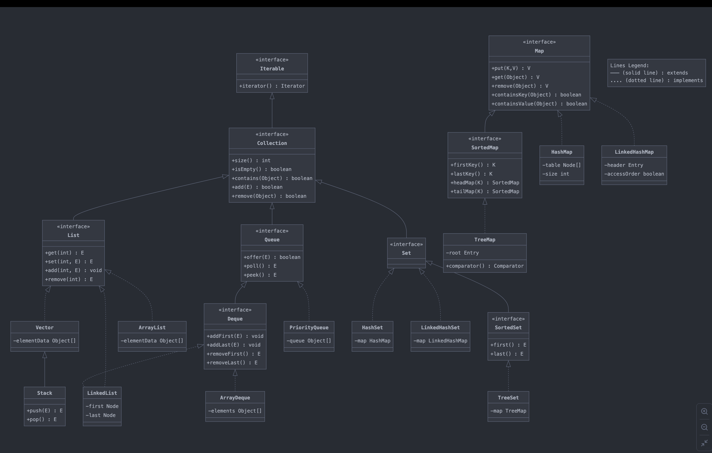

# Collection

- Java Collection means a single unit of objects.
- The Collection in Java is a framework that provides an architecture to store and manipulate the group of objects.
- Java Collections can achieve all the operations that you perform on a data such as searching, sorting, insertion, manipulation, and deletion.

## What is Collection framework

The Collection framework represents a unified architecture for storing and manipulating a group of objects. It has:
Interfaces and its implementations, i.e., classes
and Algorithm.

# Hierarchy of Collection Framework

