# TypeScript Overview

TypeScript is an open-source, object-oriented programming language developed and maintained by Microsoft Corporation. Its journey began in 2012, and since then, it has gained significant traction in the developer community. As a strict superset of JavaScript, TypeScript allows any JavaScript code to be valid TypeScript code while introducing enhanced features. TypeScript code is compiled into JavaScript, making it easy to integrate into JavaScript projects. It is primarily designed for large-scale applications.

## Key Features of TypeScript

1. **Static Type Checking (Optional)**

   - TypeScript allows you to check and assign types to variables, parameters, and function return values. This optional static typing improves code quality, prevents bugs, and enhances readability.

2. **Class-Based Objects**

   - TypeScript supports true object-oriented programming with classes, constructors, inheritance, and access modifiers (public, private, protected), unlike JavaScript’s prototype-based approach.

3. **Modularity**

   - TypeScript promotes modularity, allowing you to organize code into smaller, reusable pieces. This enhances maintainability and facilitates collaboration among team members.

4. **ES6 Features**

   - TypeScript embraces ECMAScript 6 (ES6) features such as arrow functions, template literals, and destructuring, making it familiar to developers who use ES6 syntax.

5. **Syntactical Sugaring**
   - The syntax of TypeScript is closer to high-level languages like Java, offering a more concise and expressive coding experience.

## Structure of TypeScript

TypeScript code cannot be directly interpreted by browsers; it must be compiled into plain JavaScript. This is achieved using the TypeScript Compiler (tsc).

### TypeScript Compiler (tsc)

- Written in TypeScript itself.
- Compiles `.ts` files to `.js` files.
- Installed as an NPM package (Node.js).
- Supports ES6 syntax.

## TypeScript vs. JavaScript

| Feature                 | TypeScript                    | JavaScript                     |
| ----------------------- | ----------------------------- | ------------------------------ |
| Language Type           | Object-oriented (class-based) | Object-based (prototype-based) |
| Typing System           | Statically typed              | Dynamically typed              |
| Module Support          | Supports modules              | Does not support modules       |
| Error Detection         | Provides compile-time errors  | No compile-time errors         |
| Compilation Requirement | Requires compilation          | No need for compilation        |

## Why TypeScript is Gaining Popularity

Initially, JavaScript was designed for lightweight, simple DOM manipulations. As web applications became more complex, developers sought more robust tools. TypeScript addresses these needs:

- **Classes and Objects:** Simplifies implementing object-oriented concepts, making code easier to reason about and maintain.
- **Frameworks and Libraries:** Its adoption by popular frameworks like Angular has significantly contributed to its popularity, enabling developers to write cleaner and safer code.

## Why Do We Use TypeScript?

- **Better Developer Experience:** TypeScript enhances IDE capabilities, allowing for richer error spotting and better auto-completion as you write code, particularly beneficial for large-scale projects.
- **Code Quality:** Defining data structures and using types and interfaces from the outset encourages better design decisions regarding app data structures.
- **Prevents Bugs:** While not eliminating bugs entirely, TypeScript helps prevent many type-related errors. IntelliSense and debugging support through source maps further enhance the developer experience.
- **Active Community:** TypeScript is increasingly popular among leading tech companies like Google, Airbnb, Shopify, Asana, Adobe, and Mozilla, indicating its scalability for large and complex applications.

TypeScript starts with JavaScript and ends with JavaScript. It adopts JavaScript's basic building blocks, and all TypeScript code is converted into its JavaScript equivalent for execution.

---

# Why TypeScript?

While JavaScript’s flexibility shines in quick prototyping, large-scale projects benefit from the structure and predictability that TypeScript offers. Here’s when TypeScript excels:

1. **Large-Scale Web Applications**

   - TypeScript’s static typing fosters better organization and collaboration in complex projects.

2. **Enterprise Applications**

   - The robust error checking and code clarity improve reliability and maintainability in critical systems.

3. **Front-End Frameworks**

   - Many popular frameworks, such as Angular and React, embrace TypeScript for its type safety advantages.

4. **Improved Readability**

   - Clear type annotations in TypeScript enhance code readability. Developers can easily understand the purpose of variables and functions, leading to better collaboration and maintainability.

5. **Deepening JavaScript Understanding**

   - Even if you don’t use TypeScript extensively, learning it deepens your understanding of JavaScript. You can appreciate language features and their impact on code quality, whether you’re writing TypeScript or plain JavaScript.

6. **Robust Software Development**
   - TypeScript won’t make your software bug-free, but it can prevent many type-related errors. For large-scale projects, adopting TypeScript results in more robust software that is still deployable where regular JavaScript applications run.

## Text Editors with TypeScript Support

- **Visual Studio Code** with the TypeScript extension
- **WebStorm**
- **Sublime Text** with the Anaconda plugin

---

## Setting Up the Development Environment

Run this command in your terminal to installing the package globally so we can access the typescript compiller in every folder.

```bash
sudo npm i -g typescript
```

Now, to verify the installation run this command

```bash
tsc -v
```

## Configuring Basic TypeScript Compiler

To creating configuration file for TypeScript compiler in the Terminal

```bash
tsc --init
```

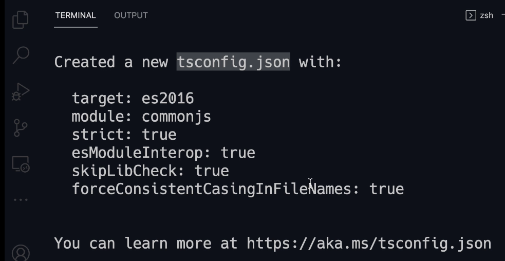

Uncomment this `rootDir` line in the **Module** section to specify the Root.
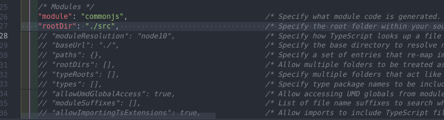

And move on to the **Emit** section, Uncomment `outDir` to specify an output folder for all emitted files.
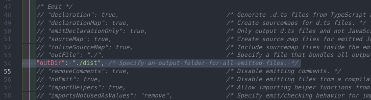

Our JavaScript files going to be stored in `/dist` folder.

Next, enable `removeComments` to remove all the comments that we add in our typescript code and `noEmitOnError` to disable emitting files if any type checking errors are reported so if we have any mistakes in our code the typescript compiler is not going to generate any **JavaScript** files.

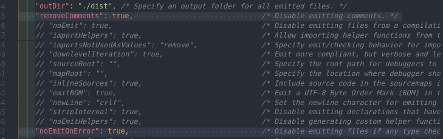

Then run this command in order to run the compiler

```bash
tsc
```

## Debugging TypeScript

In the `tsconfig.json` file go to the **Emit** section and enable `sourceMap`

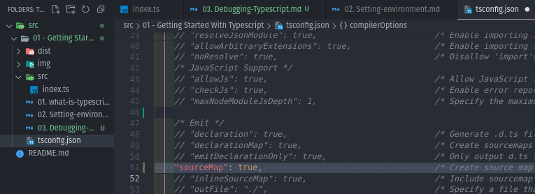

`sourceMap` is a file that specifies how each line up of **TypeScript** code maps to the generated **JavaScript**

Next, run the compiler

```bash
tsc
```

Now it'll create a `index.js.map` file inside the `./dist` folder
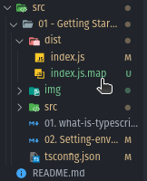

Add a breakpoint to the line of code

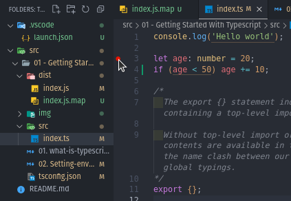

Go to the `Debug Panel` and click `create a launch.json file` then select `Node.js` in the Select environment drop down menu

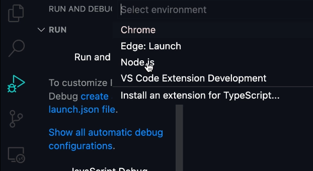

And it'll create `launch.json` file then add the `preLaunchTask` with this setting we telling VSCode to use the typescript compiler to build our application using this configuration file.
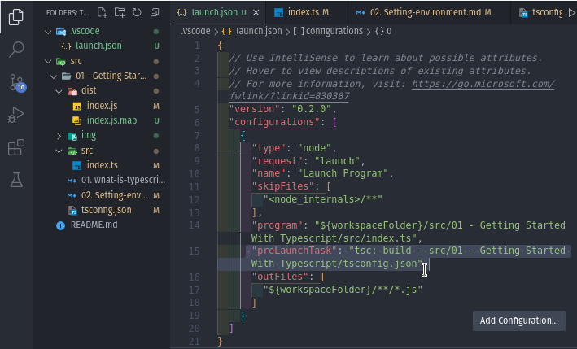

Go to the `Debug Panel` to start debugging then click `Launch Program`
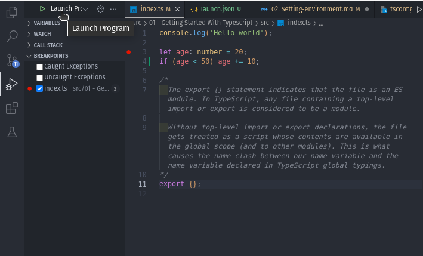

Execution will stop exactly at the line where we added the breakpoint
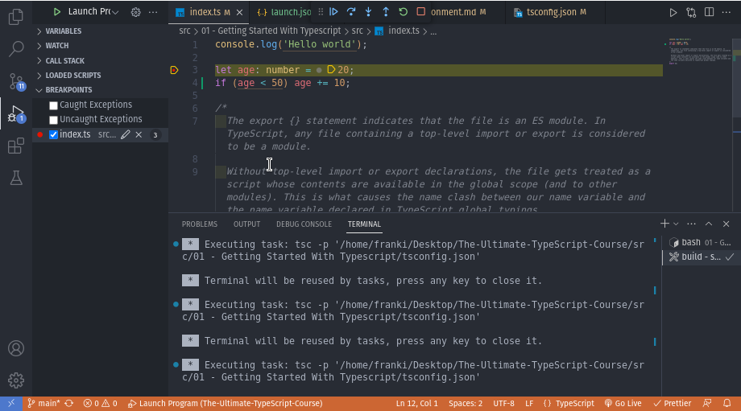

### Debugging Tools

- `Step Over` for executing one line

  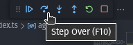

- `Step Into` for Stepping into a function

  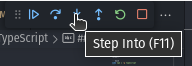

- `Step Out` for Stepping Out of a function

  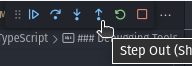

---

# Understanding Variables in TypeScript

A variable is a named place in memory where data can be stored. They act as containers for various data types, including numeric, string, boolean, and more. In this article, we’ll explore how to declare, manipulate, and utilize variables in TypeScript.

## Variable Declaration in TypeScript

### 1. var, let, and const

TypeScript offers three primary keywords for variable declaration:

- **var**: Traditionally used in JavaScript, `var` has quirks and scoping rules that can lead to unexpected behavior. Variables declared with `var` are accessible throughout their containing function, module, namespace, or global scope.

- **let**: Introduced to address the limitations of `var`, `let` provides block scoping, allowing variables to be confined to specific blocks of code (e.g., loops or conditionals). This prevents accidental redeclaration and enhances clarity.

- **const**: Similar to `let`, `const` has block scoping but prevents reassignment after initialization. Once a value is assigned to a `const` variable, it cannot be changed. Use `const` for values that should remain constant.

### 2. Naming Rules

- Variable names can contain both uppercase and lowercase letters as well as digits.
- Variable names cannot start with a digit.
- The only special characters allowed are `_` and `$`.

### 3. Ways to Declare Variables

Variables can be declared in several ways:

```typescript
var Identifier: DataType = value;
var Identifier: DataType;
var Identifier = value;
var Identifier;
```

#### Examples:

| Declaration              | Description                                                       |
| ------------------------ | ----------------------------------------------------------------- |
| `var name: number = 10;` | `name` is a variable that stores only integer type data.          |
| `var name: number;`      | `name` is a variable for integer data, defaulting to `undefined`. |
| `var name = 10;`         | The type is inferred as `number` based on the assigned value.     |
| `var name;`              | The type is inferred as `any`, defaulting to `undefined`.         |

### 4. Type Annotations

TypeScript enhances variables with type annotations, making it a strongly typed language. You can specify a variable's type explicitly:

```typescript
let name: string = "Amit";
let age: number = 25;
const country: string = "Noida";
```

### 5. Variable Scopes

Scope refers to the visibility of a variable, defining where it can be accessed. TypeScript variables can have the following scopes:

- **Local Scope**: Declared within a block (e.g., methods, loops), accessible only within that construct.
- **Global Scope**: Declared outside any construct, accessible anywhere in the code.

- **Class Scope**: Declared inside a class, accessible only within that class.

#### Example:

```typescript
let global_var: number = 10; // Global variable

class Geeks {
  geeks_var: number = 11; // Class variable
  assignNum(): void {
    let local_var: number = 12; // Local variable
  }
}

console.log("Global Variable: " + global_var);

let obj = new Geeks();
console.log("Class Variable: " + obj.geeks_var);
```

#### Output:

```
Global Variable: 10
Class Variable: 11
```

---

# What is Type Annotation in TypeScript?

TypeScript uses **type annotations** to specify explicit types for identifiers such as variables, functions, and objects. This helps enforce type safety in your code.

## Syntax of Type Annotations

Type annotations are added using the syntax `: type` after an identifier. The specified type can be any valid type.

Once an identifier is annotated with a type, it can only be used as that type. If you attempt to use it as a different type, the TypeScript compiler will issue an error.

### Type Annotations for Variables and Constants

You can specify type annotations for variables and constants using the following syntax:

```typescript
let variableName: type;
let variableName: type = value;
const constantName: type = value;
```

#### Example:

```typescript
let counter: number; // Type annotation for a variable
counter = 1; // Valid assignment

counter = "Hello"; // Compile error
// Error: Type '"Hello"' is not assignable to type 'number'.
```

You can also initialize a variable with a type annotation in a single statement:

```typescript
let counter: number = 1; // Initializes with a number type
```

### Other Primitive Type Annotations

```typescript
let name: string = "John"; // string type
let age: number = 25; // number type
let active: boolean = true; // boolean type
```

## Type Annotation Examples

### Arrays

To annotate an array type, use the syntax `type[]`:

```typescript
let names: string[] = ["John", "Jane", "Peter", "David", "Mary"]; // Array of strings
```

### Objects

To specify a type for an object, use object type annotation:

```typescript
let person: {
  name: string;
  age: number;
};

person = {
  name: "John",
  age: 25,
}; // Valid
```

### Function Arguments and Return Types

You can also annotate functions with parameter types and return types:

```typescript
let greeting: (name: string) => string;

greeting = function (name: string) {
  return `Hi ${name}`;
}; // Valid assignment

greeting = function () {
  console.log("Hello");
}; // Compile error
// Error: Type '() => void' is not assignable to type '(name: string) => string'.
```

## Summary

Use type annotations with the syntax `: type` to explicitly specify types for variables, functions, and return values, enhancing type safety in your TypeScript code.

# TypeScript Type Inference Tutorial

## Basic Type Inference

### Variable Declaration

You can explicitly annotate the type of a variable:

```typescript
let counter: number;
```

However, if you initialize `counter` with a number, TypeScript infers its type:

```typescript
let counter = 0; // inferred as number
```

This is equivalent to:

```typescript
let counter: number = 0;
```

### Function Parameters

TypeScript also infers the types of function parameters from their default values:

```typescript
function setCounter(max = 100) {
  // ...
}
```

Here, `max` is inferred as `number`.

### Return Types

The return type of a function is inferred based on the return statements:

```typescript
function increment(counter: number) {
  return counter++;
}
```

This can be explicitly annotated as:

```typescript
function increment(counter: number): number {
  return counter++;
}
```

## Best Common Type Algorithm

When inferring types for arrays, TypeScript uses the best common type algorithm. For example:

```typescript
let items = [1, 2, 3, null]; // inferred as number[]
```

If a string is added:

```typescript
let items = [0, 1, null, "Hi"]; // inferred as (number | string)[]
```

If no common type is found, TypeScript returns a union type:

```typescript
let arr = [new Date(), new RegExp("\\d+")]; // inferred as (RegExp | Date)[]
```

## Contextual Typing

TypeScript uses the context to infer types. For example:

```typescript
document.addEventListener("click", function (event) {
  console.log(event.button); // inferred as MouseEvent
});
```

Changing the event type may lead to errors:

```typescript
document.addEventListener("scroll", function (event) {
  console.log(event.button); // compiler error
});
```

This occurs because `event` is inferred as `UIEvent`, which doesn't have a `button` property.

## Type Inference vs. Type Annotations

### Differences

| Type Inference              | Type Annotations                |
| --------------------------- | ------------------------------- |
| TypeScript guesses the type | You explicitly specify the type |

### When to Use Each

- **Use type inference** whenever possible.
- **Use type annotations** in these cases:
  - When declaring a variable that will be assigned later.
  - When a variable's type cannot be inferred.
  - When a function may return `any` and you want to clarify its type.

## Summary

Type inference in TypeScript occurs during variable initialization, default parameter values, and function return types. The best common type algorithm helps in selecting compatible types, while contextual typing uses variable locations to infer types accurately. Use inference by default, and rely on annotations when necessary.

## What is a Data Type?

A **data type** is a classification that specifies which type of value a variable can hold. It defines the operations that can be performed on the data, the meaning of the data, and the way it is stored. In programming, data types help ensure that data is used consistently and correctly, allowing for better memory management, type safety, and clearer code.

### Categories of Data Types

Data types can be broadly categorized into two main groups: **Primitive Types** and **Non-Primitive Types**.

#### 1. Primitive Types

Primitive types are the basic building blocks of data. They are not objects and have no methods. In TypeScript, primitive types include:

- **Number**: Represents both integer and floating-point numbers.

  ```typescript
  let num: number = 42;
  ```

- **String**: Represents text or sequence of characters.

  ```typescript
  let str: string = "Hello";
  ```

- **Boolean**: Represents a true or false value.

  ```typescript
  let flag: boolean = true;
  ```

- **Symbol**: Represents a unique and immutable value.

  ```typescript
  let sym: symbol = Symbol("unique");
  ```

- **BigInt**: Represents integers with arbitrary precision.

  ```typescript
  let bigInt: bigint = BigInt(1234567890123456789012345678901234567890);
  ```

- **Null**: Represents the intentional absence of any value.

  ```typescript
  let n: null = null;
  ```

- **Undefined**: Represents an uninitialized variable or a variable without a value.
  ```typescript
  let u: undefined = undefined;
  ```

#### 2. Non-Primitive Types

Non-primitive types are more complex and can hold multiple values or represent more structured data. They include:

- **Object**: Represents a collection of key-value pairs.

  ```typescript
  let obj: object = { name: "Alice", age: 30 };
  ```

- **Array**: A collection of elements of the same type.

  ```typescript
  let arr: number[] = [1, 2, 3];
  ```

- **Tuple**: An array with a fixed number of elements, each of a known type.

  ```typescript
  let tuple: [string, number] = ["Alice", 30];
  ```

- **Function**: A first-class type that can be assigned to variables and passed as arguments.

  ```typescript
  let greet: (name: string) => string = (name) => `Hello, ${name}!`;
  ```

- **Enum**: A way to define named constants, improving code readability.

  ```typescript
  enum Color {
    Red,
    Green,
    Blue,
  }
  ```

- **Any**: A type that can represent any value, used for dynamic typing.

  ```typescript
  let anything: any = "could be anything";
  ```

- **Unknown**: Similar to `any`, but safer; it requires type-checking before usage.

  ```typescript
  let unknownValue: unknown = "could be anything";
  ```

- **Never**: Represents a value that never occurs, often used in functions that throw errors or loop indefinitely.

  ```typescript
  function throwError(message: string): never {
    throw new Error(message);
  }
  ```

- **Object Literals**: Custom-defined object types using interfaces or type aliases.
  ```typescript
  type Person = { name: string; age: number };
  ```

### Summary

Understanding data types and their categories is fundamental in programming, as it influences how you define variables, implement logic, and interact with data structures. By using appropriate data types, you enhance code clarity, maintainability, and reduce the likelihood of errors.

### TypeScript Number

In TypeScript, numbers can be either floating-point values or big integers. Floating-point numbers have the type `number`, while big integers have the type `bigint`.

### The `number` Type

You can declare a variable to hold a floating-point value as follows:

```typescript
let price: number;
```

You can also initialize the variable:

```typescript
let price = 9.95;
```

TypeScript supports number literals in various formats, including decimal, hexadecimal, binary, and octal.

#### Decimal Numbers

Here are some examples of decimal numbers:

```typescript
let counter: number = 0;
let x: number = 100,
  y: number = 200;
```

#### Binary Numbers

Binary numbers use a leading zero followed by a lowercase or uppercase "b" (e.g., `0b` or `0B`):

```typescript
let bin = 0b100;
let anotherBin: number = 0b010;
```

_Note: The digits must be either 0 or 1._

#### Octal Numbers

Octal numbers use a leading zero followed by the letter "o" (0o):

```typescript
let octal: number = 0o10;
```

_Note: The digits range from 0 to 7._

#### Hexadecimal Numbers

Hexadecimal numbers use a leading zero followed by a lowercase or uppercase "x" (0x or 0X):

```typescript
let hexadecimal: number = 0xa;
```

_Note: The digits must be in the range 0-9 and A-F._

### Big Integers

Big integers represent whole numbers larger than \(2^{53} - 1\). A big integer literal ends with the letter "n":

```typescript
let big: bigint = 9007199254740991n;
```

### Summary

In TypeScript, all numbers are either floating-point values (`number`) or big integers (`bigint`). It’s advisable to avoid using the `Number` type (the boxed object) whenever possible to maintain clarity and efficiency in your code.

### TypeScript String

In this tutorial, you'll learn about the TypeScript string data type.

In TypeScript, as in JavaScript, you can use double quotes (`"`) or single quotes (`'`) to define string literals:

```typescript
let firstName: string = "John";
let title: string = "Web Developer";
```

TypeScript also supports **template strings**, which use backticks (`` ` ``) to allow for multi-line strings and string interpolation features.

#### Multi-line Strings

You can create multi-line strings with backticks:

```typescript
let description = `This TypeScript string can 
span multiple 
lines`;
```

#### String Interpolation

Template strings also allow you to embed variables directly within the string:

```typescript
let firstName: string = `John`;
let title: string = `Web Developer`;
let profile: string = `I'm ${firstName}. 
I'm a ${title}`;

console.log(profile);
```

**Output:**

```
I'm John.
I'm a Web Developer.
```

### Summary

In TypeScript, all strings are of the `string` type. You can use double quotes, single quotes, or backticks to define string literals. Backticks provide additional features like multi-line strings and string interpolation, enhancing flexibility in string manipulation.

### TypeScript Boolean

In this tutorial, you will learn about the TypeScript boolean data type and how to use the `boolean` keyword.

### Introduction to the TypeScript Boolean

The TypeScript boolean type can hold two values: `true` and `false`. It is one of the primitive types in TypeScript.

### Declaring Boolean Variables

You can declare a boolean variable using the `boolean` keyword:

```typescript
let pending: boolean;
pending = true;
// after a while
pending = false;
```

### Boolean Operators

To manipulate boolean values, you can use boolean operators. TypeScript supports common boolean operators:

| Operator | Meaning              |
| -------- | -------------------- |
| `&&`     | Logical AND operator |
| `\|\|`   | Logical OR operator  |
| `!`      | Logical NOT operator |

#### Examples:

```typescript
// NOT operator
const pending: boolean = true;
const notPending = !pending; // false
console.log(notPending); // false

const hasError: boolean = false;
const completed: boolean = true;

// AND operator
let result = completed && hasError;
console.log(result); // false

// OR operator
result = completed || hasError;
console.log(result); // true
```

### Type Annotations for Boolean

You can use the `boolean` keyword to annotate boolean variables:

```typescript
let completed: boolean = true;
```

However, TypeScript often infers types automatically, so type annotations may not always be necessary:

```typescript
let completed = true;
```

You can also annotate boolean parameters or the return type of functions:

```typescript
function changeStatus(status: boolean): boolean {
  //...
}
```

### Boolean Type

JavaScript has a `Boolean` type (uppercase "B") that refers to the non-primitive boxed object. It’s generally recommended to avoid using the `Boolean` type unless absolutely necessary.

### Summary

- The TypeScript boolean type has two values: `true` and `false`.
- Use the `boolean` keyword to declare boolean variables.
- Avoid using the `Boolean` type unless you have a compelling reason to do so.

### TypeScript Object Type

### Introduction to TypeScript Object Type

The TypeScript `object` type represents all values that are not primitive types. The primitive types in TypeScript are:

- `number`
- `bigint`
- `string`
- `boolean`
- `null`
- `undefined`
- `symbol`

### Declaring an Object

You can declare a variable to hold an object as follows:

```typescript
let employee: object;

employee = {
  firstName: "John",
  lastName: "Doe",
  age: 25,
  jobTitle: "Web Developer",
};

console.log(employee);
```

**Output:**

```plaintext
{
  firstName: 'John',
  lastName: 'Doe',
  age: 25,
  jobTitle: 'Web Developer'
}
```

If you try to assign a primitive value to the `employee` object, you’ll get an error:

```typescript
employee = "Jane"; // Error: Type '"Jane"' is not assignable to type 'object'.
```

Attempting to access a property that doesn’t exist on the `employee` object will also result in an error:

```typescript
console.log(employee.hireDate); // Error: Property 'hireDate' does not exist on type 'object'.
```

This differs from JavaScript, where the code would return `undefined`.

### Specifying Object Properties

To explicitly define the properties of the `employee` object, you can declare it with a specific structure:

```typescript
let employee: {
  firstName: string;
  lastName: string;
  age: number;
  jobTitle: string;
};

employee = {
  firstName: "John",
  lastName: "Doe",
  age: 25,
  jobTitle: "Web Developer",
};
```

You can also combine the declaration and assignment in a single statement:

```typescript
let employee: {
  firstName: string;
  lastName: string;
  age: number;
  jobTitle: string;
} = {
  firstName: "John",
  lastName: "Doe",
  age: 25,
  jobTitle: "Web Developer",
};
```

### `object` vs. `Object`

TypeScript distinguishes between `object` (lowercase "o") and `Object` (uppercase "O").

- **`object`**: Represents all non-primitive values.
- **`Object`**: Describes the functionality available on all objects, such as `toString()` and `valueOf()`.

### The Empty Type `{}`

The empty type, denoted by `{}`, describes an object that has no properties on its own. Accessing a property on such an object will result in a compile-time error:

```typescript
let vacant: {};
vacant.firstName = "John"; // Error: Property 'firstName' does not exist on type '{}'.
```

However, you can access properties and methods declared on the `Object` type:

```typescript
let vacant: {} = {};
console.log(vacant.toString()); // Output: [object Object]
```

### Summary

- The TypeScript `object` type represents any value that is not a primitive.
- The `Object` type describes functionality available to all objects.
- The empty type `{}` refers to an object that has no properties on its own.

### TypeScript Array Type

### Introduction to TypeScript Array Type

A TypeScript array is an ordered list of values. To declare an array that holds values of a specific type, you can use the following syntax:

```typescript
let arrayName: type[];
```

#### Declaring an Array

For example, to declare an array of strings:

```typescript
let skills: string[] = [];
```

You can add elements to the array using indexing:

```typescript
skills[0] = "Problem Solving";
skills[1] = "Programming";
```

Or you can use the `push()` method:

```typescript
skills.push("Software Design");
```

You can also declare a variable and assign an array directly:

```typescript
let skills = ["Problem Solving", "Software Design", "Programming"];
```

In this case, TypeScript infers that `skills` is an array of strings, equivalent to:

```typescript
let skills: string[];
skills = ["Problem Solving", "Software Design", "Programming"];
```

### Type Safety

After defining an array of a specific type, TypeScript prevents adding incompatible values. For example:

```typescript
skills.push(100); // Error: Argument of type 'number' is not assignable to parameter of type 'string'.
```

### Type Inference

When you extract an element from the array, TypeScript infers its type. For example:

```typescript
let skill = skills[0];
console.log(typeof skill); // Output: string
```

### Array Properties and Methods

TypeScript arrays have the same properties and methods as JavaScript arrays. For instance, you can use the `length` property:

```typescript
let series = [1, 2, 3];
console.log(series.length); // Output: 3
```

You can also utilize useful array methods such as `forEach()`, `map()`, `reduce()`, and `filter()`. For example:

```typescript
let series = [1, 2, 3];
let doubleIt = series.map((e) => e * 2);
console.log(doubleIt); // Output: [2, 4, 6]
```

### Storing Values of Mixed Types

To define an array that holds both strings and numbers, you can use a union type:

```typescript
let scores = ["Programming", 5, "Software Design", 4];
```

TypeScript infers the `scores` array as `(string | number)[]`, which is equivalent to:

```typescript
let scores: (string | number)[];
scores = ["Programming", 5, "Software Design", 4];
```

### Summary

- In TypeScript, an array is an ordered list of values.
- Use the `let arr: type[]` syntax to declare an array of a specific type. Adding a value of a different type will result in an error.
- An array can store values of mixed types. Use the `arr: (type1 | type2)[]` syntax to declare an array that holds mixed types.

### TypeScript Tuple

### Introduction to TypeScript Tuple Type

A tuple is similar to an array but comes with specific rules:

- The number of elements in the tuple is fixed.
- The types of the elements are known and can differ from one another.

For example, you can use a tuple to represent a value as a pair of a string and a number:

```typescript
let skill: [string, number];
skill = ["Programming", 5];
```

The order of values in a tuple is significant. For instance, if you change the order of values in the `skill` tuple:

```typescript
let skill: [string, number];
skill = [5, "Programming"]; // Error: Type 'number' is not assignable to type 'string'.
```

### When to Use Tuples

It's a good practice to use tuples when you have related data that must be in a specific order. For example, you can define an RGB color that always comes in a three-number pattern (red, green, blue):

```typescript
let color: [number, number, number] = [255, 0, 0];
```

In this case, `color[0]`, `color[1]`, and `color[2]` represent the Red, Green, and Blue values, respectively.

### Optional Tuple Elements

Since TypeScript 3.0, you can define optional elements in a tuple using the question mark (`?`) postfix. This is useful when some elements may not always be present.

For example, you can define an RGBA tuple with an optional alpha channel value:

```typescript
let bgColor: [number, number, number, number?];
bgColor = [0, 255, 255, 0.5]; // Includes alpha
let headerColor: [number, number, number] = [0, 255, 255]; // No alpha
```

Here, the RGBA model defines colors using red, green, blue, and an optional alpha value that specifies the opacity of the color.

### Summary

A tuple is an array-like structure with a fixed number of elements, where the types of each element are known and can differ. This makes tuples useful for representing structured data with specific relationships.

### TypeScript Enum

### What is an Enum?

An enum (short for enumerated type) is a group of named constant values. Enums are useful for representing a fixed set of related values, making your code more readable and maintainable.

### Defining an Enum

To define an enum, use the `enum` keyword followed by the name of the enum and its constant values:

```typescript
enum name {
    constant1,
    constant2,
    ...
}
```

### Example of TypeScript Enum

Here's an example that creates an enum representing the months of the year:

```typescript
enum Month {
  Jan,
  Feb,
  Mar,
  Apr,
  May,
  Jun,
  Jul,
  Aug,
  Sep,
  Oct,
  Nov,
  Dec,
}
```

### Using Enums

You can declare a function that takes the `Month` enum as a parameter:

```typescript
function isItSummer(month: Month): boolean {
  switch (month) {
    case Month.Jun:
    case Month.Jul:
    case Month.Aug:
      return true;
    default:
      return false;
  }
}

console.log(isItSummer(Month.Jun)); // true
```

Using enum values instead of magic numbers makes your code clearer.

### How TypeScript Enums Work

Enums can accept numbers directly, allowing flexibility:

```typescript
console.log(isItSummer(6)); // true
```

The generated JavaScript code for the `Month` enum looks like this:

```javascript
var Month;
(function (Month) {
    Month[Month["Jan"] = 0] = "Jan";
    Month[Month["Feb"] = 1] = "Feb";
    ...
})(Month || (Month = {}));
```

This indicates that TypeScript enums are objects in JavaScript, with named properties and corresponding numeric values.

### Specifying Enum Members’ Numbers

By default, enums start numbering from 0. However, you can explicitly set values:

```typescript
enum Month {
  Jan = 1,
  Feb,
  Mar,
  Apr,
  May,
  Jun,
  Jul,
  Aug,
  Sep,
  Oct,
  Nov,
  Dec,
}
```

In this case, `Jan` starts at 1, and subsequent months increment from there.

### When to Use an Enum

Enums are ideal when you have a small set of closely related fixed values that are known at compile time. For example, you can use an enum for approval status:

```typescript
enum ApprovalStatus {
  draft,
  submitted,
  approved,
  rejected,
}

const request = {
  id: 1,
  status: ApprovalStatus.approved,
  description: "Please approve this request",
};

if (request.status === ApprovalStatus.approved) {
  console.log("Send email to the Applicant...");
}
```

### Summary

- A TypeScript enum is a group of constant values that enhances code readability.
- Under the hood, an enum is a JavaScript object with named properties.
- Use enums when you have a small set of related, fixed values known at compile time.

Sure! Let’s expand on the key points and provide more context to ensure a comprehensive understanding of the `any` type in TypeScript.

### TypeScript Any Type

### Introduction to TypeScript Any Type

The `any` type in TypeScript is used when you want to opt out of type-checking for a particular variable. This can be especially useful when you are working with data from sources where the type cannot be determined at compile time, such as APIs or user inputs.

### Using the Any Type

You can declare a variable with the `any` type like this:

```typescript
let result: any;

result = 1;
console.log(result); // 1

result = "Hello";
console.log(result); // Hello

result = [1, 2, 3];
const total = result.reduce((a: number, b: number) => a + b, 0);
console.log(total); // 6
```

In this example:

1. The variable `result` is declared with the type `any`.
2. It is assigned different types of values (number, string, and array).
3. The `reduce` method is called on an array stored in `result`, demonstrating its flexibility.

### Example with JSON Parsing

When working with JSON data from APIs, you might encounter the `any` type:

```typescript
const json = `{"latitude": 10.11, "longitude": 12.12}`;
const currentLocation = JSON.parse(json);
console.log(currentLocation); // { latitude: 10.11, longitude: 12.12 }

console.log(currentLocation.x); // undefined
```

In this example:

- The `currentLocation` variable is inferred as `any` due to the JSON parsing.
- Accessing a non-existing property like `x` does not raise an error; it simply returns `undefined`.

### Implicit Typing with Any

If you declare a variable without a type annotation, TypeScript infers it as `any`:

```typescript
let result; // Implicitly of type any
```

To avoid potential issues with `any`, you can disable implicit `any` types by setting the `noImplicitAny` option in your `tsconfig.json` file:

```json
{
  "compilerOptions": {
    "noImplicitAny": true
  }
}
```

### Any vs. Object

While both `any` and `object` can hold various types, they behave differently:

```typescript
let result: any;
result = 10.123;
console.log(result.toFixed()); // 10.12

result.willExist(); // No compile-time error, but will throw at runtime
```

However, if you use the `object` type, you'll encounter errors:

```typescript
let result: object;
result = 10.123; // Error: Type 'number' is not assignable to type 'object'.
result.toFixed(); // Error: Property 'toFixed' does not exist on type 'object'.
```

### Best Practices

- **Limit Usage:** Use `any` sparingly, as it can lead to less maintainable code. Instead, try to define specific types when possible.
- **Gradual Migration:** When migrating a JavaScript project to TypeScript, use `any` temporarily until you can replace it with more specific types.
- **Type Guards:** Consider using type guards to check the type of a variable before using it, helping ensure type safety.

### Summary

- The `any` type allows you to store values of any type, bypassing TypeScript's type-checking.
- Use `any` when the type of a variable is unknown at compile time or when dealing with dynamic data.
- Be cautious with `any`, as it may reduce the benefits of TypeScript's type system, leading to potential runtime errors.

### TypeScript Unknown Type

### Introduction to the TypeScript Unknown Type

In TypeScript, the `unknown` type represents a value that is not known at compile time. It is a safer alternative to the `any` type, as it requires type checking before you can perform operations on it.

### Declaring an Unknown Type

To declare a variable of the `unknown` type, use the following syntax:

```typescript
let result: unknown;
```

### Assigning Values to Unknown

You can assign any value to a variable of the `unknown` type, similar to `any`:

```typescript
let result: unknown;

result = 1;
result = "hello";
result = false;
result = Symbol();
result = { name: "John" };
result = [1, 2, 3];
```

### Type Checking with Unknown

Unlike `any`, TypeScript requires that you perform type checks before you can manipulate an `unknown` variable. For instance:

```typescript
let result: unknown;
result = [1, 2, 3];

const total = result.reduce((a: number, b: number) => a + b, 0); // Error
```

Here, attempting to call `reduce()` on `result` results in a TypeScript error because the type is `unknown`.

### Using Type Assertions

To perform operations on an `unknown` type, you can use type assertions to inform TypeScript about the specific type you are working with:

```typescript
let result: unknown;
result = [1, 2, 3];

const total = (result as number[]).reduce((a: number, b: number) => a + b, 0);
console.log(total); // 6
```

In this example, we assert that `result` is of type `number[]`, allowing us to call `reduce()` without issues.

### Unknown vs Any Type

| Feature       | any                                  | unknown                                            |
| ------------- | ------------------------------------ | -------------------------------------------------- |
| Type Safety   | No type-safety                       | Enforces type safety                               |
| Operations    | Can perform without checks           | Cannot perform without type assertion              |
| Use Cases     | Useful for dynamic values but unsafe | Useful for dynamic values and safe with validation |
| Type Checking | No checks performed                  | Enforces checks before use                         |

### TypeScript Unknown Examples

#### 1) Handling External Data

When working with data from external sources, the `unknown` type can help enforce validation:

```typescript
const fetchData = async (url: string): Promise<unknown> => {
  const response = await fetch(url);
  return await response.json();
};

const showPosts = async () => {
  const url = "https://jsonplaceholder.typicode.com/posts";
  try {
    const posts = await fetchData(url); // unknown type

    (
      posts as { userId: number; id: number; title: string; body: string }[]
    ).map((post) => console.log(post.title));
  } catch (err) {
    console.log(err);
  }
};

showPosts();
```

In this example:

- The `fetchData` function retrieves JSON data, returning a `Promise<unknown>`.
- Before accessing properties on `posts`, we use type assertion to treat it as an array of objects.

#### 2) Creating Type-Safe Interfaces

You can also define functions that require type validation:

```typescript
function format(value: unknown): void {
  switch (typeof value) {
    case "string":
      console.log("String:", value.toUpperCase());
      break;
    case "number":
      console.log("Number:", value.toFixed(2));
      break;
    default:
      console.log("Other types:", value);
  }
}
```

Here, the `format` function checks the type of `value` before applying any operations, ensuring type safety.

### Summary

- The `unknown` type is similar to `any` but more restrictive.
- It is useful for handling data from external sources, as it enforces validation before usage.
- Prefer `unknown` over `any` to enhance type safety and maintainability in your TypeScript code.

### TypeScript Void Type

### Introduction to TypeScript Void Type

The `void` type indicates the absence of a return value. It is typically used as the return type for functions that do not return any value. Here's a basic example:

```typescript
function log(message: string): void {
  console.log(message);
}
```

### Benefits of Using Void

Using the `void` type as a function's return type provides several advantages:

1. **Improves Clarity:** By explicitly indicating that a function does not return a value, you can enhance the readability of your code. Readers don’t need to check the function body to determine if it returns something.

2. **Ensures Type Safety:** Functions with a `void` return type cannot be assigned to a variable. This helps prevent unintended assignments and maintains type safety.

### Using Void with Variables

When you declare a variable with the `void` type, it can only be assigned the value `undefined`. For example:

```typescript
let useless: void = undefined;
// useless = 1; // Error: Type 'number' is not assignable to type 'void'.
```

If the `--strictNullChecks` flag is not enabled, you can assign `null` to a `void` variable:

```typescript
useless = null; // Allowed if --strictNullChecks is not specified
```

### Summary

- Use the `void` type as the return type for functions that do not return any value.
- It helps improve code clarity and ensures type safety by preventing unintended variable assignments.

### TypeScript Never Type

### Introduction to the TypeScript Never Type

In TypeScript, types represent sets of values. For instance, the `number` type includes values like 1, 2, 3, while the `string` type holds strings such as 'Hi' or 'Hello'. The `never` type, however, signifies that a value will never occur—it’s like an empty set.

Since the `never` type cannot hold any value, trying to assign a value to a variable of type `never` results in an error:

```typescript
let empty: never = "hello"; // Error: Type 'string' is not assignable to type 'never'.
```

### Purpose of the Never Type

The `never` type is useful for denoting impossibilities in the type system. Here are a couple of scenarios where it is commonly used:

1. **Intersection Types:** If you create an intersection type that combines mutually exclusive types, TypeScript will infer that type as `never`. For example:

   ```typescript
   type Alphanumeric = string & number; // never
   ```

2. **Functions That Never Return:** The `never` type is often used as the return type for functions that do not return to the caller, such as those that always throw an error or contain infinite loops:

   ```typescript
   function raiseError(message: string): never {
     throw new Error(message);
   }

   function forever(): never {
     while (true) {}
   }
   ```

### Using Never in a Practical Example

Here’s an example that demonstrates the use of the `never` type in a function that authorizes user roles:

```typescript
type Role = "admin" | "user" | "guest";

const authorize = (role: Role): string => {
  switch (role) {
    case "admin":
      return "You can do anything";
    case "user":
      return "You can do something";
    case "guest":
      return "You can do nothing";
    default:
      // This should never be reached
      const _unreachable: never = role;
      throw new Error(`Invalid role: ${_unreachable}`);
  }
};

console.log(authorize("admin"));
```

### How It Works

1. **Define the Role Type:** The `Role` type can be either 'admin', 'user', or 'guest'.

2. **Authorize Function:** The `authorize` function takes a `Role` and uses a switch statement to return a corresponding message. If a new role is added and not handled in the switch statement, the `default` case assigns the `role` to a variable of type `never`, ensuring that TypeScript raises an error if the `Role` type is extended without updating the logic.

3. **Error Handling:** The `_unreachable` variable of type `never` ensures that if the `default` case is executed, it indicates a logic error, as it should never occur.

### Summary

- The `never` type represents a value that cannot exist, effectively denoting an impossibility in the type system.
- It is particularly useful for functions that throw errors or run indefinitely and for situations where the code should handle all possible values of a type.

### TypeScript Union Type

### Introduction to TypeScript Union Type

In TypeScript, there are situations where you may need a function that accepts parameters of different types. For instance, consider a function that can either add numbers or concatenate strings. Here’s an example using `any` type:

```typescript
function add(a: any, b: any) {
  if (typeof a === "number" && typeof b === "number") {
    return a + b;
  }
  if (typeof a === "string" && typeof b === "string") {
    return a.concat(b);
  }
  throw new Error("Parameters must be numbers or strings");
}
```

In this code:

- If both parameters are numbers, it sums them.
- If both are strings, it concatenates them.
- If neither condition is met, it throws an error.

However, using `any` allows the function to accept parameters of any type, which can lead to runtime errors:

```typescript
add(true, false); // Compiles, but throws an error at runtime
```

### Using Union Types

To improve type safety, you can use TypeScript's union types. A union type allows you to specify multiple types for a variable or function parameter. For example, the following variable can be either a number or a string:

```typescript
let result: number | string;
result = 10; // OK
result = "Hi"; // OK
result = false; // Error: Type 'boolean' is not assignable to type 'number | string'
```

#### Updating the `add` Function

You can change the `add` function to use union types instead of `any`:

```typescript
function add(a: number | string, b: number | string): number | string {
  if (typeof a === "number" && typeof b === "number") {
    return a + b;
  }
  if (typeof a === "string" && typeof b === "string") {
    return a.concat(b);
  }
  throw new Error("Parameters must be numbers or strings");
}
```

### Summary

- A **union type** allows a variable to hold values of multiple specified types.
- This improves type safety by ensuring that only valid types can be passed to functions, helping to catch potential errors at compile time rather than at runtime.

### TypeScript String Literal Types

### Introduction to String Literal Types

String literal types in TypeScript let you define a type that can only hold a specific string value. For instance, you can create a string literal type that accepts only the string `'click'`:

```typescript
let click: "click";
```

In this example, the `click` variable is constrained to only accept the string literal `'click'`.

### Valid and Invalid Assignments

You can assign the specified literal string to the variable without issues:

```typescript
click = "click"; // valid
```

However, if you attempt to assign a different string, the TypeScript compiler will throw an error:

```typescript
click = "dblclick"; // compiler error
```

**Error:**

```
Type '"dblclick"' is not assignable to type '"click"'.
```

### Use Cases for String Literal Types

String literal types are particularly useful for limiting the possible string values that a variable can hold, enhancing type safety.

### Combining String Literal Types with Union Types

You can combine string literal types with union types to create a finite set of acceptable string values. For example:

```typescript
let mouseEvent: "click" | "dblclick" | "mouseup" | "mousedown";
mouseEvent = "click"; // valid
mouseEvent = "dblclick"; // valid
mouseEvent = "mouseup"; // valid
mouseEvent = "mousedown"; // valid
mouseEvent = "mouseover"; // compiler error
```

### Reducing Verbosity with Type Aliases

If you find yourself using the same string literal types in multiple places, it can get verbose. To simplify, you can use type aliases:

```typescript
type MyMouseEvent = "click" | "dblclick" | "mouseup" | "mousedown";

let mouseEvent: MyMouseEvent;
mouseEvent = "click"; // valid
mouseEvent = "dblclick"; // valid
mouseEvent = "mouseup"; // valid
mouseEvent = "mousedown"; // valid
mouseEvent = "mouseover"; // compiler error

let anotherEvent: MyMouseEvent;
```

### Summary

- **String literal types** define a type that only accepts specific string literals.
- Use **union types** to create a finite set of acceptable string values.
- **Type aliases** can help reduce verbosity when using string literals in multiple places.

### TypeScript Type Aliases

### Introduction to TypeScript Type Aliases

In TypeScript, a **type alias** allows you to create a new name for an existing type. Type aliases can be beneficial for:

- **Simplifying complex types.**
- **Improving code readability.**
- **Creating reusable types** that can be used throughout your codebase.

### Defining a Type Alias

To define a type alias, you use the `type` keyword followed by the alias name and the type it represents. The syntax is as follows:

```typescript
type alias = existingType;
```

The existing type can be any valid TypeScript type, including primitive types, object types, union types, intersection types, and function types.

### Type Alias Examples

1. **Primitive Types**

   Here’s an example using a type alias for the `string` type:

   ```typescript
   type Name = string;

   let firstName: Name;
   let lastName: Name;
   ```

   In this example, we create `Name` as a type alias for the `string` type and use it to declare two variables, `firstName` and `lastName`.

2. **Object Types**

   The following example defines a type alias `Person` for an object with two properties: `name` and `age`:

   ```typescript
   type Person = {
     name: string;
     age: number;
   };

   let person: Person = {
     name: "John",
     age: 25,
   };
   ```

3. **Union Types**

   This example shows how to define a type alias for a union type (`string | number`):

   ```typescript
   type Alphanumeric = string | number;

   let input: Alphanumeric;
   input = 100; // valid
   input = "Hi"; // valid
   input = false; // Compiler error
   ```

4. **Intersection Types**

   In this example, we create a type alias for an intersection type combining `Personal` and `Contact`:

   ```typescript
   type Personal = {
     name: string;
     age: number;
   };

   type Contact = {
     email: string;
     phone: string;
   };

   type Candidate = Personal & Contact;

   let candidate: Candidate = {
     name: "Joe",
     age: 25,
     email: "joe@example.com",
     phone: "(408)-123-4567",
   };
   ```

### Summary

- Use **type aliases** to define new names for existing types.
- Type aliases improve code readability, simplify complex types, and create reusable types throughout your codebase.
