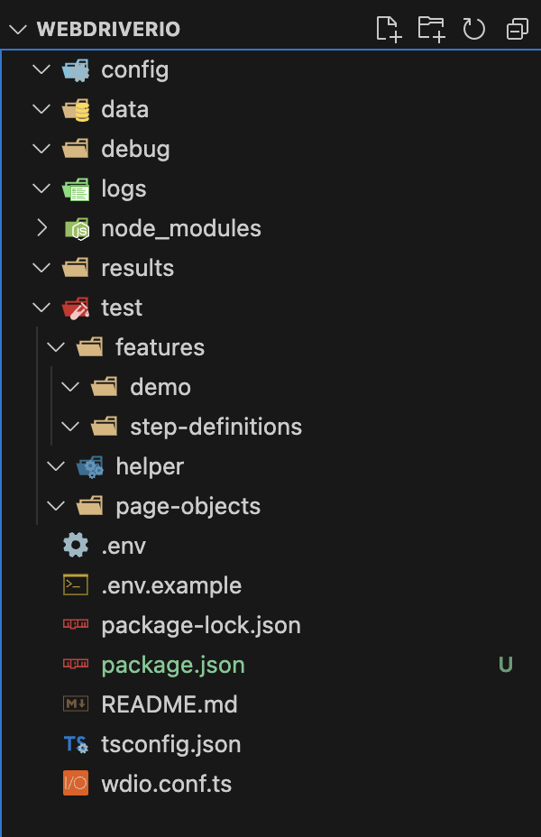

# WebdriverIO

## WebdriverIO Overview

**WebdriverIO** is an open-source automation test framework built around **Node.js**. It allows you to write tests in JavaScript or TypeScript and is primarily used for testing web and mobile applications. WebdriverIO integrates with the WebDriver protocol for controlling web browsers and Appium for mobile testing. It also supports various testing frameworks like Mocha, Jasmine, and Cucumber.

### Protocols used by WebdriverIO

1. **WebDriver Protocol** (formerly known as Selenium WebDriver):

   - A protocol designed for automating browsers by driving browser behavior programmatically.
   - Follows the W3C WebDriver specification, which is the standard protocol for browser automation.

2. **DevTools Protocol**:
   - WebdriverIO can use the Chrome DevTools Protocol (CDP) to interact with Chrome or Chromium-based browsers.
   - Provides additional features like network throttling, capturing JavaScript console logs, and accessing browser events directly.

### Pros of WebdriverIO

1. **Cross-Browser Testing**:

   - Supports all major browsers (Chrome, Firefox, Edge, etc.) and platforms, ensuring comprehensive test coverage.

2. **Multiple Framework Support**:

   - Supports multiple test frameworks such as Mocha, Jasmine, and Cucumber, giving flexibility in how you structure your tests.

3. **Full Integration with Modern Tools**:

   - Easily integrates with tools like Applitools for visual testing, BrowserStack/Sauce Labs for cross-browser testing, and reporting tools like Allure and TestRail.

4. **DevTools Protocol**:

   - Offers direct access to Chrome DevTools Protocol for performance testing, capturing network requests, and mocking responses.

5. **Mobile Testing**:

   - Supports mobile testing for Android and iOS by integrating with Appium.

6. **Rich Plugin Ecosystem**:

   - A large number of plugins are available for additional features like screenshots, video recording of tests, assertions, and reporting.

7. **Active Community and Documentation**:
   - WebdriverIO has a large, active community and comprehensive documentation, making it easy to get support and resources.

### Cons of WebdriverIO

1. **Steeper Learning Curve**:

   - WebdriverIO can have a steep learning curve, especially for testers new to Node.js and JavaScript/TypeScript environments.

2. **Limited Support for Some Legacy Browsers**:

   - While it supports modern browsers, there is limited support for older or less common browsers compared to Selenium WebDriver.

3. **Heavier Setup for Mobile Testing**:

   - Mobile testing can be more complex as it requires Appium and specific mobile environment configurations.

4. **Performance**:

   - WebDriver-based automation can be slower compared to newer protocols like Playwright or Puppeteer, which directly control the browser without WebDriver overhead.

5. **Maintaining Tests at Scale**:
   - Managing large-scale test suites can become challenging due to potential flakiness, synchronization issues, or test dependencies.

WebdriverIO is a powerful and flexible framework for end-to-end testing in JavaScript/TypeScript environments. It is well-suited for both browser and mobile testing, though the learning curve and setup complexity may require some investment of time.

## Installation

1. Install Node
2. Install Visual Studio Code

## Creating a New Project

1. Navigate to targetted Folder
2. create project using command `npm init -y`
3. Install wdio using command `npm install wdio .`

Here is the sample configuration for Cucumber project with TypesScript

`````````bash
Tester@Testers-MacBook-Air webdriverio % npm init wdio .
Need to install the following packages:
create-wdio@8.4.8
Ok to proceed? (y) y

                 -:...........................-:.
                 +                              +
              `` +      `...`        `...`      + `
            ./+/ +    .:://:::`    `::///::`  ` + ++/.
           .+oo+ +    /:+ooo+-/    /-+ooo+-/ ./ + +oo+.
           -ooo+ +    /-+ooo+-/    /-+ooo+-/ .: + +ooo.
            -+o+ +    `::///:-`    `::///::`    + +o+-
             ``. /.     `````        `````     .: .``
                  .----------------------------.
           `-::::::::::::::::::::::::::::::::::::::::-`
          .+oooo/:------------------------------:/oooo+.
      `.--/oooo-                                  :oooo/--.`
    .::-``:oooo`                                  .oooo-``-::.
  ./-`    -oooo`--.: :.--                         .oooo-    `-/.
 -/`    `-/oooo////////////////////////////////////oooo/.`    `/-
`+`   `/+oooooooooooooooooooooooooooooooooooooooooooooooo+:`   .+`
-/    +o/.:oooooooooooooooooooooooooooooooooooooooooooo:-/o/    +.
-/   .o+  -oooosoooososssssooooo------------------:oooo- `oo`   +.
-/   .o+  -oooodooohyyssosshoooo`                 .oooo-  oo.   +.
-/   .o+  -oooodooysdooooooyyooo` `.--.``     .:::-oooo-  oo.   +.
-/   .o+  -oooodoyyodsoooooyyooo.//-..-:/:.`.//.`./oooo-  oo.   +.
-/   .o+  -oooohsyoooyysssysoooo+-`     `-:::.    .oooo-  oo.   +.
-/   .o+  -ooooosooooooosooooooo+//////////////////oooo-  oo.   +.
-/   .o+  -oooooooooooooooooooooooooooooooooooooooooooo-  oo.   +.
-/   .o+  -oooooooooooooooooooooooooooooooooooooooooooo-  oo.   +.
-+////o+` -oooo---:///:----://::------------------:oooo- `oo////+-
+ooooooo/`-oooo``:-```.:`.:.`.+/-    .::::::::::` .oooo-`+ooooooo+
oooooooo+`-oooo`-- `/` .:+  -/-`/`   .::::::::::  .oooo-.+oooooooo
+-/+://-/ -oooo-`:`.o-`:.:-````.:    .///:``````  -oooo-`/-//:+:-+
: :..--:-:.+ooo+/://o+/-.-:////:-....-::::-....--/+ooo+.:.:--.-- /
- /./`-:-` .:///+/ooooo/+///////////////+++ooooo/+///:. .-:.`+./ :
:-:/.           :`ooooo`/`              .:.ooooo :           ./---
                :`ooooo`/`              .:.ooooo :
                :`ooooo./`              .:-ooooo :
                :`ooooo./`              .:-ooooo :
            `...:-+++++:/.              ./:+++++-:...`
           :-.````````/../              /.-:````````.:-
          -/::::::::://:/+             `+/:+::::::::::+.
          :oooooooooooo++/              +++oooooooooooo-

                           Webdriver.IO
              Next-gen browser and mobile automation
                    test framework for Node.js


Installing @wdio/cli to initialize project...
✔ Success!

===============================
🤖 WDIO Configuration Wizard 🧙
===============================

✔ A project named "webdriverio" was detected at "/Users/Tester/Documents/Tester/repositories/webdriverio", correct? yes
✔ What type of testing would you like to do? E2E Testing - of Web or Mobile Applications
✔ Where is your automation backend located? On my local machine
✔ Which environment you would like to automate? Web - web applications in the browser
✔ With which browser should we start?
✔ Which framework do you want to use? Cucumber (https://cucumber.io/)
✔ Do you want to use Typescript to write tests? yes
✔ Do you want WebdriverIO to autogenerate some test files? no
✔ Which reporter do you want to use? spec, allure
✔ Do you want to add a plugin to your test setup?
✔ Would you like to include Visual Testing to your setup? For more information see https://webdriver.io/docs/visual-testing! no
✔ Do you want to add a service to your test setup?
✔ Do you want me to run `npm install` yes


Setting up TypeScript...
✔ Success!

Installing packages using npm:
- @wdio/local-runner@latest
- @wdio/cucumber-framework@latest
- @wdio/spec-reporter@latest
- @wdio/allure-reporter@latest


npm WARN deprecated inflight@1.0.6: This module is not supported, and leaks memory. Do not use it. Check out lru-cache if you want a good and tested way to coalesce async requests by a key value, which is much more comprehensive and powerful.
npm WARN deprecated glob@7.1.7: Glob versions prior to v9 are no longer supported
npm WARN deprecated reflect-metadata@0.2.1: This version has a critical bug in fallback handling. Please upgrade to reflect-metadata@0.2.2 or newer.
npm WARN deprecated reflect-metadata@0.2.1: This version has a critical bug in fallback handling. Please upgrade to reflect-metadata@0.2.2 or newer.

added 146 packages, and audited 592 packages in 11s

108 packages are looking for funding
  run `npm fund` for details

found 0 vulnerabilities
✔ Success!

Creating a WebdriverIO config file...
✔ Success!

Adding "wdio" script to package.json
✔ Success!

🤖 Successfully setup project at /Users/Tester/Documents/Tester/repositories/webdriverio 🎉

Join our Discord Community Server and instantly find answers to your issues or queries. Or just join and say hi 👋!
  🔗 https://discord.webdriver.io

Visit the project on GitHub to report bugs 🐛 or raise feature requests 💡:
  🔗 https://github.com/webdriverio/webdriverio

To run your tests, execute:
$ cd /Users/Tester/Documents/Tester/repositories/webdriverio
$ npm run wdio

`````````

Install Chai Assertions as well

```
npm i --save-dev @types/chai
```

## Verify following

#### package. json

- check type': 'module"

#### tsconfig. json

- check '"module": "ESNext"'
- check '"resolveJsonModule": true'
- add '"esModuleInterop": true,'
- change '"strict": false'

#### wdio.conf.ts

- check 'project: "./tsconfig-json\*
- add '${process. cwd ()}/test/features/\*_/_.feature'
- add './test/features/step-definitions/\*.ts'

**Note:**
[Sample config file](https://github.com/copeautomation/wdio-cucumber-e2e-test/blob/56ae1e4b0ebe6a690cf32682a9ee516be8562f86/wdio.conf.ts#L1)

## Project Structure



## Useful VScode extensions

1. vscode-icons
2. Prettier - Code formatter
3. Path intellisense
4. npm intellisense
5. JavaScript (ES6) code snippets [clg is used from this extn]
6. Cucumber (Gherkin) Full Support
7. Code Runner
8. gitignore
9. DotENV
10. Surround With

[Click here for reference](../vscode/vscode-extensions-guide.md)

## First Test

```
Test Case:
----------
• Launch google
• Search for WDIO
• Click on first search results link
• Assert the URL is "https://webdriver.io/"

Steps:
--------
1. Create a demo.feature file under /demo
2. Write the feature steps
3. Under /step-definitions, create demo.ts file
4. Import Given, When and Then from cucumber
5. Write the steps
6. Add tag
7. Run test
```

## Step definition

demo.ts

```typescript
import { Given, When, Then } from "@wdio/cucumber-framework";
import * as chai from "chai";

Given(/^Google page is opened$/, async function () {
  await browser.url("https://www.google.com");
  await browser.pause(1000);
  console.log(`After opening browser...`);
});

When(/^Search with (.*)$/, async function name(searchItem) {
  let ele = await $(`[name=q]`);
  await ele.setValue(searchItem);
  await browser.keys("Enter");
});

Then(/^Click on the first search results$/, async function () {
  let ele = await $("h3");
  ele.click();
});

Then(/^URL should match (.*)$/, async function (expectedURL) {
  await browser.pause(3000);
  let url = await browser.getUrl();
  chai.expect(url).to.equal(expectedURL);
});
```

## Feature File

demo.feature

```gherkin
Feature: Demo feature
    Feature Description

    @demo
    Scenario Outline: Run first demo feature
        Given Google page is opened
        When Search with <SearchItem>
        Then Click on the first search results
        Then URL should match <ExpectedURL>
        Examples:
            | TestID     | SearchItem | ExpectedURL           |
            | DEMO_TC001 | WDIO       | https://webdriver.io/ |

```

**Issues with importing chai using** `import chai from "chai";`

The issue arises from how `chai` exports its module. Despite having `esModuleInterop` enabled in TypeScript, some CommonJS modules (like `chai`) do not provide a "default" export in a way that TypeScript can automatically handle. `chai` is a CommonJS module, and its exports are not compatible with the default import syntax unless specifically designed for ES modules.

By switching to `import * as chai from "chai"`, you're correctly importing all named exports, including those that `chai` offers. This approach ensures compatibility regardless of the module resolution strategy used.

Even though `esModuleInterop` is supposed to handle default imports from CommonJS modules, some libraries may still require the explicit `import * as` syntax due to how they are structured internally. This is why switching to named imports (`* as chai`) resolved the issue.

## Locators tips and tricks

| Scenario          | CSS                                | XPath                                                                           | WebdriverIO Example                                                                                                                                                       | Description                                           |
| ----------------- | ---------------------------------- | ------------------------------------------------------------------------------- | ------------------------------------------------------------------------------------------------------------------------------------------------------------------------- | ----------------------------------------------------- |
| Index             | `:nth-child(n)`                    | `[n]` or `[position()=n]`                                                       | `const element = await $('ul li:nth-child(2)');`<br>`const element = await $('(//ul/li)[2]');`                                                                            | Selects the nth child element                         |
| Parent            | Not directly supported             | `..` or `parent::tagname`                                                       | `const parent = await $('child_element/..');`<br>`const parent = await $('//child_element/parent::div');`                                                                 | Selects the parent of the current node                |
| Child             | `>`                                | `/`                                                                             | `const child = await $('parent > child');`<br>`const child = await $('//parent/child');`                                                                                  | Selects direct child elements                         |
| All Siblings      | `~`                                | `following-sibling::*` or `preceding-sibling::*`                                | `const siblings = await $$('elem ~ *');`<br>`const siblings = await $$('//elem/following-sibling::*');`                                                                   | Selects all siblings after or before the current node |
| Starts with       | `[attr^="value"]`                  | `starts-with(@attr, "value")`                                                   | `const element = await $('[class^="prefix"]');`<br>`const element = await $('//div[starts-with(@class, "prefix")]');`                                                     | Selects elements whose attribute starts with a value  |
| Ends with         | `[attr$="value"]`                  | `substring(@attr, string-length(@attr) - string-length("value") + 1) = "value"` | `const element = await $('[class$="suffix"]');`<br>`const element = await $('//div[substring(@class, string-length(@class) - string-length("suffix") + 1) = "suffix"]');` | Selects elements whose attribute ends with a value    |
| Contains          | `[attr*="value"]`                  | `contains(@attr, "value")`                                                      | `const element = await $('[class*="partial"]');`<br>`const element = await $('//div[contains(@class, "partial")]');`                                                      | Selects elements whose attribute contains a value     |
| Contains text     | `:contains("text")` (jQuery)       | `contains(text(), "value")`                                                     | `const element = await $('div:contains("text")');`<br>`const element = await $('//div[contains(text(), "text")]');`                                                       | Selects elements containing specific text             |
| Not contains text | `:not(:contains("text"))` (jQuery) | `not(contains(text(), "value"))`                                                | `const element = await $('div:not(:contains("text"))');`<br>`const element = await $('//div[not(contains(text(), "text"))]');`                                            | Selects elements not containing specific text         |

XPath Axes:

| Axis              | XPath                         | WebdriverIO Example                                                 | Description                                                                 |
| ----------------- | ----------------------------- | ------------------------------------------------------------------- | --------------------------------------------------------------------------- |
| self              | `self::nodename`              | `const element = await $('//div[self::div]');`                      | Selects the current node                                                    |
| child             | `child::nodename`             | `const children = await $$('//div/child::p');`                      | Selects all children of the current node                                    |
| descendant        | `descendant::nodename`        | `const descendants = await $$('//div/descendant::p');`              | Selects all descendants (children, grandchildren, etc.) of the current node |
| parent            | `parent::nodename`            | `const parent = await $('//p/parent::div');`                        | Selects the parent of the current node                                      |
| ancestor          | `ancestor::nodename`          | `const ancestors = await $$('//p/ancestor::div');`                  | Selects all ancestors (parent, grandparent, etc.) of the current node       |
| following-sibling | `following-sibling::nodename` | `const followingSiblings = await $$('//div/following-sibling::p');` | Selects all siblings after the current node                                 |
| preceding-sibling | `preceding-sibling::nodename` | `const precedingSiblings = await $$('//div/preceding-sibling::p');` | Selects all siblings before the current node                                |
| following         | `following::nodename`         | `const following = await $$('//div/following::p');`                 | Selects everything after the closing tag of the current node                |
| preceding         | `preceding::nodename`         | `const preceding = await $$('//div/preceding::p');`                 | Selects everything before the opening tag of the current node               |
| attribute         | `attribute::attrname`         | `const attribute = await $('//div/attribute::class');`              | Selects attributes of the current node                                      |
| namespace         | `namespace::prefix`           | `const namespace = await $('//div/namespace::*');`                  | Selects the namespace nodes of the current node                             |
